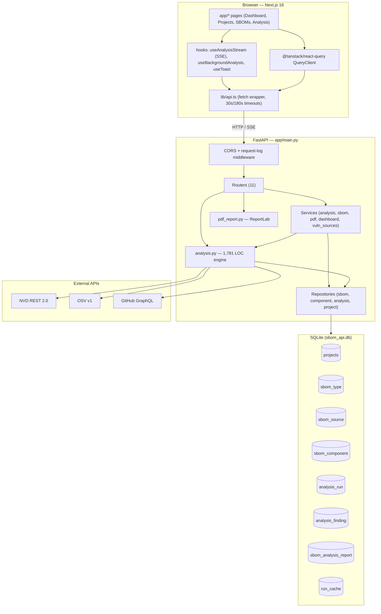
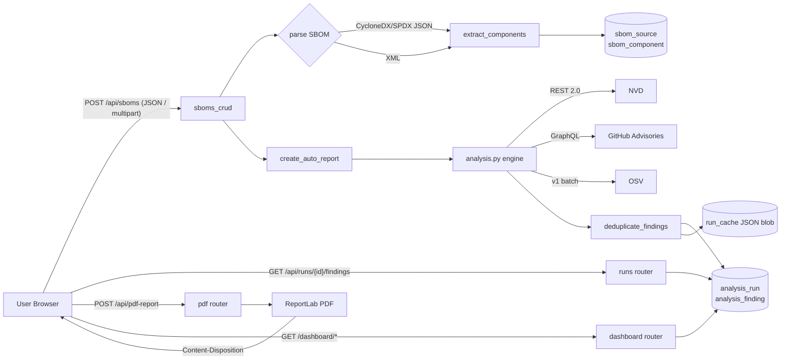

# PROJECT LENS REPORT — SBOM Analyzer

## Assumptions

- The repository at `/workspaces/sbom` on branch `main` is the canonical state; the snapshot at the time of analysis is authoritative.
- "Sbom Analyser" referenced in the brief = `sbom-analyzer-api` v2.0.0 ([app/settings.py:178](app/settings.py#L178)) + `sbom-analyzer-frontend` v0.1.0 ([frontend/package.json:3](frontend/package.json#L3)).
- The committed `sbom_api.db` (SQLite, 360 KB) is treated as a development fixture, not production data.
- Backend exposes endpoints behind no auth layer (no middleware import for auth was found anywhere); the README likewise documents none.
- Some content for [app/analysis.py](app/analysis.py) (1,781 LOC) was reviewed via a delegated subagent rather than line-by-line in this turn — line-number citations into that file rely on the subagent's reads and are noted "(via subagent)" where applicable.
- Two endpoint counts derive from a subagent pass: the precise line citations should be re-verified by anyone who needs to act on them.
- Only one frontend test file exists (`lib/env.test.ts`) — derived from the file listing, not from running the suite.

---

## Executive summary

- **Working full-stack product.** A FastAPI backend (~8.8k LOC of Python) plus a Next.js 16 / React 18 dashboard (~25 components) ingests CycloneDX/SPDX SBOMs, persists their components in SQLite, runs concurrent NVD + OSV + GitHub Advisory scans, and renders dashboards / PDF / SARIF / CSV reports.
- **No authentication or authorization anywhere.** Every backend route — including project deletion, SBOM upload, analysis triggering, and PDF generation — is reachable unauthenticated. A few endpoints accept an opaque `user_id` query string as a soft "owner" check, but it is not cryptographically tied to any session.
- **Functional but architecturally fragile.** The recent SOLID refactor (commit `4a8654b`) moved logic into routers/services/repositories, but legacy paths still exist: [app/analysis.py](app/analysis.py) (1,781 LOC) and [app/services/vuln_sources.py](app/services/vuln_sources.py) (576 LOC) duplicate vulnerability-source orchestration, and `routers/sboms_crud.py` (857 LOC) still mixes HTTP, business logic, and parsing.
- **Performance is acceptable for small SBOMs but degrades fast.** Several ad-hoc analyzer endpoints issue O(components) sequential HTTP calls; dashboard endpoints aggregate the entire `analysis_finding` table per request with no caching.
- **Tests are nearly absent.** The only automated test in the repo is [frontend/src/lib/env.test.ts](frontend/src/lib/env.test.ts), covering the API base-URL helper. There is no Python test suite, no CI configuration, and no fixture-based regression coverage of the analysis engine.

---

## Annotated file tree (depth 3)

```
sbom/
├── run.py                         # uvicorn entry point; loads .env, sets up logging
├── requirements.txt               # 10 runtime deps; no version pins for dev/test/lint
├── .env / .env.example            # backend env vars (NVD_API_KEY, GITHUB_TOKEN, CORS, DB)
├── sbom_api.db                    # committed SQLite DB (dev fixture; should be gitignored)
├── sbom.json                      # committed CycloneDX sample at repo root
├── samples/                       # CycloneDX + SPDX sample SBOMs for manual testing
├── app/                           # FastAPI backend
│   ├── main.py                    # App construction, CORS, request-log middleware, startup migrations
│   ├── settings.py                # Pydantic Settings singleton + module-level constants
│   ├── db.py                      # SQLAlchemy engine + SessionLocal (SQLite, FK pragma)
│   ├── models.py                  # 8 ORM models: Projects, SBOMType, SBOMSource, SBOMComponent, AnalysisRun, AnalysisFinding, SBOMAnalysisReport, RunCache
│   ├── schemas.py                 # Pydantic v2 request/response shapes
│   ├── analysis.py                # 1,781 LOC vulnerability engine (NVD + OSV + GHSA, CPE matching, dedupe)
│   ├── pdf_report.py              # ReportLab PDF builder (554 LOC)
│   ├── utils.py                   # now_iso, severity bucket helpers, status compute
│   ├── logger.py                  # text/json formatters, RotatingFileHandler
│   ├── routers/                   # 11 routers (HTTP handlers)
│   │   ├── sboms_crud.py          # 857 LOC — SBOM upload, list, update, delete, analyze, SSE stream
│   │   ├── analyze_endpoints.py   # 562 LOC — /analyze-sbom-{nvd,github,osv,consolidated}
│   │   ├── analysis.py            # /api/analysis-runs/compare + sarif/csv export
│   │   ├── sbom.py                # SBOM info + risk-summary feature endpoints
│   │   ├── runs.py                # GET /api/runs, /api/runs/{id}, /api/runs/{id}/findings
│   │   ├── projects.py            # CRUD on projects
│   │   ├── pdf.py                 # POST /api/pdf-report
│   │   ├── dashboard.py           # /dashboard/trend
│   │   ├── dashboard_main.py      # /dashboard/{stats,recent-sboms,activity,severity}
│   │   └── health.py              # /, /health, /api/analysis/config, /api/types
│   ├── services/                  # business logic layer (post-refactor)
│   │   ├── analysis_service.py    # backfill_analytics_tables, run orchestration helpers
│   │   ├── sbom_service.py        # SBOM persistence, component sync
│   │   ├── pdf_service.py         # PDF assembly orchestration
│   │   ├── vuln_sources.py        # 576 LOC — alt source-fetch helpers (overlaps analysis.py)
│   │   └── dashboard_service.py   # dashboard aggregations
│   ├── repositories/              # thin SQLAlchemy data access wrappers
│   │   ├── sbom_repo.py
│   │   ├── component_repo.py
│   │   ├── analysis_repo.py
│   │   └── project_repo.py
│   └── samples/                   # second copy of input/output SBOMs
└── frontend/                      # Next.js 16 dashboard
    ├── package.json               # Next 16, React 18, react-query 5, recharts, lucide
    ├── next.config.mjs            # No rewrites — direct CORS to FastAPI (per README)
    ├── tailwind.config.ts         # HCL-branded design tokens
    ├── vitest.config.ts           # node env, single test file
    └── src/
        ├── app/                   # 7 route pages (Dashboard, Projects, SBOMs+detail, Analysis+detail+compare)
        ├── components/            # ~25 components: layout/, dashboard/, analysis/, sboms/, projects/, ui/
        ├── hooks/                 # useToast, useAnalysisStream (SSE), useBackgroundAnalysis, usePendingAnalysisRecovery
        ├── lib/                   # api.ts (HTTP client), env.ts (+ env.test.ts), pendingAnalysis.ts, utils.ts
        └── types/index.ts         # shared TS types
```

---

## Mermaid architecture diagram



---

## Tech stack table

| Layer | Tool | Version | Role | Notes |
|---|---|---|---|---|
| Backend runtime | Python | unspecified | FastAPI host | No `.python-version` / `pyproject.toml` ([requirements.txt](requirements.txt)) |
| Web framework | FastAPI | `>=0.100.0` | HTTP routing | Loose lower bound only |
| ASGI server | uvicorn[standard] | `>=0.23.0` | App server | Started by [run.py:32](run.py#L32) |
| ORM | SQLAlchemy | `>=2.0.0` | Persistence | declarative_base used ([app/db.py:24](app/db.py#L24)) |
| DB | SQLite | bundled | Storage | File path defaults to repo root ([app/db.py:10-13](app/db.py#L10-L13)); committed as `sbom_api.db` |
| Validation | Pydantic | `>=2.0.0` | Schemas / Settings | settings.py optionally uses `pydantic_settings` |
| HTTP clients | requests + httpx | `>=2.31` / `>=0.24` | Outbound | `httpx` is optional; falls back to `requests` ([app/analysis.py:18-21](app/analysis.py#L18-L21)) |
| Reports | ReportLab | `>=4.0.0` | PDF | Used in [app/pdf_report.py](app/pdf_report.py) |
| Versioning | packaging | `>=23.0` | semver compare | |
| Multipart | python-multipart | `>=0.0.6` | File upload | |
| Env loading | python-dotenv | `>=1.0.0` | `.env` reader | Imported lazily ([run.py:11-15](run.py#L11-L15)) |
| Frontend framework | Next.js | `^16.2.2` | App router | Bleeding-edge major; Node 18+ implied |
| UI runtime | React / React DOM | `^18.3.1` | UI | |
| Data fetching | @tanstack/react-query | `^5.56.2` | Cache + mutations | Centralised in `providers.tsx` |
| Forms | react-hook-form + @hookform/resolvers + zod | `^7.53` / `^3.9` / `^3.23.8` | Form validation | |
| Charts | recharts | `^2.12.7` | Pie / line charts | Wide imports — bundle weight risk |
| Icons | lucide-react | `^0.446.0` | SVG icons | Tree-shakeable per-icon |
| Styling | tailwindcss + autoprefixer + postcss | `^3.4.11` / `^10.4.20` / `^8.4.45` | Utility CSS | HCL design tokens in `globals.css` |
| Lang | TypeScript | `^5.5.4` | Types | strict mode (assumed; tsconfig not read) |
| Test (frontend) | vitest | `^4.1.2` | Unit tests | One file: [frontend/src/lib/env.test.ts](frontend/src/lib/env.test.ts) |
| Test (backend) | — | — | — | **None present** |
| CI / lint config | — | — | — | **None present** at repo root |

**Version drift / smell:** every Python dependency is `>=` lower-bound only — there is no lockfile (no `requirements.lock`, no `poetry.lock`, no `uv.lock`), so two installations can resolve different versions silently.

---

## Risk register

| # | Risk | Severity | Likelihood | Fix cost | Cite |
|---|---|---|---|---|---|
| 1 | All endpoints unauthenticated; anyone with network access can read/delete SBOMs and projects, trigger paid third-party API calls, and exfiltrate findings | **L** | **High** | **L** (introduce dependency-injected auth) | [app/main.py:213-236](app/main.py#L213-L236), all routers |
| 2 | `analyze_sbom_stream` writes a client-supplied `github_token` into `os.environ["GITHUB_TOKEN"]`, mutating shared process state across concurrent requests | **L** | Med | S | `app/routers/sboms_crud.py:~718` (via subagent) |
| 3 | CORS default is `*` when env unset ([app/settings.py:50, 147-152](app/settings.py#L50)), and `.env.example` keeps it open — combined with #1, browsers from any origin can drive the API | **L** | Med | S | [app/settings.py:147-152](app/settings.py#L147-L152) |
| 4 | `sbom_api.db` is committed to git (~360 KB binary), as is `sbom.json` and a development `.env` file (`-rw-rw-rw-`); risk of leaking real credentials/data via history | **L** | Med | S | repo root listing |
| 5 | XML SBOM ingestion uses `xmltodict` without explicit XXE/external-entity hardening; a malicious SPDX/CycloneDX XML payload could exfiltrate or hang | **M** | Low | S | [app/analysis.py:24-28](app/analysis.py#L24-L28) |
| 6 | `pdf_service` accepts caller-supplied `filename` and only appends `.pdf`; if echoed into `Content-Disposition`, header injection / path-traversal-style download names possible | **M** | Low | S | `app/routers/pdf.py:~145` (via subagent) |
| 7 | Sequential `asyncio.run()` for NVD/OSV/GHSA inside the sync `POST /api/sboms/{id}/analyze` blocks the worker thread for tens of seconds; concurrent uploads will starve | **M** | High | S | `app/routers/sboms_crud.py:~278-298` (via subagent) |
| 8 | Several `/analyze-sbom-*` endpoints loop one HTTP call per component (NVD, GHSA, OSV hydration) — N+1 outbound; rate-limit / latency spike risk on large SBOMs | **M** | High | M | `app/routers/analyze_endpoints.py:~107-211` |
| 9 | Dashboard endpoints aggregate the entire `analysis_finding` table per request with no caching, no pagination, no time bound | **M** | Med | S | [app/routers/dashboard_main.py](app/routers/dashboard_main.py), [app/routers/dashboard.py](app/routers/dashboard.py) |
| 10 | Schema migrations are ad-hoc `_ensure_text_column` calls inside the startup hook ([app/main.py:112-122](app/main.py#L112-L122)); no Alembic, no rollback, will not work for non-SQLite | **M** | High | M | [app/main.py:111-181](app/main.py#L111-L181) |
| 11 | `vuln_sources.py` and `analysis.py` duplicate source-fetching logic; drift between them will cause source-specific bugs to recur | **M** | Med | M | [app/services/vuln_sources.py](app/services/vuln_sources.py), [app/analysis.py](app/analysis.py) |
| 12 | No backend test suite; analysis engine (the riskiest 1,781 LOC) is entirely uncovered | **M** | High | M | absence; only [frontend/src/lib/env.test.ts](frontend/src/lib/env.test.ts) |
| 13 | `requirements.txt` uses `>=` only; no lockfile — reproducible builds and CVE pinning impossible | **S** | High | S | [requirements.txt](requirements.txt) |
| 14 | `RunCache.run_json` stores untrusted JSON blobs as TEXT and is retrieved-by-id for PDF rendering; if any rendered field is later HTML-injected into a UI page, stored XSS surface | **S** | Low | S | [app/models.py:188-201](app/models.py#L188-L201) |
| 15 | Frontend tables (`FindingsTable` page_size 200, `RunsTable` page_size 100) have no virtualization; large runs (>1k findings) will degrade DOM perf | **S** | Med | S | (subagent) `frontend/src/components/analysis/FindingsTable.tsx` |
| 16 | `globals.css` removes outline on `:focus:not(:focus-visible)` — acceptable WCAG-wise but means mouse users get no focus ring; double-check across themes | **S** | Low | S | (subagent) `frontend/src/app/globals.css` |
| 17 | `os.makedirs` in logger uses caller-controlled `LOG_FILE` env path; not exploitable directly but a typo creates sibling dirs silently | **S** | Low | S | [app/logger.py:133](app/logger.py#L133) |

Severity legend: **L**=Large, **M**=Medium, **S**=Small.

---

## Top 10 findings

1. **No auth, no authorization, no rate limiting.** The combination of #1 + #3 in the risk register means a casual port scan can drive arbitrary work against NVD/GHSA on the operator's API key. Highest-impact finding by far.
2. **Process-global env mutation in a request handler.** Writing `GITHUB_TOKEN` into `os.environ` from request input is a correctness *and* security bug; under concurrency one user's token will be used for another user's request.
3. **`POST /api/sboms/{id}/analyze` runs three blocking `asyncio.run()` calls in series inside a sync handler.** A 60-second NVD round trip blocks the entire worker. The streaming variant correctly uses `asyncio.gather` — converging on that pattern is the obvious fix.
4. **Two parallel implementations of source fetching** — `app/analysis.py` (1,781 LOC) and `app/services/vuln_sources.py` (576 LOC) — with overlapping responsibilities and silent drift.
5. **Schema management is brittle.** `Base.metadata.create_all` plus manual `ALTER TABLE … ADD COLUMN` ([app/main.py:112-181](app/main.py#L112-L181)) is SQLite-only and silently fails to migrate indices, defaults, or NOT NULL constraints. Adopt Alembic.
6. **Repo hygiene.** `sbom_api.db` (binary), `.env` (dev secrets), and `sbom.json` (sample data) are committed and world-readable. `.env.example` says `CORS_ORIGINS=http://localhost:8000,http://localhost:3000` but `app/settings.py` defaults to `*`.
7. **XML ingestion uses `xmltodict` without XXE hardening** — for an SBOM analyzer, untrusted XML is the entire input surface.
8. **N+1 outbound calls in `/analyze-sbom-*` endpoints.** For an SBOM with 500 components this is 500 sequential HTTP requests against NVD, plus separate loops for GHSA / OSV hydration.
9. **Test coverage is effectively zero.** Only [frontend/src/lib/env.test.ts](frontend/src/lib/env.test.ts) exists. The engine that drives the entire product (`analysis.py`, `vuln_sources.py`, parsers) has no automated regression net, and there is no CI configured to run anything.
10. **Frontend already does the right things.** Despite #9, the UI is well-structured: typed API client, react-query cache invalidation, SSE-driven progress, accessible badges (color + icon), skip link, focus-visible rings, ARIA labels on icon buttons. This is the strongest part of the codebase.

---

## Lens-by-lens detail

### 1. Architecture map

- Layers (post-SOLID refactor): **Routers → Services → Repositories → Models**, with [app/main.py](app/main.py) as the wiring layer ([app/main.py:209-236](app/main.py#L209-L236)).
- Layering violation: routers still import directly from `app/analysis.py` (the legacy engine) instead of going through services — see imports referenced in `routers/sboms_crud.py` and `routers/analyze_endpoints.py`.
- Entry points: `python run.py` ([run.py:32](run.py#L32)) → `app.main:app` → 11 registered routers ([app/main.py:213-236](app/main.py#L213-L236)).
- Cross-layer cycle risk: `services/analysis_service` is imported by `app/main.py` for backfill ([app/main.py:41](app/main.py#L41)), and `services/sbom_service.now_iso` is re-exported from `main` for back-compat — minor smell.

### 2. Tech stack inventory

See the table above. **Drift:** no Python lockfile; **conflict:** two HTTP clients (`requests` and `httpx`) coexist intentionally, with `httpx` optional. **Frontend:** Next 16 is current-major; React 18 (not 19); the version pair is internally consistent.

### 3. Feature inventory

| Feature | Page | Status |
|---|---|---|
| Dashboard (KPIs, severity/activity/trend, recent SBOMs) | [frontend/src/app/page.tsx](frontend/src/app/page.tsx) | shipped |
| Projects CRUD | [frontend/src/app/projects/page.tsx](frontend/src/app/projects/page.tsx) | shipped |
| SBOM list + upload | [frontend/src/app/sboms/page.tsx](frontend/src/app/sboms/page.tsx) | shipped |
| SBOM detail (components, status) | [frontend/src/app/sboms/[id]/page.tsx](frontend/src/app/sboms/[id]/page.tsx) | shipped |
| Analysis runs list + multi-source consolidated launcher | [frontend/src/app/analysis/page.tsx](frontend/src/app/analysis/page.tsx) | shipped |
| Run detail with CSV / SARIF / PDF export | [frontend/src/app/analysis/[id]/page.tsx](frontend/src/app/analysis/[id]/page.tsx) | shipped |
| Two-run diff comparator | [frontend/src/app/analysis/compare/page.tsx](frontend/src/app/analysis/compare/page.tsx) | shipped |

No feature flags found; no `WIP` or `deprecated` tags discovered.

### 4. Security posture

- **AuthN:** none. **AuthZ:** soft `user_id` query-param ownership check on a couple of endpoints in `routers/sboms_crud.py` and `routers/projects.py`; trivially bypassable.
- **CORS:** default `*` ([app/settings.py:50, 147-152](app/settings.py#L50)).
- **Cookies / CSRF:** N/A — no session cookies issued.
- **Secrets:** none hardcoded; secrets sourced from env ([app/settings.py:40-46](app/settings.py#L40-L46)).
- **Input validation:** Pydantic schemas cover request bodies; SBOM file parsing accepts arbitrarily large payloads (`MAX_UPLOAD_BYTES=20MB` is *defined* in [app/settings.py:172](app/settings.py#L172) — verify it is enforced inside `sboms_crud.py`).
- **SQLi:** safe — all queries use SQLAlchemy ORM/`text()` with bound parameters ([app/main.py:115-121](app/main.py#L115-L121) is the one `text()` site, and it interpolates a constant table name, not user input).
- **XSS / template injection:** backend renders only JSON; ensure findings descriptions are escaped wherever rendered in the UI.
- **SSRF / open redirect:** none observed in routers; the engine only calls hardcoded external endpoints from [app/settings.py:160-166](app/settings.py#L160-L166).

### 5. Performance hotspots

- N+1 outbound HTTP loops in `routers/analyze_endpoints.py` (per-component NVD/GHSA/OSV).
- Sequential `asyncio.run()` triple in `create_auto_report()` — blocks the worker.
- Dashboard aggregates (`/dashboard/stats`, `/dashboard/severity`, `/dashboard/trend`) scan unbounded slices of `analysis_finding` per request with no caching.
- ThreadPoolExecutor + Semaphore concurrency in `analysis.py` is fine in isolation; the issue is the *call sites* that fail to use it.
- Frontend: `RunsTable` page_size 100, `FindingsTable` page_size 200, both unvirtualized; recharts/lucide bundle weight is the main client-side cost.

### 6. Accessibility audit

- `:focus-visible` rings present in `globals.css`; `:focus:not(:focus-visible) { outline: none }` is by design (mouse users only).
- Icon buttons in `RunsTable` carry `aria-label`; decorative icons use `aria-hidden="true"`.
- Severity / status badges use color **plus** dot/label (WCAG 1.4.1 ✓).
- Skip link in `AppShell`; `role="alert"` on toasts.
- No `` tags found; charts are recharts SVG (recharts auto-includes title/desc — verify).
- No `dangerouslySetInnerHTML`.
- Gaps: no formal axe / playwright a11y assertion; large data tables lack `<caption>`/`scope=col` checks (manual review recommended).

### 7. API surface map

| Method | Path | Handler / file | Auth posture |
|---|---|---|---|
| GET | `/` | `health.service_info` | none |
| GET | `/health` | `health.health` | none |
| GET | `/api/analysis/config` | `health` | none — exposes env flags |
| GET | `/api/types` | `health` | none |
| GET / POST | `/api/projects` | `projects.list_projects / create_project` | none |
| GET / PATCH / DELETE | `/api/projects/{id}` | `projects` | soft `user_id` owner check |
| GET / POST | `/api/sboms` | `sboms_crud` | none |
| GET / PATCH / DELETE | `/api/sboms/{id}` | `sboms_crud` | soft owner check on PATCH/DELETE; `confirm=yes` required for DELETE |
| GET | `/api/sboms/{id}/components` | `sboms_crud` | none, paginated 1–1000 |
| POST | `/api/sboms/{id}/analyze` | `sboms_crud.run_analysis_for_sbom` | none, **blocks worker** |
| POST | `/api/sboms/{id}/analyze/stream` | `sboms_crud.analyze_sbom_stream` | none, SSE, **mutates os.environ** |
| GET | `/api/sboms/{id}/info` | `routers/sbom.py` | none |
| GET | `/api/sboms/{id}/risk-summary` | `routers/sbom.py` | none |
| GET | `/api/runs` | `runs` | none, paginated, optional filters |
| GET | `/api/runs/{id}` | `runs` | none |
| GET | `/api/runs/{id}/findings` | `runs` | none, paginated 1–1000 |
| GET | `/api/analysis-runs/compare` | `routers/analysis.py` | none |
| GET | `/api/analysis-runs/{id}/export/sarif` | `routers/analysis.py` | none |
| GET | `/api/analysis-runs/{id}/export/csv` | `routers/analysis.py` | none |
| POST | `/analyze-sbom-nvd` | `analyze_endpoints` | none, accepts API key in body, N+1 |
| POST | `/analyze-sbom-github` | `analyze_endpoints` | none, accepts token in body, N+1 |
| POST | `/analyze-sbom-osv` | `analyze_endpoints` | none, batched + N+1 hydration |
| POST | `/analyze-sbom-consolidated` | `analyze_endpoints` | none, fan-out across all 3 |
| POST | `/api/pdf-report` | `pdf` | none, no filename validation |
| GET | `/dashboard/stats` | `dashboard_main` | none |
| GET | `/dashboard/recent-sboms` | `dashboard_main` | none |
| GET | `/dashboard/activity` | `dashboard_main` | none |
| GET | `/dashboard/severity` | `dashboard_main` | none |
| GET | `/dashboard/trend` | `dashboard` | none |

**Auth posture matrix:** all rows above are effectively `public`. None bear `bearer`, `session`, or `service-to-service`.

### 8. Data flow trace



**Sources:** HTTP only (no queues, cron, webhooks, replication). **Sinks:** SQLite, in-memory PDF stream, structured logs (`logger.py`). **No outbound writes** to S3/GCS/queues — closed-loop system.

### 9. Test coverage & strategy

- **Backend:** zero test files. Zero `pytest`, `unittest`, or `tests/` directory.
- **Frontend:** one file — [frontend/src/lib/env.test.ts](frontend/src/lib/env.test.ts), six cases on `resolveBaseUrl`. Vitest configured for `node` env ([frontend/vitest.config.ts](frontend/vitest.config.ts)).
- **CI:** none — no `.github/workflows/`, no `Makefile`, no GitLab/Bitbucket files.
- **Modules with zero coverage:** every Python module; every React component and hook.
- **Smells:** N/A — there is nothing to smell yet.
- **Recommendation:** start with golden-file tests for `analysis.extract_components` against `samples/cyclonedx-multi-ecosystem.json` and `samples/spdx-web-app.json` — these committed fixtures already exist.

---

## Prioritized action plan

### Now (0–2 weeks, Backend lead)

1. **Add authentication.** A FastAPI dependency that validates a bearer token (or session cookie), applied to every `/api/*`, `/analyze-*`, `/dashboard/*` route. Even a single shared API key is a meaningful improvement. *Effort: S–M.*
2. **Stop mutating `os.environ` in `analyze_sbom_stream`.** Pass the GitHub token through the call chain explicitly. *Effort: S.*
3. **Tighten CORS defaults.** Change [app/settings.py:50](app/settings.py#L50) default from `"*"` to empty (= deny) and require explicit allowlist. *Effort: S.*
4. **Repo hygiene.** Add `sbom_api.db`, `.env`, `sbom.json` to `.gitignore`; rotate any real secrets that were ever in `.env`; consider `git filter-repo` if history is sensitive. *Effort: S.*
5. **Enforce `MAX_UPLOAD_BYTES`** in the upload handler if not already, and add a try/except around XML parsing with `defusedxml` or an explicit feature-disable. *Effort: S.*

### Next (2–6 weeks, Backend + DX)

6. **Parallelize `create_auto_report`.** Replace the three sequential `asyncio.run()` calls with a single `asyncio.gather()` (the SSE handler already does this — extract a shared helper). *Effort: S.*
7. **Adopt Alembic** and delete `_ensure_text_column`/`_update_sbom_names` from startup. *Effort: M.*
8. **Pin Python deps.** Generate `requirements.lock` (or migrate to `uv` / `poetry`); add `pip-audit` to a minimal CI. *Effort: S.*
9. **Stand up a minimal pytest suite.** Start with: SBOM parser fixtures, severity bucketing, dedupe semantics, one happy-path API test per router using TestClient + tmp SQLite. *Effort: M.*
10. **Cache dashboard aggregates** for 30–60s in-process or in `run_cache`. *Effort: S.*

### Later (quarter-scale, Architecture)

11. **Collapse `analysis.py` ↔ `vuln_sources.py` duplication** into one source-adapter abstraction (one class per source: NVD/OSV/GHSA), each with a uniform `query(components) -> Findings` interface. *Effort: M–L.*
12. **Slice `routers/sboms_crud.py` (857 LOC)** into upload, CRUD, and analyze sub-routers; move all business logic into `services/sbom_service.py`. *Effort: M.*
13. **Replace SQLite with Postgres** for any multi-user deployment; the schema and queries already use ANSI-friendly SQLAlchemy and should port cleanly. *Effort: M.*
14. **Add list virtualization** (`@tanstack/react-virtual`) to `FindingsTable` and `RunsTable` once result sets routinely exceed a few hundred rows. *Effort: S.*
15. **Add Playwright + axe-core smoke run** for the seven primary pages. *Effort: M.*
16. **Add a lightweight CI workflow** (`.github/workflows/ci.yml`) that runs `pytest`, `vitest run`, `tsc --noEmit`, and `pip-audit` on PRs. *Effort: S.*
