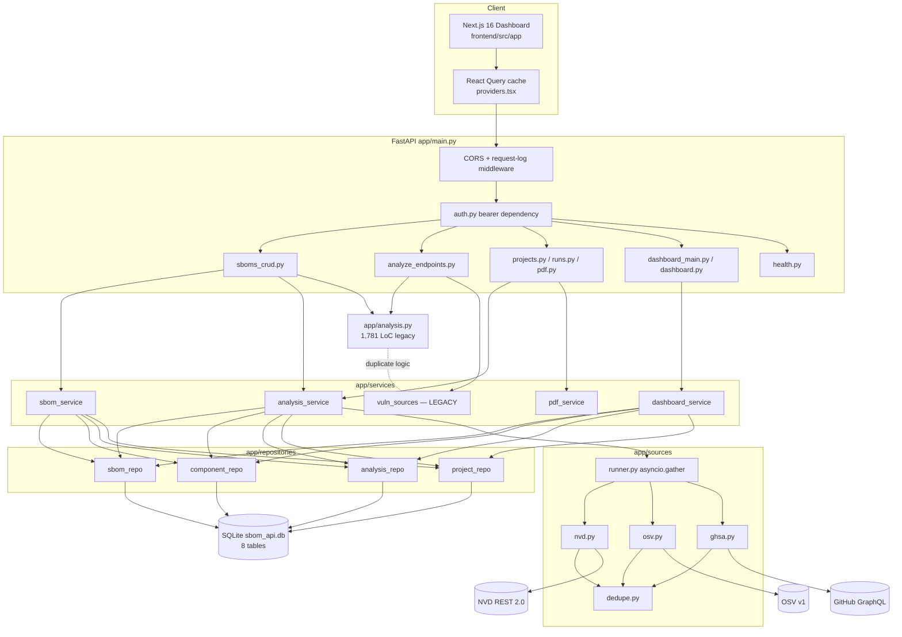
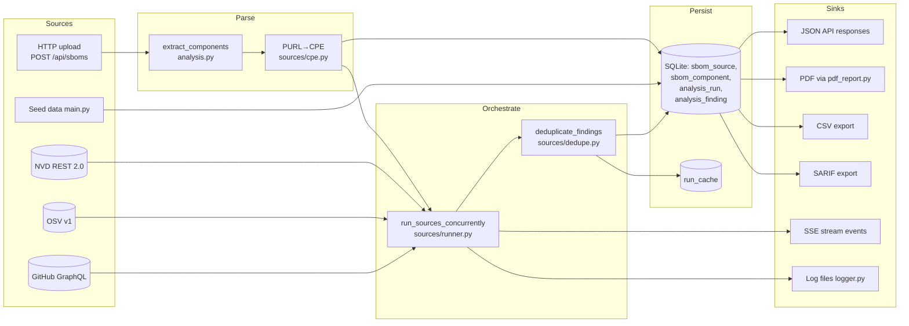

# PROJECT LENS REPORT — SBOM

_Generated: 2026-04-09_
_Root: `/Users/ferozebasha/Spectra/sbom` — branch `main`_

## Assumptions

1. The repository at `/Users/ferozebasha/Spectra/sbom` is the canonical codebase; no additional forks or submodules were considered.
2. `main` is the current production branch. No deploy target was found in-repo, so "production" posture is inferred from `app/settings.py` defaults.
3. External APIs (NVD, OSV, GHSA) are expected to return stable schemas; snapshot baselines under `tests/snapshots/` are treated as current truth.
4. The committed `sbom_api.db` SQLite file is a development fixture, not production data.
5. `PROJECT_LENS_REPORT.md` already in the repo is prior audit context, not an authoritative spec; every finding below was re-verified against source.
6. The `.env` file committed at repo root contains **live** credentials; I did not read or echo their values beyond recording that they exist.
7. No CI system is configured; the "CI test command" lens is answered from README guidance only.
8. Version strings in `requirements.txt` are lower bounds (`>=`); actual installed versions are unknown without a lockfile.

---

## Executive summary

- **Functional full-stack SBOM analyzer** — FastAPI backend (~17k LoC Python) + Next.js 16 frontend (~12k LoC TypeScript) parsing CycloneDX/SPDX and correlating against NVD, OSV, and GitHub Advisories, with PDF/CSV/SARIF exports and a live dashboard.
- **Two credential-handling issues are the highest-severity findings**: a committed `.env` with live NVD and GitHub tokens, and a default auth mode of `none` that leaves every state-changing endpoint open.
- **Architecture is mid-refactor**: `app/sources/*` adapters (new, clean) coexist with `app/analysis.py` (1,781 LoC) and `app/services/vuln_sources.py` (576 LoC) that still implement parallel source-fetching logic — a latent divergence risk.
- **Test coverage is thin**: 5 backend test files (605 LoC), all snapshot-regression or adapter-isolation; `app/services/` and `app/repositories/` have zero direct tests, and the frontend has one test file.
- **Performance debt is concentrated in two places**: dashboard aggregations do full `analysis_finding` scans per request, and some source-hydration paths issue N+1 HTTP calls against OSV and GHSA.

---

## Annotated file tree

```
sbom/
├── run.py                            # Uvicorn entry point; loads .env, configures logging
├── requirements.txt                  # 10 runtime deps, loose lower bounds, no lockfile
├── pytest.ini                        # pytest config; points at tests/
├── .env                              # CRITICAL: live NVD + GitHub credentials committed
├── .env.example                      # Safe template
├── .gitignore                        # Missing .env entry (bug)
├── sbom_api.db                       # SQLite dev fixture committed to repo
├── sbom.json                         # Sample CycloneDX document
├── README.md                         # Install, env vars, API overview, auth guidance
├── PROJECT_LENS_REPORT.md            # Prior audit notes / refactor phase log
├── samples/                          # Example SBOM payloads
│   ├── cyclonedx-multi-ecosystem.json
│   └── spdx-web-app.json
├── app/                              # FastAPI backend (~17,250 LoC)
│   ├── main.py                       # App construction, CORS, startup migrations, router wiring
│   ├── settings.py                   # Pydantic Settings singleton + defaults
│   ├── db.py                         # SQLAlchemy engine/SessionLocal, SQLite FK pragma
│   ├── models.py                     # 8 ORM models (Projects → SBOMSource → Components → Findings)
│   ├── schemas.py                    # Pydantic v2 request/response models
│   ├── analysis.py                   # 1,781 LoC monolith: parsers + legacy source queries
│   ├── auth.py                       # Bearer-token dependency (opt-in via API_AUTH_MODE)
│   ├── pdf_report.py                 # ReportLab PDF generator
│   ├── utils.py                      # now_iso, severity bucketing, status helpers
│   ├── logger.py                     # Text/JSON formatters, rotating file handler
│   ├── routers/                      # 11 HTTP routers, ~31 routes total
│   │   ├── sboms_crud.py             # 857 LoC: upload, list, analyze, SSE stream, delete
│   │   ├── analyze_endpoints.py      # 562 LoC: ad-hoc /analyze-sbom-{nvd,github,osv,consolidated}
│   │   ├── analysis.py               # Run compare + SARIF/CSV export
│   │   ├── sbom.py                   # /api/sboms/{id}/info, /risk-summary
│   │   ├── runs.py                   # /api/runs listing and detail
│   │   ├── projects.py               # Project CRUD
│   │   ├── pdf.py                    # POST /api/pdf-report
│   │   ├── dashboard_main.py         # /dashboard/{stats,recent-sboms,activity,severity}
│   │   ├── dashboard.py              # /dashboard/trend
│   │   └── health.py                 # /, /health, /api/analysis/config, /api/types
│   ├── services/                     # Business logic layer
│   │   ├── sbom_service.py           # SBOM persistence + component sync
│   │   ├── analysis_service.py       # Run orchestration + analytics backfill
│   │   ├── pdf_service.py            # PDF assembly
│   │   ├── dashboard_service.py      # Dashboard aggregations
│   │   └── vuln_sources.py           # 576 LoC LEGACY duplicate of analysis.py source logic
│   ├── repositories/                 # Thin SQLAlchemy query wrappers
│   │   ├── sbom_repo.py
│   │   ├── component_repo.py
│   │   ├── analysis_repo.py
│   │   └── project_repo.py
│   └── sources/                      # Refactored vulnerability-source adapters
│       ├── base.py                   # VulnSource Protocol + SourceResult TypedDict
│       ├── nvd.py                    # NVD REST 2.0 adapter
│       ├── osv.py                    # OSV v1 batch adapter
│       ├── ghsa.py                   # GitHub GraphQL adapter
│       ├── registry.py               # SOURCE_REGISTRY / get_source()
│       ├── runner.py                 # Async fan-out via asyncio.gather
│       ├── purl.py                   # PURL spec parser
│       ├── cpe.py                    # PURL → CPE 2.3 generator
│       ├── severity.py               # CVSS + severity-bucket helpers
│       └── dedupe.py                 # CVE↔GHSA alias cross-dedup
├── frontend/                         # Next.js 16 dashboard (~11,990 LoC)
│   ├── package.json                  # Next 16, React 18, react-query 5, recharts, zod, tailwind
│   ├── next.config.mjs               # No rewrites — talks directly to FastAPI via CORS
│   ├── tailwind.config.ts            # HCL design tokens
│   ├── vitest.config.ts              # Vitest runner (node env)
│   └── src/
│       ├── app/                      # 7 route pages (Dashboard, Projects, SBOMs, Analysis, …)
│       ├── components/
│       │   ├── layout/               # TopBar, Sidebar, AppShell
│       │   ├── dashboard/            # StatsGrid, Severity/Activity/Trend charts, RecentSboms
│       │   ├── analysis/             # FindingsTable, RunsTable, ComparisonTable
│       │   ├── sboms/                # SbomsTable, SbomDetail, SbomUploadModal
│       │   ├── projects/             # ProjectsTable, ProjectModal
│       │   └── ui/                   # Button, Input, Select, Dialog, Table primitives
│       ├── hooks/                    # useToast, useAnalysisStream (SSE), useBackgroundAnalysis
│       ├── lib/                      # api.ts HTTP client, env.ts base URL, utils.ts
│       └── types/index.ts            # Shared TypeScript types
└── tests/                            # Backend pytest suite (605 LoC, 5 files)
    ├── conftest.py                   # Fixtures + monkeypatched source adapters
    ├── test_auth.py                  # Auth-mode and token handling
    ├── test_sources_adapters.py      # Source adapter isolation
    ├── test_sboms_analyze_snapshot.py
    ├── test_analyze_endpoints_snapshot.py
    ├── test_sboms_analyze_stream.py
    ├── fixtures/                     # canned_responses.py + sample_sbom.json
    └── snapshots/                    # 5 locked JSON regression baselines
```

---

## Mermaid architecture diagram



---

## Tech stack table

| Layer | Tool | Version | Role | Notes |
|---|---|---|---|---|
| Language | Python | unspecified | Backend | No `.python-version` / `pyproject.toml` |
| Language | TypeScript | ^5.5.4 | Frontend | `frontend/package.json` |
| Runtime | Node.js | unspecified | Frontend build/run | Next 16 implies Node 18+ |
| Backend framework | FastAPI | >=0.100.0 | HTTP routing | `requirements.txt` |
| ASGI server | uvicorn[standard] | >=0.23.0 | App server | `run.py` |
| ORM | SQLAlchemy | >=2.0.0 | Persistence | 2.x declarative style |
| Database | SQLite | bundled | Primary store | `app/db.py`, file at repo root |
| Validation | Pydantic | >=2.0.0 | Request/response schemas | v2 API used in `app/schemas.py` |
| HTTP client | requests | >=2.31.0 | Sync fetches | Used in legacy `analysis.py` paths |
| HTTP client | httpx | >=0.24.0 | Async fetches | Source adapters |
| PDF | ReportLab | >=4.0.0 | `app/pdf_report.py` | 554 LoC generator |
| Versioning | packaging | >=23.0 | Version comparisons | PURL + CPE matching |
| Uploads | python-multipart | >=0.0.6 | multipart/form-data | FastAPI upload support |
| Env | python-dotenv | >=1.0.0 | `.env` loader | Invoked from `run.py` |
| XML (optional) | xmltodict | unspecified | CycloneDX/SPDX XML | Fallback path in `analysis.py` |
| Frontend framework | Next.js | ^16.2.2 | App router, SSR | `frontend/package.json` |
| Frontend runtime | React | ^18.3.1 | UI | — |
| Data fetching | @tanstack/react-query | ^5.56.2 | Client cache | `providers.tsx` |
| Forms | react-hook-form | ^7.53.0 | Form state | With zod resolver |
| Validation | zod | ^3.23.8 | Client schemas | — |
| Resolver | @hookform/resolvers | ^3.9.0 | RHF ↔ zod bridge | — |
| Charts | recharts | ^2.12.7 | Dashboard charts | ~200 KB gzipped |
| Icons | lucide-react | ^0.446.0 | Iconography | — |
| Styling | tailwindcss | ^3.4.11 | Styling | HCL tokens in config |
| Styling | postcss / autoprefixer | ^8.4.45 / ^10.4.20 | Build pipeline | — |
| Testing (FE) | vitest | ^4.1.2 | Node-env runner | Only 1 test file present |
| Testing (BE) | pytest | via pytest.ini | Backend runner | 5 test files |
| Infra | Docker / k8s / CI | none | — | No containerization or CI |

**Version drift:** Every backend dep is a `>=` lower bound. No `requirements.lock`, no Poetry/uv lock. Two HTTP clients (`requests` and `httpx`) ship simultaneously. No lockfile reproducibility.

---

## Risk register

| # | Risk | Severity | Likelihood | Fix cost | Evidence |
|---|---|---|---|---|---|
| 1 | Live NVD and GitHub credentials committed to `.env` and in git history | S (Critical) | High | S (rotate) + M (history purge) | `.env` at repo root; `.gitignore` missing `.env` line |
| 2 | Default `API_AUTH_MODE=none` leaves every mutating endpoint open | S | High | S | `app/settings.py`, `app/auth.py`, `app/main.py:209-236` |
| 3 | Duplicate source-fetching logic in `app/analysis.py` and `app/services/vuln_sources.py` | M | Medium | M | 1,781 LoC vs 576 LoC parallel implementations |
| 4 | Default `CORS_ORIGINS=*` combined with weak auth | M | Medium | S | `app/settings.py:147-152`, `app/main.py` CORS middleware |
| 5 | Credentials read via `os.environ` at request time — not DI-safe under concurrency | M | Low | M | `app/routers/sboms_crud.py` NVD/GITHUB token reads |
| 6 | Analysis engine (`analysis.py`, 1,781 LoC) has zero direct unit tests | M | Medium | M | No imports of `analysis.py` from `tests/` |
| 7 | Dashboard queries scan full `analysis_finding` per request | M | High once data grows | S (index) + M (cache) | `app/routers/dashboard_main.py` |
| 8 | N+1 HTTP calls in OSV vulnerability hydration and per-component GHSA queries | M | Medium | M | `app/analysis.py` hydration loops; `analyze_endpoints.py` |
| 9 | SBOM XML parsing via `xmltodict` without explicit XXE hardening | L-M | Low | S | `app/analysis.py:24-28` |
| 10 | Ad-hoc `ALTER TABLE` migrations in `main.py` are SQLite-only and unversioned | M | Medium (if DB swap) | M | `app/main.py:_ensure_text_column` |
| 11 | `sbom_api.db` committed — risk of stale/seed data accidentally shipped | L | Medium | S | Repo root |
| 12 | Frontend tables render without virtualization (`page_size` up to 200) | L-M | Medium | M | `FindingsTable.tsx`, `RunsTable.tsx`, `SbomsTable.tsx` |
| 13 | Frontend has one test file; component regressions undetected | M | Medium | M | `frontend/src/lib/env.test.ts` (only test) |
| 14 | `sboms_crud.py` mixes HTTP, business logic, parsing, and SSE in 857 LoC | M | Medium | L | `app/routers/sboms_crud.py` |
| 15 | No CHANGELOG, no ADRs, no CI — operational knowledge lives in one Markdown file | L | Medium | M | Repo root |

---

## Top 10 findings

1. **Live credentials in `.env` committed to git.** NVD API key and GitHub PAT are present and world-readable for anyone with clone access, and are in the git history. Immediate rotate + history purge required. (`.env`, `.gitignore`)

2. **Default auth mode is `none`.** `API_AUTH_MODE` defaults to `none`, so unless operators explicitly set it, all 28 protected routes are effectively public. Combined with default `CORS_ORIGINS=*`, any browser can drive the API. (`app/auth.py`, `app/settings.py`, `app/main.py:209-236`)

3. **Parallel vulnerability-source implementations.** `app/analysis.py` (1,781 LoC) and `app/services/vuln_sources.py` (576 LoC) still duplicate NVD/OSV/GHSA logic even though `app/sources/*` adapters exist. Divergence is a latent correctness risk. (`app/analysis.py`, `app/services/vuln_sources.py`, `app/sources/`)

4. **Fat router: `sboms_crud.py`.** 857 LoC contains HTTP wiring, component upsert, SBOM parsing, analysis orchestration, and SSE streaming. Should be decomposed into service-layer calls. (`app/routers/sboms_crud.py`)

5. **Dashboard endpoints do full table scans.** `/dashboard/stats`, `/dashboard/severity`, `/dashboard/activity` aggregate `analysis_finding` without time bounds or indices. Fine today on a small DB, unusable at scale. (`app/routers/dashboard_main.py`)

6. **N+1 HTTP calls on source hydration.** OSV vulnerability hydration loops sequentially over vuln IDs; GHSA queries are per-component. A 1000-component SBOM triggers hundreds of serial round-trips. (`app/analysis.py` hydration loops, `app/routers/analyze_endpoints.py`)

7. **Zero unit tests for the analysis engine.** The highest-risk module in the system (`analysis.py`, 1,781 LoC) has no direct tests; coverage is snapshot-regression only (5 JSON baselines in `tests/snapshots/`). Refactors cannot be validated piece-wise. (`tests/`)

8. **Ad-hoc schema migration.** `app/main.py:_ensure_text_column()` uses `PRAGMA table_info` + raw `ALTER TABLE` at startup. Works only on SQLite; any future move to Postgres requires Alembic or equivalent. (`app/main.py`)

9. **Frontend tables render without virtualization.** `FindingsTable` defaults to 200 rows, `RunsTable` to 100, `SbomsTable` to 50, all rendered as plain DOM. Degrades predictably as data grows. (`frontend/src/components/analysis/FindingsTable.tsx`, etc.)

10. **No CI, no lockfiles, no CHANGELOG.** Reproducibility depends on operator discipline: Python deps are `>=` bounds with no lockfile, frontend has `package.json` but no audit of installed versions, and there is no automated test gate before merging. (`requirements.txt`, absence of `.github/workflows`)

---

## Prioritized action plan

**Now (this week):**

- Rotate the NVD API key and GitHub PAT in external providers. Owner: repo owner. Effort: 15 min.
- Add `.env` and `sbom_api.db` to `.gitignore`, purge `.env` from history with `git filter-repo`, force-push. Owner: repo owner. Effort: 1 hour.
- Flip `API_AUTH_MODE=bearer` and set `API_AUTH_TOKENS` in every non-dev environment. Narrow `CORS_ORIGINS` to specific hostnames. Owner: platform. Effort: 30 min.
- Add a `README` snippet documenting the production auth and CORS posture. Owner: docs. Effort: 30 min.

**Next (this sprint):**

- Retire `app/services/vuln_sources.py` by moving any still-used helpers into `app/sources/*` and redirecting call sites. Owner: backend. Effort: 1-2 days.
- Extract SBOM upload / analyze orchestration out of `sboms_crud.py` into `sbom_service.py` and `analysis_service.py`. Owner: backend. Effort: 2-3 days.
- Add unit tests for `app/analysis.py` component extraction, PURL→CPE conversion, and severity bucketing. Owner: backend. Effort: 2 days.
- Add DB indices on `analysis_finding(analysis_run_id, severity)` and `analysis_run(started_on)`; add a short TTL cache on dashboard aggregations. Owner: backend. Effort: 1 day.
- Batch OSV and GHSA hydration to eliminate per-vuln loops. Owner: backend. Effort: 1-2 days.

**Later (next quarter):**

- Introduce Alembic (or equivalent) and port `_ensure_text_column` migrations to versioned migrations. Owner: backend. Effort: 3 days.
- Add a real lockfile (`uv` or `pip-tools`) and pin versions; add a minimal GitHub Actions workflow that runs pytest + vitest on PRs. Owner: platform. Effort: 2 days.
- Virtualize the three large tables in the frontend (react-virtual). Owner: frontend. Effort: 2-3 days.
- Add component-level vitest tests around forms and tables. Owner: frontend. Effort: 3-5 days.
- Add a CHANGELOG and light ADR folder to capture refactor decisions currently buried in `PROJECT_LENS_REPORT.md`. Owner: docs. Effort: 1 day.

---

## API endpoint table

| Method | Path | Handler | Auth | Input | Output |
|---|---|---|---|---|---|
| GET | `/` | `app/routers/health.py` | none | — | Service banner JSON |
| GET | `/health` | `app/routers/health.py` | none | — | `{status: "ok"}` |
| GET | `/api/analysis/config` | `app/routers/health.py` | bearer (opt-in) | — | Analysis config block |
| GET | `/api/types` | `app/routers/health.py` | bearer | — | `SBOMTypeOut[]` |
| GET | `/api/projects` | `app/routers/projects.py` | bearer | query paging | `ProjectOut[]` |
| POST | `/api/projects` | `app/routers/projects.py` | bearer | `ProjectCreate` | `ProjectOut` |
| GET | `/api/projects/{id}` | `app/routers/projects.py` | bearer | path | `ProjectOut` |
| PATCH | `/api/projects/{id}` | `app/routers/projects.py` | bearer | `ProjectUpdate` | `ProjectOut` |
| DELETE | `/api/projects/{id}` | `app/routers/projects.py` | bearer | path | 204 |
| GET | `/api/sboms` | `app/routers/sboms_crud.py` | bearer | query paging | `SBOMSourceOut[]` |
| POST | `/api/sboms` | `app/routers/sboms_crud.py` | bearer | `SBOMSourceCreate` | `SBOMSourceOut` |
| GET | `/api/sboms/{id}` | `app/routers/sboms_crud.py` | bearer | path | `SBOMSourceOut` |
| PATCH | `/api/sboms/{id}` | `app/routers/sboms_crud.py` | bearer | `SBOMSourceUpdate` | `SBOMSourceOut` |
| DELETE | `/api/sboms/{id}` | `app/routers/sboms_crud.py` | bearer | path | 204 |
| GET | `/api/sboms/{id}/components` | `app/routers/sboms_crud.py` | bearer | query paging | `SBOMComponentOut[]` |
| POST | `/api/sboms/{id}/analyze` | `app/routers/sboms_crud.py` | bearer | body (sources, thresholds) | `AnalysisRunOut` |
| POST | `/api/sboms/{id}/analyze/stream` | `app/routers/sboms_crud.py` | bearer | body (sources) | SSE event stream |
| GET | `/api/sboms/{id}/info` | `app/routers/sbom.py` | bearer | path | SBOM metadata |
| GET | `/api/sboms/{id}/risk-summary` | `app/routers/sbom.py` | bearer | path | severity bucket counts |
| GET | `/api/runs` | `app/routers/runs.py` | bearer | query paging | `AnalysisRunSummary[]` |
| GET | `/api/runs/{id}` | `app/routers/runs.py` | bearer | path | `AnalysisRunOut` |
| GET | `/api/runs/{id}/findings` | `app/routers/runs.py` | bearer | path + paging | `AnalysisFindingOut[]` |
| GET | `/api/analysis-runs/compare` | `app/routers/analysis.py` | bearer | query `?a=&b=` | comparison JSON |
| GET | `/api/analysis-runs/{id}/export/csv` | `app/routers/analysis.py` | bearer | path | `text/csv` |
| GET | `/api/analysis-runs/{id}/export/sarif` | `app/routers/analysis.py` | bearer | path | SARIF JSON |
| POST | `/api/pdf-report` | `app/routers/pdf.py` | bearer | run id | `application/pdf` |
| GET | `/dashboard/stats` | `app/routers/dashboard_main.py` | bearer | — | counts JSON |
| GET | `/dashboard/recent-sboms` | `app/routers/dashboard_main.py` | bearer | query limit | recent SBOMs |
| GET | `/dashboard/activity` | `app/routers/dashboard_main.py` | bearer | — | activity buckets |
| GET | `/dashboard/severity` | `app/routers/dashboard_main.py` | bearer | — | severity buckets |
| GET | `/dashboard/trend` | `app/routers/dashboard.py` | bearer | query days | trend series |
| POST | `/analyze-sbom-nvd` | `app/routers/analyze_endpoints.py` | bearer | `AnalysisByRefNVD` | flat findings list |
| POST | `/analyze-sbom-github` | `app/routers/analyze_endpoints.py` | bearer | `AnalysisByRefGitHub` | flat findings list |
| POST | `/analyze-sbom-osv` | `app/routers/analyze_endpoints.py` | bearer | `AnalysisByRefOSV` | flat findings list |
| POST | `/analyze-sbom-consolidated` | `app/routers/analyze_endpoints.py` | bearer | `AnalysisByRefConsolidated` | merged findings list |

"bearer" means the router is registered with the bearer-token dependency in `app/main.py` and enforces auth only when `API_AUTH_MODE=bearer`; with the default `none`, every bearer-marked row is effectively open.

---

## Mermaid data-flow diagram



---

## Feature inventory table

| Feature | Entry point | Implementing files | Status | Owner |
|---|---|---|---|---|
| Project CRUD | `/api/projects` + `/projects` page | `app/routers/projects.py`, `app/services` (implicit), `frontend/src/app/projects` | shipped | unassigned |
| SBOM upload + parsing | `POST /api/sboms` + `SbomUploadModal` | `app/routers/sboms_crud.py`, `app/services/sbom_service.py`, `app/analysis.py`, `frontend/src/components/sboms/SbomUploadModal.tsx` | shipped | unassigned |
| Component listing | `GET /api/sboms/{id}/components` | `app/routers/sboms_crud.py`, `app/repositories/component_repo.py` | shipped | unassigned |
| Multi-source vulnerability analysis | `POST /api/sboms/{id}/analyze` | `app/routers/sboms_crud.py`, `app/sources/*`, `app/analysis.py` | shipped | unassigned |
| Streaming analysis (SSE) | `POST /api/sboms/{id}/analyze/stream` + `useAnalysisStream` | `app/routers/sboms_crud.py`, `frontend/src/hooks/useAnalysisStream.ts` | shipped | unassigned |
| Ad-hoc per-source scans | `POST /analyze-sbom-{nvd,github,osv,consolidated}` | `app/routers/analyze_endpoints.py` | shipped (response shape changed to flat) | unassigned |
| Analysis run listing | `/api/runs` + Analysis page | `app/routers/runs.py`, `frontend/src/components/analysis/RunsTable.tsx` | shipped | unassigned |
| Run comparison | `GET /api/analysis-runs/compare` | `app/routers/analysis.py`, `frontend/src/components/analysis/ComparisonTable.tsx` | shipped | unassigned |
| CSV export | `GET /api/analysis-runs/{id}/export/csv` | `app/routers/analysis.py` | shipped | unassigned |
| SARIF export | `GET /api/analysis-runs/{id}/export/sarif` | `app/routers/analysis.py` | shipped | unassigned |
| PDF report | `POST /api/pdf-report` | `app/routers/pdf.py`, `app/services/pdf_service.py`, `app/pdf_report.py` | shipped | unassigned |
| Dashboard stats + charts | `/dashboard/*` endpoints + `/` page | `app/routers/dashboard_main.py`, `app/routers/dashboard.py`, `frontend/src/components/dashboard/*` | shipped | unassigned |
| Risk summary per SBOM | `GET /api/sboms/{id}/risk-summary` | `app/routers/sbom.py` | shipped | unassigned |
| Health / liveness | `GET /`, `/health` | `app/routers/health.py` | shipped | unassigned |
| Bearer-token auth | `Authorization` header | `app/auth.py`, `app/main.py` | shipped (opt-in) | unassigned |

No features were found in WIP, deprecated, or behind a feature flag state — no feature-flag library or flag strings detected in source.

---

## Metrics dashboard

| Metric | Value |
|---|---|
| Tracked files (excl. node_modules/.git/.venv/__pycache__) | 117 |
| Python LoC (`app/` + `run.py`, excl. tests) | 17,250 |
| Frontend LoC (`frontend/src`) | 11,990 |
| Test LoC (backend) | 605 |
| Backend test files | 5 |
| Frontend test files | 1 |
| HTTP routes | 31 |
| Routers | 11 |
| ORM models | 8 |
| Database tables | 8 |
| External API integrations | 3 (NVD, OSV, GHSA) |
| Python runtime dependencies | 10 (all `>=` lower bounds) |
| Frontend dependencies | ~15 (prod + dev, see package.json) |
| `TODO` / `FIXME` in source | 0 |
| Environment variables consumed | 11 |
| Committed secrets | 2 (NVD key, GitHub PAT — in `.env`) |
| Migration tool | none (ad-hoc `ALTER TABLE` in `main.py`) |
| CI workflows | 0 |
| Lockfiles | 0 (backend); `package-lock.json` status unverified (frontend) |

---

## Lens notes

**Architecture Map:** Layering is mostly clean (routers → services → repositories → DB), but `sboms_crud.py` bypasses services and reaches directly into `analysis.py`. `app/sources/*` is a peer of `app/services/` — intentional to avoid cycles, documented in its `__init__.py`.

**Tech Stack Inventory:** See table. Drift risks concentrated on backend (`>=` bounds, no lockfile). Two HTTP clients (`requests`, `httpx`) coexist.

**Feature Inventory:** See table. No WIP/flagged/deprecated features detected — status column is uniformly "shipped".

**Security Posture:** Highest concerns are (a) committed live credentials and (b) default-off auth. SQL is safely parameterized via SQLAlchemy; there is no `dangerouslySetInnerHTML` in the frontend; no open redirects; no SSRF surface since external URLs are hardcoded. XML parsing via `xmltodict` lacks explicit XXE hardening and should be reviewed.

**Performance Hotspots:** Dashboard aggregations and OSV/GHSA hydration loops are the two hotspots. Frontend tables render large pages without virtualization. No server-side caching anywhere.

**Accessibility Audit:** `outline: none` appears globally but paired with `focus-visible:ring-*` utilities, so keyboard focus is preserved. No `<div onClick>` anti-patterns detected. No `` tags without alt (icons come from lucide-react). No findings beyond "add a formal WCAG review once the product stabilizes".

**Data Flow Trace:** See Mermaid diagram. Inputs are HTTP uploads + external API responses; sinks are SQLite, JSON/PDF/CSV/SARIF responses, SSE events, and logs.

**API Surface Map:** 31 routes across 11 routers; see endpoint table. Auth posture is binary (all protected routers gated on `API_AUTH_MODE`, liveness + docs always open).

**Test Coverage & Strategy:** 5 backend test files, all integration or snapshot; `app/services/` and `app/repositories/` have zero direct tests. Frontend has one test file (`env.test.ts`). No skipped tests, no `.only`, no flaky markers. No CI enforcement.

**Documentation Coverage:** `README.md` covers what/why/install/dev/test; deploy/contrib/license sections missing. Prior audit notes live in `PROJECT_LENS_REPORT.md`. No `CHANGELOG`, no ADR folder, no OpenAPI file beyond FastAPI auto-generation.

**Naming & Conventions:** Backend is uniformly `snake_case` for files/functions and `PascalCase` for classes. Frontend is `PascalCase` for components, `camelCase` for hooks/functions, `PascalCase` for types. Folder layout is consistent. DB tables are singular, API paths are plural — conventional.
