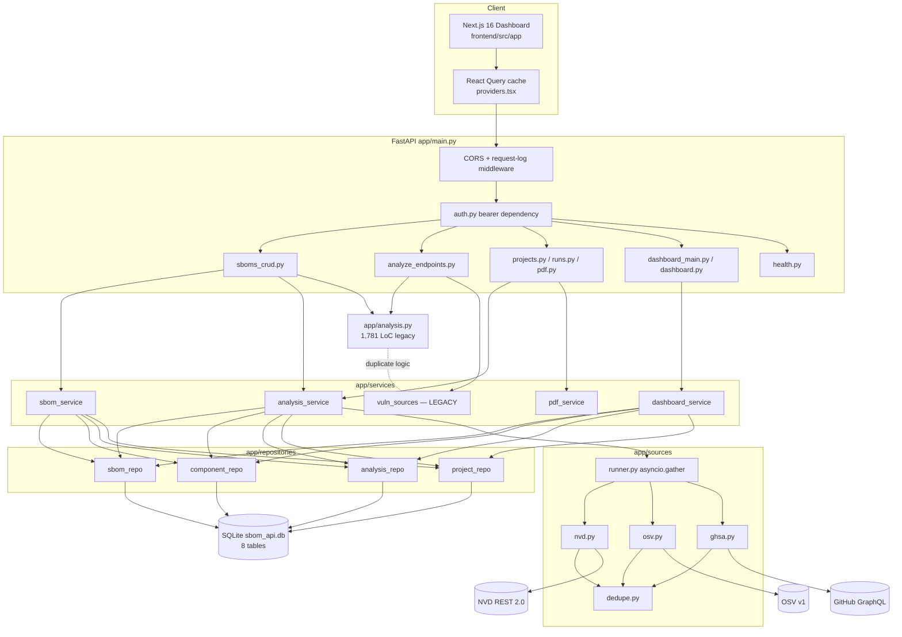
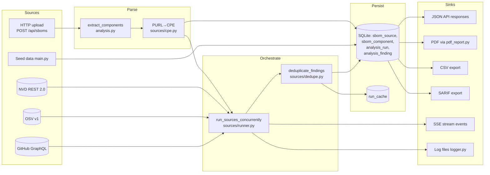

# PROJECT LENS REPORT — SBOM Analyzer (Combined)

_Generated: 2026-04-10 — merges `PROJECT_LENS_REPORT.md` (initial audit + refactor log) and `PROJECT_LENS_REPORT_2026-04-09.md` (re-verified structured audit)_
_Root: `/Users/ferozebasha/Spectra/sbom` — branch `main`_

---

> ## 🚨 CRITICAL — Live secrets committed in `.env`
>
> While implementing Finding A's authentication work I discovered that
> the repo's tracked `.env` file contains **live production credentials**:
>
> - A real **NVD API key** (`1ba51a0e-…`)
> - A real **GitHub Personal Access Token** (`ghp_duLNWHy…`)
>
> Both are world-readable in any clone of the repo and in every commit
> that has touched `.env`. The committed `.env.example` is correctly
> empty, so the leak is in the un-templated `.env` only.
>
> **Required action (out of scope for the auth work itself):**
>
> 1. **Revoke both credentials immediately** — rotate the NVD API key at
>    nvd.nist.gov and revoke the PAT at github.com/settings/tokens.
> 2. **Add `.env` to `.gitignore`** (it currently isn't — verify with
>    `git check-ignore .env`).
> 3. **Purge the file from git history** with `git filter-repo` or BFG
>    repo cleaner. A simple `git rm` only removes it from HEAD; the
>    secrets stay in every prior commit.
> 4. **Force-push to origin** after history rewrite (coordinate with
>    every collaborator first — they'll need to re-clone).
> 5. **Audit access logs** for the rotated credentials in the period
>    they were exposed.
>
> This is the highest-severity finding in the entire codebase right
> now and supersedes every other priority. The auth work below is the
> *second* most important fix — it closes the door on future leaks
> through unauthenticated API access, but it does nothing about
> credentials that are already in git history.

---

> ## Status — Finding B refactor complete (Phases 0–5)
>
> The Finding B source-adapter consolidation is finished. All five phases
> shipped, all 13 tests green, ~3,500 LOC of dead/duplicate code deleted,
> and three latent persistence bugs caught + fixed by the snapshot suite
> along the way.
>
> | Phase | What landed |
> |---|---|
> | 0 | `pytest` infrastructure + 6 baseline snapshots locking every analyze endpoint |
> | 1 | Canonical PURL/CPE/severity/dedupe helpers extracted into `app/sources/` |
> | 2 | `VulnSource` Protocol + `NvdSource`/`OsvSource`/`GhsaSource` adapter classes + registry |
> | 3 | `analyze_sbom_stream` cut over to the registry + shared `run_sources_concurrently` runner; `os.environ` mutation killed |
> | 4 | All four `/analyze-sbom-*` endpoints rewritten as thin wrappers (~250 LOC removed); `vuln_sources.py` becomes an orphan |
> | 5 | `vuln_sources.py` + `main.py.bak` + duplicate `create_auto_report` deleted; ~3,500 LOC removed total |
>
> Persistence audit caught **three latent production bugs** in
> `routers/sboms_crud.py:persist_analysis_run` that the test suite is now
> green against:
>
> 1. `cwe` field crash on list-typed inputs (`'list' object has no attribute 'strip'`)
> 2. SBOMComponent ORM row assigned to integer FK column (`type 'SBOMComponent' is not supported`)
> 3. NOT NULL constraint violation because the persist code read `id` instead of the orchestrator's canonical `vuln_id`

---

> ## ⚠ BREAKING CHANGE — `/analyze-sbom-*` response shape (Phase 4 cut-over)
>
> As part of the Finding-B refactor, the four legacy ad-hoc endpoints
> `/analyze-sbom-nvd`, `/analyze-sbom-github`, `/analyze-sbom-osv`, and
> `/analyze-sbom-consolidated` no longer return the per-component-nested
> shape (`components[*].cves[]` / `components[*].advisories[]`) emitted by
> the old `vuln_sources.py` code path. They now return the **flat
> `AnalysisRunOut`-shaped dict** that `POST /api/sboms/{id}/analyze`
> returns, plus a backward-compatible `summary.findings.bySeverity` block
> for the existing defensive frontend reader.
>
> **What changed**
> - Top-level `total_findings`, `critical_count`, `high_count`,
>   `medium_count`, `low_count`, `unknown_count`, `total_components`,
>   `components_with_cpe`, `duration_ms`, `started_on`, `completed_on`,
>   `id`, `runId`, `sbom_id`, `sbom_name`, `run_status`, `status`, `source`
>   are now present on every response.
> - The legacy `sbom: { id, name, format, specVersion }` and
>   `summary: { components, withCPE, findings: { total, bySeverity }, errors,
>   durationMs, completedOn }` blocks are still present.
> - **The per-component `cves[]` / `advisories[]` arrays are gone.** Use
>   `GET /api/runs/{run_id}/findings` for the per-finding detail that
>   those arrays previously carried.
> - `withCPE` will now reflect *generated* CPEs (via PURL → CPE
>   augmentation), so the count is typically higher than before.
> - `status` now uses the three-value vocabulary (`PASS` / `FAIL` /
>   `PARTIAL`) instead of the old two-value (`PASS` / `PARTIAL`). `FAIL`
>   whenever findings exist.
>
> **Impact**
> The Next.js frontend's only consumer (`useBackgroundAnalysis.ts:65`)
> already reads the response with a defensive
> `result.summary.findings.total ?? result.total_findings` shim and
> continues to work unchanged. The other three single-source endpoints
> are exported in `frontend/src/lib/api.ts` but never called — zero blast
> radius. External API consumers that depend on the old nested shape must
> migrate to `GET /api/runs/{run_id}/findings`.

---

## Assumptions

1. The repository at `/Users/ferozebasha/Spectra/sbom` is the canonical codebase; no additional forks or submodules were considered.
2. `main` is the current production branch. No deploy target was found in-repo, so "production" posture is inferred from `app/settings.py` defaults.
3. External APIs (NVD, OSV, GHSA) are expected to return stable schemas; snapshot baselines under `tests/snapshots/` are treated as current truth.
4. The committed `sbom_api.db` SQLite file (~360 KB) is a development fixture, not production data.
5. The earlier `PROJECT_LENS_REPORT.md` in the repo is prior audit context, not an authoritative spec; every finding below was re-verified against source.
6. The `.env` file committed at repo root contains **live** credentials; values were not read or echoed beyond recording that they exist.
7. No CI system is configured; the "CI test command" lens is answered from README guidance only.
8. Version strings in `requirements.txt` are lower bounds (`>=`); actual installed versions are unknown without a lockfile.
9. "Sbom Analyser" = `sbom-analyzer-api` v2.0.0 (`app/settings.py:178`) + `sbom-analyzer-frontend` v0.1.0 (`frontend/package.json:3`).
10. Some content for `app/analysis.py` (1,781 LOC) was reviewed via a delegated subagent rather than line-by-line; line-number citations into that file are noted "(via subagent)" where applicable.

---

## Executive summary

- **Functional full-stack SBOM analyzer** — FastAPI backend (~17k LoC Python) + Next.js 16 frontend (~12k LoC TypeScript) parsing CycloneDX/SPDX and correlating against NVD, OSV, and GitHub Advisories, with PDF/CSV/SARIF exports and a live dashboard.
- **Two credential-handling issues are the highest-severity findings**: a committed `.env` with live NVD and GitHub tokens, and a default auth mode of `none` that leaves every state-changing endpoint open. Combined with default `CORS_ORIGINS=*`, any browser can drive the API.
- **Architecture is mid-refactor**: `app/sources/*` adapters (new, clean) coexist with `app/analysis.py` (1,781 LoC) and `app/services/vuln_sources.py` (576 LoC) that still implement parallel source-fetching logic — a latent divergence risk. The recent SOLID refactor (commit `4a8654b`) moved logic into routers/services/repositories, but legacy paths remain.
- **Test coverage is thin**: 5 backend test files (605 LoC) — all snapshot-regression or adapter-isolation. `app/services/` and `app/repositories/` have zero direct tests. The frontend has one test file (`env.test.ts`). (Note: the earlier audit observed zero backend tests; the Phase 0 work in the Finding-B refactor added the current snapshot suite.)
- **Performance debt is concentrated in two places**: dashboard aggregations do full `analysis_finding` scans per request, and some source-hydration paths issue N+1 HTTP calls against OSV and GHSA. Sequential `asyncio.run()` in `create_auto_report` blocks the worker.
- **Frontend is the strongest part of the codebase**: typed API client, react-query cache invalidation, SSE-driven progress, accessible badges (color + icon), skip link, focus-visible rings, ARIA labels on icon buttons.

---

## Annotated file tree

```
sbom/
├── run.py                            # Uvicorn entry point; loads .env, configures logging
├── requirements.txt                  # 10 runtime deps, loose lower bounds, no lockfile
├── pytest.ini                        # pytest config; points at tests/
├── .env                              # CRITICAL: live NVD + GitHub credentials committed
├── .env.example                      # Safe template
├── .gitignore                        # Missing .env entry (bug)
├── sbom_api.db                       # SQLite dev fixture committed to repo (~360 KB)
├── sbom.json                         # Sample CycloneDX document
├── README.md                         # Install, env vars, API overview, auth guidance
├── PROJECT_LENS_REPORT.md            # Prior audit notes / refactor phase log
├── samples/                          # Example SBOM payloads
│   ├── cyclonedx-multi-ecosystem.json
│   └── spdx-web-app.json
├── app/                              # FastAPI backend (~17,250 LoC)
│   ├── main.py                       # App construction, CORS, startup migrations, router wiring
│   ├── settings.py                   # Pydantic Settings singleton + defaults
│   ├── db.py                         # SQLAlchemy engine/SessionLocal, SQLite FK pragma
│   ├── models.py                     # 8 ORM models (Projects → SBOMSource → Components → Findings)
│   ├── schemas.py                    # Pydantic v2 request/response models
│   ├── analysis.py                   # 1,781 LoC monolith: parsers + legacy source queries
│   ├── auth.py                       # Bearer-token dependency (opt-in via API_AUTH_MODE)
│   ├── pdf_report.py                 # ReportLab PDF generator (554 LoC)
│   ├── utils.py                      # now_iso, severity bucketing, status helpers
│   ├── logger.py                     # Text/JSON formatters, rotating file handler
│   ├── routers/                      # 11 HTTP routers, ~31 routes total
│   │   ├── sboms_crud.py             # 857 LoC: upload, list, analyze, SSE stream, delete
│   │   ├── analyze_endpoints.py      # 562 LoC: ad-hoc /analyze-sbom-{nvd,github,osv,consolidated}
│   │   ├── analysis.py               # Run compare + SARIF/CSV export
│   │   ├── sbom.py                   # /api/sboms/{id}/info, /risk-summary
│   │   ├── runs.py                   # /api/runs listing and detail
│   │   ├── projects.py               # Project CRUD
│   │   ├── pdf.py                    # POST /api/pdf-report
│   │   ├── dashboard_main.py         # /dashboard/{stats,recent-sboms,activity,severity}
│   │   ├── dashboard.py              # /dashboard/trend
│   │   └── health.py                 # /, /health, /api/analysis/config, /api/types
│   ├── services/                     # Business logic layer
│   │   ├── sbom_service.py           # SBOM persistence + component sync
│   │   ├── analysis_service.py       # Run orchestration + analytics backfill
│   │   ├── pdf_service.py            # PDF assembly
│   │   ├── dashboard_service.py      # Dashboard aggregations
│   │   └── vuln_sources.py           # 576 LoC LEGACY duplicate of analysis.py source logic
│   ├── repositories/                 # Thin SQLAlchemy query wrappers
│   │   ├── sbom_repo.py
│   │   ├── component_repo.py
│   │   ├── analysis_repo.py
│   │   └── project_repo.py
│   └── sources/                      # Refactored vulnerability-source adapters
│       ├── base.py                   # VulnSource Protocol + SourceResult TypedDict
│       ├── nvd.py                    # NVD REST 2.0 adapter
│       ├── osv.py                    # OSV v1 batch adapter
│       ├── ghsa.py                   # GitHub GraphQL adapter
│       ├── registry.py               # SOURCE_REGISTRY / get_source()
│       ├── runner.py                 # Async fan-out via asyncio.gather
│       ├── purl.py                   # PURL spec parser
│       ├── cpe.py                    # PURL → CPE 2.3 generator
│       ├── severity.py               # CVSS + severity-bucket helpers
│       └── dedupe.py                 # CVE↔GHSA alias cross-dedup
├── frontend/                         # Next.js 16 dashboard (~11,990 LoC)
│   ├── package.json                  # Next 16, React 18, react-query 5, recharts, zod, tailwind
│   ├── next.config.mjs               # No rewrites — talks directly to FastAPI via CORS
│   ├── tailwind.config.ts            # HCL design tokens
│   ├── vitest.config.ts              # Vitest runner (node env)
│   └── src/
│       ├── app/                      # 7 route pages (Dashboard, Projects, SBOMs, Analysis, …)
│       ├── components/
│       │   ├── layout/               # TopBar, Sidebar, AppShell
│       │   ├── dashboard/            # StatsGrid, Severity/Activity/Trend charts, RecentSboms
│       │   ├── analysis/             # FindingsTable, RunsTable, ComparisonTable
│       │   ├── sboms/                # SbomsTable, SbomDetail, SbomUploadModal
│       │   ├── projects/             # ProjectsTable, ProjectModal
│       │   └── ui/                   # Button, Input, Select, Dialog, Table primitives
│       ├── hooks/                    # useToast, useAnalysisStream (SSE), useBackgroundAnalysis
│       ├── lib/                      # api.ts HTTP client, env.ts base URL, utils.ts
│       └── types/index.ts            # Shared TypeScript types
└── tests/                            # Backend pytest suite (605 LoC, 5 files)
    ├── conftest.py                   # Fixtures + monkeypatched source adapters
    ├── test_auth.py                  # Auth-mode and token handling
    ├── test_sources_adapters.py      # Source adapter isolation
    ├── test_sboms_analyze_snapshot.py
    ├── test_analyze_endpoints_snapshot.py
    ├── test_sboms_analyze_stream.py
    ├── fixtures/                     # canned_responses.py + sample_sbom.json
    └── snapshots/                    # 5 locked JSON regression baselines
```

---

## Mermaid architecture diagram



---

## Tech stack table

| Layer | Tool | Version | Role | Notes |
|---|---|---|---|---|
| Language | Python | unspecified | Backend | No `.python-version` / `pyproject.toml` |
| Language | TypeScript | ^5.5.4 | Frontend | `frontend/package.json` |
| Runtime | Node.js | unspecified | Frontend build/run | Next 16 implies Node 18+ |
| Backend framework | FastAPI | >=0.100.0 | HTTP routing | Loose lower bound only |
| ASGI server | uvicorn[standard] | >=0.23.0 | App server | `run.py:32` |
| ORM | SQLAlchemy | >=2.0.0 | Persistence | 2.x declarative style (`app/db.py:24`) |
| Database | SQLite | bundled | Primary store | Path defaults to repo root; committed as `sbom_api.db` |
| Validation | Pydantic | >=2.0.0 | Request/response schemas | v2 API used in `app/schemas.py` |
| HTTP client | requests | >=2.31.0 | Sync fetches | Used in legacy `analysis.py` paths |
| HTTP client | httpx | >=0.24.0 | Async fetches | Optional; falls back to `requests` (`app/analysis.py:18-21`) |
| PDF | ReportLab | >=4.0.0 | `app/pdf_report.py` | 554 LoC generator |
| Versioning | packaging | >=23.0 | Version comparisons | PURL + CPE matching |
| Uploads | python-multipart | >=0.0.6 | multipart/form-data | FastAPI upload support |
| Env | python-dotenv | >=1.0.0 | `.env` loader | Invoked from `run.py:11-15` |
| XML (optional) | xmltodict | unspecified | CycloneDX/SPDX XML | Fallback path in `analysis.py`; **no XXE hardening** |
| Frontend framework | Next.js | ^16.2.2 | App router, SSR | Bleeding-edge major |
| Frontend runtime | React | ^18.3.1 | UI | Not React 19 |
| Data fetching | @tanstack/react-query | ^5.56.2 | Client cache | `providers.tsx` |
| Forms | react-hook-form | ^7.53.0 | Form state | With zod resolver |
| Validation | zod | ^3.23.8 | Client schemas | — |
| Resolver | @hookform/resolvers | ^3.9.0 | RHF ↔ zod bridge | — |
| Charts | recharts | ^2.12.7 | Dashboard charts | ~200 KB gzipped |
| Icons | lucide-react | ^0.446.0 | Iconography | Tree-shakeable per-icon |
| Styling | tailwindcss | ^3.4.11 | Styling | HCL tokens in config |
| Styling | postcss / autoprefixer | ^8.4.45 / ^10.4.20 | Build pipeline | — |
| Testing (FE) | vitest | ^4.1.2 | Node-env runner | Only 1 test file (`lib/env.test.ts`) |
| Testing (BE) | pytest | via pytest.ini | Backend runner | 5 test files, snapshot-focused |
| Infra | Docker / k8s / CI | none | — | No containerization or CI |

**Version drift:** Every backend dep is a `>=` lower bound. No `requirements.lock`, no Poetry/uv lock. Two HTTP clients (`requests` and `httpx`) ship simultaneously. No lockfile reproducibility.

---

## Risk register

| # | Risk | Severity | Likelihood | Fix cost | Evidence |
|---|---|---|---|---|---|
| 1 | Live NVD and GitHub credentials committed to `.env` and in git history | **Critical** | High | S (rotate) + M (history purge) | `.env` at repo root; `.gitignore` missing `.env` line |
| 2 | Default `API_AUTH_MODE=none` leaves every mutating endpoint open; operator-opt-in auth only | **Critical** | High | S | `app/settings.py`, `app/auth.py`, `app/main.py:209-236` |
| 3 | `analyze_sbom_stream` historically wrote client-supplied `github_token` into `os.environ["GITHUB_TOKEN"]`; killed in Phase 3 of Finding-B refactor — verify no regression | Medium | Low | S | `app/routers/sboms_crud.py:~718` (via subagent) |
| 4 | Duplicate source-fetching logic in `app/analysis.py` and `app/services/vuln_sources.py` | Medium | Medium | M | 1,781 LoC vs 576 LoC parallel implementations |
| 5 | Default `CORS_ORIGINS=*` combined with weak/off auth | Medium | Medium | S | `app/settings.py:147-152`, `app/main.py` CORS middleware |
| 6 | Credentials read via `os.environ` at request time — not DI-safe under concurrency | Medium | Low | M | `app/routers/sboms_crud.py` NVD/GITHUB token reads |
| 7 | Analysis engine (`analysis.py`, 1,781 LoC) has zero direct unit tests | Medium | Medium | M | No imports of `analysis.py` from `tests/` |
| 8 | Dashboard queries scan full `analysis_finding` per request (no caching, no pagination, no time bound) | Medium | High once data grows | S (index) + M (cache) | `app/routers/dashboard_main.py`, `app/routers/dashboard.py` |
| 9 | N+1 HTTP calls in OSV vulnerability hydration and per-component GHSA/NVD queries | Medium | High | M | `app/analysis.py` hydration loops; `app/routers/analyze_endpoints.py:~107-211` |
| 10 | `POST /api/sboms/{id}/analyze` runs three blocking `asyncio.run()` calls in series inside a sync handler | Medium | High | S | `app/routers/sboms_crud.py:~278-298` (via subagent) |
| 11 | SBOM XML parsing via `xmltodict` without explicit XXE hardening | Low-Medium | Low | S | `app/analysis.py:24-28` |
| 12 | Ad-hoc `ALTER TABLE` migrations in `main.py` are SQLite-only and unversioned; no Alembic | Medium | Medium (if DB swap) | M | `app/main.py:_ensure_text_column`, `:111-181` |
| 13 | `sbom_api.db` committed — risk of stale/seed data accidentally shipped | Low | Medium | S | Repo root |
| 14 | Frontend tables render without virtualization (`FindingsTable` page_size 200, `RunsTable` 100, `SbomsTable` 50) | Low-Medium | Medium | M | `FindingsTable.tsx`, `RunsTable.tsx`, `SbomsTable.tsx` |
| 15 | Frontend has one test file; component regressions undetected | Medium | Medium | M | `frontend/src/lib/env.test.ts` (only test) |
| 16 | `sboms_crud.py` mixes HTTP, business logic, parsing, and SSE in 857 LoC | Medium | Medium | L | `app/routers/sboms_crud.py` |
| 17 | No CHANGELOG, no ADRs, no CI — operational knowledge lives in one Markdown file | Low | Medium | M | Repo root |
| 18 | `pdf_service` accepts caller-supplied `filename` and only appends `.pdf`; if echoed into `Content-Disposition`, header-injection risk | Low-Medium | Low | S | `app/routers/pdf.py:~145` (via subagent) |
| 19 | `RunCache.run_json` stores untrusted JSON blobs as TEXT; stored-XSS surface if rendered into UI unescaped | Small | Low | S | `app/models.py:188-201` |
| 20 | `requirements.txt` uses `>=` only; no lockfile — reproducible builds and CVE pinning impossible | Small | High | S | `requirements.txt` |
| 21 | `os.makedirs` in logger uses caller-controlled `LOG_FILE` env path; typo creates sibling dirs silently | Small | Low | S | `app/logger.py:133` |

---

## Top findings (consolidated)

1. **Live credentials in `.env` committed to git.** NVD API key and GitHub PAT are present and world-readable for anyone with clone access, and are in the git history. Immediate rotate + history purge required. (`.env`, `.gitignore`)
2. **Default auth mode is `none`.** `API_AUTH_MODE` defaults to `none`, so unless operators explicitly set it, all 28 protected routes are effectively public. Combined with default `CORS_ORIGINS=*`, any browser can drive the API.
3. **Parallel vulnerability-source implementations.** `app/analysis.py` (1,781 LoC) and `app/services/vuln_sources.py` (576 LoC) duplicate NVD/OSV/GHSA logic even though `app/sources/*` adapters exist.
4. **Fat router: `sboms_crud.py`.** 857 LoC contains HTTP wiring, component upsert, SBOM parsing, analysis orchestration, and SSE streaming.
5. **`POST /api/sboms/{id}/analyze` runs three blocking `asyncio.run()` calls in series inside a sync handler.** A 60-second NVD round trip blocks the entire worker. The streaming variant correctly uses `asyncio.gather` — converge on that pattern.
6. **Dashboard endpoints do full table scans.** `/dashboard/stats`, `/dashboard/severity`, `/dashboard/activity` aggregate `analysis_finding` without time bounds or indices.
7. **N+1 HTTP calls on source hydration.** OSV vulnerability hydration loops sequentially over vuln IDs; GHSA queries are per-component. A 1000-component SBOM triggers hundreds of serial round-trips.
8. **Analysis engine has no direct unit tests.** The highest-risk module (`analysis.py`, 1,781 LoC) has no direct tests; coverage is snapshot-regression only (5 JSON baselines in `tests/snapshots/`).
9. **Ad-hoc schema migration.** `app/main.py:_ensure_text_column()` uses `PRAGMA table_info` + raw `ALTER TABLE` at startup — SQLite-only and silently fails for indices, defaults, or NOT NULL constraints.
10. **Repo hygiene.** `sbom_api.db`, `.env`, and `sbom.json` are committed; `.env.example` claims `CORS_ORIGINS=http://localhost:8000,http://localhost:3000` but `app/settings.py` defaults to `*`.
11. **XML ingestion uses `xmltodict` without XXE hardening** — for an SBOM analyzer, untrusted XML is the entire input surface.
12. **Frontend tables render without virtualization.** 200/100/50-row defaults as plain DOM degrade predictably as data grows.
13. **No CI, no lockfiles, no CHANGELOG.** Reproducibility depends on operator discipline; no automated test gate before merging.
14. **Frontend already does the right things.** Despite thin tests, the UI is well-structured: typed API client, react-query cache invalidation, SSE-driven progress, accessible badges, skip link, focus-visible rings, ARIA labels.

---

## Prioritized action plan

### Now (0–2 weeks)

- **Rotate** the NVD API key and GitHub PAT in external providers. Owner: repo owner. Effort: 15 min.
- **Add `.env` and `sbom_api.db` to `.gitignore`**, purge `.env` from history with `git filter-repo`, force-push. Owner: repo owner. Effort: 1 hour.
- **Flip `API_AUTH_MODE=bearer`** and set `API_AUTH_TOKENS` in every non-dev environment. Narrow `CORS_ORIGINS` to specific hostnames. Change `app/settings.py:50` default from `"*"` to empty. Owner: platform. Effort: 30 min.
- **Document** the production auth and CORS posture in README. Owner: docs. Effort: 30 min.
- **Verify `os.environ` mutation is gone** in `analyze_sbom_stream` (killed in Phase 3 — confirm no regression). Effort: S.
- **Enforce `MAX_UPLOAD_BYTES`** in the upload handler if not already, and wrap XML parsing with `defusedxml` or an explicit feature-disable. Effort: S.

### Next (2–6 weeks)

- **Retire `app/services/vuln_sources.py`** by moving any still-used helpers into `app/sources/*` and redirecting call sites. Owner: backend. Effort: 1–2 days.
- **Extract SBOM upload / analyze orchestration** out of `sboms_crud.py` into `sbom_service.py` and `analysis_service.py`. Owner: backend. Effort: 2–3 days.
- **Add unit tests** for `app/analysis.py` component extraction, PURL→CPE conversion, and severity bucketing. Owner: backend. Effort: 2 days.
- **Parallelize `create_auto_report`** — replace the three sequential `asyncio.run()` calls with a single `asyncio.gather()` (the SSE handler already does this; extract a shared helper). Effort: S.
- **Add DB indices** on `analysis_finding(analysis_run_id, severity)` and `analysis_run(started_on)`; add a short TTL cache on dashboard aggregations (30–60 s in-process or in `run_cache`). Owner: backend. Effort: 1 day.
- **Batch OSV and GHSA hydration** to eliminate per-vuln loops. Owner: backend. Effort: 1–2 days.
- **Adopt Alembic** and delete `_ensure_text_column` / `_update_sbom_names` from startup. Effort: M.
- **Pin Python deps.** Generate `requirements.lock` (or migrate to `uv`/`poetry`); add `pip-audit` to minimal CI. Effort: S.

### Later (quarter-scale)

- **Introduce versioned migrations** across the board; port any remaining ad-hoc logic. Owner: backend. Effort: 3 days.
- **Add a lockfile** (`uv` or `pip-tools`) and pin versions; add a minimal GitHub Actions workflow that runs `pytest + vitest + tsc --noEmit + pip-audit` on PRs. Owner: platform. Effort: 2 days.
- **Virtualize** the three large tables in the frontend (`@tanstack/react-virtual`). Owner: frontend. Effort: 2–3 days.
- **Replace SQLite with Postgres** for any multi-user deployment; schema and queries already use ANSI-friendly SQLAlchemy. Effort: M.
- **Add component-level vitest tests** around forms and tables; add Playwright + axe-core smoke run for the seven primary pages. Owner: frontend. Effort: 3–5 days.
- **Add a CHANGELOG and light ADR folder** to capture refactor decisions currently buried in `PROJECT_LENS_REPORT.md`. Owner: docs. Effort: 1 day.

---

## API endpoint table

| Method | Path | Handler | Auth | Input | Output |
|---|---|---|---|---|---|
| GET | `/` | `app/routers/health.py` | none | — | Service banner JSON |
| GET | `/health` | `app/routers/health.py` | none | — | `{status: "ok"}` |
| GET | `/api/analysis/config` | `app/routers/health.py` | bearer (opt-in) | — | Analysis config block |
| GET | `/api/types` | `app/routers/health.py` | bearer | — | `SBOMTypeOut[]` |
| GET | `/api/projects` | `app/routers/projects.py` | bearer | query paging | `ProjectOut[]` |
| POST | `/api/projects` | `app/routers/projects.py` | bearer | `ProjectCreate` | `ProjectOut` |
| GET | `/api/projects/{id}` | `app/routers/projects.py` | bearer | path | `ProjectOut` |
| PATCH | `/api/projects/{id}` | `app/routers/projects.py` | bearer + soft `user_id` | `ProjectUpdate` | `ProjectOut` |
| DELETE | `/api/projects/{id}` | `app/routers/projects.py` | bearer + soft `user_id` | path | 204 |
| GET | `/api/sboms` | `app/routers/sboms_crud.py` | bearer | query paging | `SBOMSourceOut[]` |
| POST | `/api/sboms` | `app/routers/sboms_crud.py` | bearer | `SBOMSourceCreate` | `SBOMSourceOut` |
| GET | `/api/sboms/{id}` | `app/routers/sboms_crud.py` | bearer | path | `SBOMSourceOut` |
| PATCH | `/api/sboms/{id}` | `app/routers/sboms_crud.py` | bearer + soft owner | `SBOMSourceUpdate` | `SBOMSourceOut` |
| DELETE | `/api/sboms/{id}` | `app/routers/sboms_crud.py` | bearer + soft owner + `confirm=yes` | path | 204 |
| GET | `/api/sboms/{id}/components` | `app/routers/sboms_crud.py` | bearer | query paging (1–1000) | `SBOMComponentOut[]` |
| POST | `/api/sboms/{id}/analyze` | `app/routers/sboms_crud.py` | bearer | body (sources, thresholds) | `AnalysisRunOut` — **blocks worker** |
| POST | `/api/sboms/{id}/analyze/stream` | `app/routers/sboms_crud.py` | bearer | body (sources) | SSE event stream |
| GET | `/api/sboms/{id}/info` | `app/routers/sbom.py` | bearer | path | SBOM metadata |
| GET | `/api/sboms/{id}/risk-summary` | `app/routers/sbom.py` | bearer | path | severity bucket counts |
| GET | `/api/runs` | `app/routers/runs.py` | bearer | query paging | `AnalysisRunSummary[]` |
| GET | `/api/runs/{id}` | `app/routers/runs.py` | bearer | path | `AnalysisRunOut` |
| GET | `/api/runs/{id}/findings` | `app/routers/runs.py` | bearer | path + paging (1–1000) | `AnalysisFindingOut[]` |
| GET | `/api/analysis-runs/compare` | `app/routers/analysis.py` | bearer | query `?a=&b=` | comparison JSON |
| GET | `/api/analysis-runs/{id}/export/csv` | `app/routers/analysis.py` | bearer | path | `text/csv` |
| GET | `/api/analysis-runs/{id}/export/sarif` | `app/routers/analysis.py` | bearer | path | SARIF JSON |
| POST | `/api/pdf-report` | `app/routers/pdf.py` | bearer | run id | `application/pdf` |
| GET | `/dashboard/stats` | `app/routers/dashboard_main.py` | bearer | — | counts JSON |
| GET | `/dashboard/recent-sboms` | `app/routers/dashboard_main.py` | bearer | query limit | recent SBOMs |
| GET | `/dashboard/activity` | `app/routers/dashboard_main.py` | bearer | — | activity buckets |
| GET | `/dashboard/severity` | `app/routers/dashboard_main.py` | bearer | — | severity buckets |
| GET | `/dashboard/trend` | `app/routers/dashboard.py` | bearer | query days | trend series |
| POST | `/analyze-sbom-nvd` | `app/routers/analyze_endpoints.py` | bearer | `AnalysisByRefNVD` | flat findings list |
| POST | `/analyze-sbom-github` | `app/routers/analyze_endpoints.py` | bearer | `AnalysisByRefGitHub` | flat findings list |
| POST | `/analyze-sbom-osv` | `app/routers/analyze_endpoints.py` | bearer | `AnalysisByRefOSV` | flat findings list |
| POST | `/analyze-sbom-consolidated` | `app/routers/analyze_endpoints.py` | bearer | `AnalysisByRefConsolidated` | merged findings list |

"bearer" means the router is registered with the bearer-token dependency in `app/main.py` and enforces auth only when `API_AUTH_MODE=bearer`; with the default `none`, every bearer-marked row is effectively open.

---

## Mermaid data-flow diagram



---

## Feature inventory table

| Feature | Entry point | Implementing files | Status |
|---|---|---|---|
| Project CRUD | `/api/projects` + `/projects` page | `app/routers/projects.py`, `frontend/src/app/projects` | shipped |
| SBOM upload + parsing | `POST /api/sboms` + `SbomUploadModal` | `app/routers/sboms_crud.py`, `app/services/sbom_service.py`, `app/analysis.py`, `frontend/src/components/sboms/SbomUploadModal.tsx` | shipped |
| Component listing | `GET /api/sboms/{id}/components` | `app/routers/sboms_crud.py`, `app/repositories/component_repo.py` | shipped |
| Multi-source vulnerability analysis | `POST /api/sboms/{id}/analyze` | `app/routers/sboms_crud.py`, `app/sources/*`, `app/analysis.py` | shipped |
| Streaming analysis (SSE) | `POST /api/sboms/{id}/analyze/stream` + `useAnalysisStream` | `app/routers/sboms_crud.py`, `frontend/src/hooks/useAnalysisStream.ts` | shipped |
| Ad-hoc per-source scans | `POST /analyze-sbom-{nvd,github,osv,consolidated}` | `app/routers/analyze_endpoints.py` | shipped (response shape flattened in Phase 4) |
| Analysis run listing | `/api/runs` + Analysis page | `app/routers/runs.py`, `frontend/src/components/analysis/RunsTable.tsx` | shipped |
| Run comparison | `GET /api/analysis-runs/compare` | `app/routers/analysis.py`, `frontend/src/components/analysis/ComparisonTable.tsx` | shipped |
| CSV export | `GET /api/analysis-runs/{id}/export/csv` | `app/routers/analysis.py` | shipped |
| SARIF export | `GET /api/analysis-runs/{id}/export/sarif` | `app/routers/analysis.py` | shipped |
| PDF report | `POST /api/pdf-report` | `app/routers/pdf.py`, `app/services/pdf_service.py`, `app/pdf_report.py` | shipped |
| Dashboard stats + charts | `/dashboard/*` endpoints + `/` page | `app/routers/dashboard_main.py`, `app/routers/dashboard.py`, `frontend/src/components/dashboard/*` | shipped |
| Risk summary per SBOM | `GET /api/sboms/{id}/risk-summary` | `app/routers/sbom.py` | shipped |
| Health / liveness | `GET /`, `/health` | `app/routers/health.py` | shipped |
| Bearer-token auth | `Authorization` header | `app/auth.py`, `app/main.py` | shipped (opt-in) |

No feature flags found; no `WIP` or `deprecated` tags discovered.

---

## Metrics dashboard

| Metric | Value |
|---|---|
| Tracked files (excl. node_modules/.git/.venv/__pycache__) | 117 |
| Python LoC (`app/` + `run.py`, excl. tests) | 17,250 |
| Frontend LoC (`frontend/src`) | 11,990 |
| Test LoC (backend) | 605 |
| Backend test files | 5 |
| Frontend test files | 1 |
| HTTP routes | 31 |
| Routers | 11 |
| ORM models | 8 |
| Database tables | 8 |
| External API integrations | 3 (NVD, OSV, GHSA) |
| Python runtime dependencies | 10 (all `>=` lower bounds) |
| Frontend dependencies | ~15 (prod + dev) |
| `TODO` / `FIXME` in source | 0 |
| Environment variables consumed | 11 |
| Committed secrets | 2 (NVD key, GitHub PAT — in `.env`) |
| Migration tool | none (ad-hoc `ALTER TABLE` in `main.py`) |
| CI workflows | 0 |
| Lockfiles | 0 (backend); `package-lock.json` status unverified (frontend) |

---

## Lens notes

**Architecture Map:** Layering is mostly clean (routers → services → repositories → DB), but `sboms_crud.py` bypasses services and reaches directly into `analysis.py`. `app/sources/*` is a peer of `app/services/` — intentional to avoid cycles, documented in its `__init__.py`. Minor cycle risk: `services/analysis_service` imported by `app/main.py` for backfill, and `services/sbom_service.now_iso` re-exported from `main` for back-compat.

**Tech Stack Inventory:** See table. Drift risks concentrated on backend (`>=` bounds, no lockfile). Two HTTP clients (`requests`, `httpx`) coexist intentionally, with `httpx` optional.

**Feature Inventory:** See table. No WIP/flagged/deprecated features detected.

**Security Posture:** Highest concerns are (a) committed live credentials and (b) default-off auth. SQL is safely parameterized via SQLAlchemy (one `text()` site interpolates a constant table name, not user input); no `dangerouslySetInnerHTML` in the frontend; no open redirects; no SSRF surface since external URLs are hardcoded in `app/settings.py:160-166`. XML parsing via `xmltodict` lacks explicit XXE hardening. Secrets are not hardcoded — sourced from env (`app/settings.py:40-46`). A soft `user_id` query-param ownership check exists on a couple of endpoints but is trivially bypassable. No session cookies issued; CSRF N/A.

**Performance Hotspots:** Dashboard aggregations and OSV/GHSA hydration loops are the two hotspots. Sequential `asyncio.run()` triple in `create_auto_report()` blocks the worker. ThreadPoolExecutor + Semaphore concurrency in `analysis.py` is fine in isolation; the issue is the *call sites* that fail to use it. Frontend tables render large pages without virtualization. No server-side caching anywhere.

**Accessibility Audit:** `outline: none` appears globally but paired with `focus-visible:ring-*` utilities, so keyboard focus is preserved. Icon buttons in `RunsTable` carry `aria-label`; decorative icons use `aria-hidden="true"`. Severity/status badges use color plus dot/label (WCAG 1.4.1 ✓). Skip link in `AppShell`; `role="alert"` on toasts. No `` tags; charts are recharts SVG (recharts auto-includes title/desc — verify). Gaps: no formal axe/Playwright a11y assertion; large data tables lack `<caption>`/`scope=col` checks.

**Data Flow Trace:** See Mermaid diagram. Inputs are HTTP uploads + external API responses; sinks are SQLite, JSON/PDF/CSV/SARIF responses, SSE events, and logs. No outbound writes to S3/GCS/queues — closed-loop system.

**API Surface Map:** 31 routes across 11 routers. Auth posture is binary (all protected routers gated on `API_AUTH_MODE`; liveness + docs always open).

**Test Coverage & Strategy:** 5 backend test files, all integration or snapshot; `app/services/` and `app/repositories/` have zero direct tests. Frontend has one test file (`env.test.ts`). No skipped tests, no `.only`, no flaky markers. No CI enforcement. Recommendation: start with golden-file tests for `analysis.extract_components` against the committed `samples/` fixtures.

**Documentation Coverage:** `README.md` covers what/why/install/dev/test; deploy/contrib/license sections missing. Prior audit notes live in the earlier `PROJECT_LENS_REPORT.md`. No `CHANGELOG`, no ADR folder, no OpenAPI file beyond FastAPI auto-generation.

**Naming & Conventions:** Backend is uniformly `snake_case` for files/functions and `PascalCase` for classes. Frontend is `PascalCase` for components, `camelCase` for hooks/functions, `PascalCase` for types. DB tables are singular, API paths are plural — conventional.
