# Software Design Document For SBOM Analyzer

| | |
|---|---|
| **Project Code** | `<TBD>` (see Open Questions OQ-001) |
| **System** | SBOM Vulnerability Analysis Platform for Medical Devices |
| **Doc ID** | SBOM-DOC-002 |
| **Release Date** | 07-Jul-2026 |
| **Revision** | 0.1 |
| **Status** | Draft — for review |

## Copyright Notice

> **TBD — reuse verbatim from reference document CS-FRMK-DOC-002.** The HCL Technologies confidentiality paragraph must be copied verbatim from the reference document, which is not stored in this repository (see Open Questions OQ-002). Interim text: This document contains proprietary and confidential information of HCL Technologies Limited ("HCLTech"). It is furnished for evaluation and internal use only, may not be reproduced or disclosed to third parties, in whole or in part, without the prior written consent of HCLTech, and must be returned or destroyed upon request. © 2026 HCL Technologies Limited. All rights reserved.

## Review / Approval

| Name | Role / Function | Signature | Date |
|---|---|---|---|
| `<TBD>` | Reviewed By — Software Architect | | |
| `<TBD>` | Reviewed By — Verification and Validation Lead | | |
| `<TBD>` | Reviewed By — Cybersecurity Reviewer | | |
| `<TBD>` | Approved By — Engineering Manager | | |
| `<TBD>` | Approved By — Quality / Regulatory | | |
| `<TBD>` | Approved By — Product Owner | | |

## Revision History

| Revision No. | Date | Prepared By | Summary of changes |
|---|---|---|---|
| 0.1 | 07-Jul-2026 | Feroze | Initial design document for SBOM Analyzer, generated from a full repository investigation (backend, frontend, database, workers, deployment, tests) at Alembic head `041_project_product_hierarchy`, backend version 2.0.0. |

## Glossary

| Abbreviation / Terminology | Description / Definition |
|---|---|
| SBOM | Software Bill of Materials — a machine-readable inventory of the software components contained in a product. The uploaded artefact processed by this platform. |
| CycloneDX | OWASP/Ecma SBOM specification (ECMA-424). The Analyzer accepts CycloneDX 1.4, 1.5 and 1.6 in JSON and XML. |
| SPDX | System Package Data Exchange (formerly Software Package Data Exchange), the Linux Foundation SBOM specification (ISO/IEC 5962:2021). The Analyzer accepts SPDX 2.2 and 2.3 in JSON and Tag-Value. |
| PURL | Package URL (ECMA-427) — canonical package identifier (`pkg:type/namespace/name@version`), the primary component identity used for matching. |
| CPE | Common Platform Enumeration 2.3 (NISTIR 7695) — NVD's platform identifier scheme, used for NVD queries. |
| CVE | Common Vulnerabilities and Exposures identifier (e.g. `CVE-2018-18074`). |
| CVSS | Common Vulnerability Scoring System (FIRST); v3.1 and v4.0 are the current specifications. |
| EPSS | Exploit Prediction Scoring System (FIRST) — daily probability (0–1) that a CVE will be exploited in the next 30 days. |
| KEV | CISA Known Exploited Vulnerabilities catalog — authoritative "known exploited" flag. |
| NVD | U.S. National Vulnerability Database (NIST); consumed through the CVE API 2.0. |
| OSV | Open Source Vulnerability schema and the OSV.dev aggregation service (OpenSSF). |
| GHSA | GitHub Security Advisories (GitHub Advisory Database); IDs of the form `GHSA-xxxx-xxxx-xxxx`. |
| VulnDB | Commercial vulnerability database (VulDB, vuldb.com) — optional fourth source adapter. |
| NTIA | National Telecommunications and Information Administration; publisher of "The Minimum Elements For an SBOM" (July 2021). |
| FDA 524B | Section 524B of the FD&C Act ("Ensuring Cybersecurity of Devices", 21 U.S.C. § 360n-2) — statutory SBOM and vulnerability-management obligations for cyber devices. |
| 510(k) | FDA premarket notification pathway; the Analyzer exports a five-tab 510(k) SBOM Excel workbook. |
| SSE | Server-Sent Events — one-way HTTP streaming used for live analysis and AI-fix progress. |
| JWT | JSON Web Token — bearer token format validated by the backend (RS256 via JWKS in the primary auth mode). |
| OIDC / PKCE | OpenID Connect / Proof Key for Code Exchange — the frontend login protocol against HCL IAM. |
| JWKS | JSON Web Key Set — published public keys used to validate JWT signatures. |
| Celery | Distributed task queue used for scheduled scans, NVD mirror sync and cache maintenance. |
| Celery Beat | Celery's periodic scheduler process (must run as a single instance). |
| Redis | In-memory data store; Celery broker/result backend and AI-fix progress store. |
| Alembic | SQLAlchemy schema migration tool; 41 revisions, head `041_project_product_hierarchy`. |
| ORM | Object-Relational Mapper (SQLAlchemy 2.0, synchronous). |
| DTO | Data Transfer Object — Pydantic request/response schemas at the API boundary. |
| Analysis Run | One execution of the multi-source matching pipeline against an SBOM (`analysis_run` row). |
| Component | A single entry within an SBOM (identified by PURL / CPE / name+version; `sbom_component` row). |
| Finding | A confirmed vulnerability association surfaced to the user (`analysis_finding` row). |
| Match Confidence | Token-overlap score in [0,1] attached to findings (0.5×name + 0.3×version + 0.2×vendor, with per-strategy floors). |
| Canonical CVE | The CVE identifier selected during deduplication to represent a vulnerability reported under multiple aliases (GHSA/OSV/Debian IDs). |
| Feature Flag | Environment-driven toggle in `app/settings.py`; most require a process restart (see Appendix 17.6). |
| SOUP | Software Of Unknown Provenance (IEC 62304 term) — third-party software components, listed in §7.3. |
| VEX | Vulnerability Exploitability eXchange — statements about whether a product is affected by a vulnerability. |
| EOL / EOS / EOF | End of Life / End of Support / End of Fixes — component lifecycle states produced by the lifecycle enrichment chain. |
| RBAC | Role-Based Access Control — 5 roles mapped to 41 permissions. |
| Tenant | Isolation boundary; every business row carries `tenant_id`, enforced at ORM level. |
| SARIF | Static Analysis Results Interchange Format — one of the run export formats. |
| ADR | Architecture Decision Record (`docs/adr/`). |

## Table of Contents

Auto-generated from heading styles (Word: References → Table of Contents; the generated .docx includes a heading-derived TOC).

---

# 1. Introduction

## 1.1 Purpose

This Software Design Document (SDD) describes the architecture, detailed design and implementation approach of the **SBOM Analyzer** — a self-hosted platform that ingests machine-readable Software Bills of Materials (CycloneDX and SPDX), matches their components against multiple vulnerability sources (NVD, OSV, GitHub Security Advisories and optionally VulnDB), enriches confirmed findings with CVSS, EPSS, KEV and component-lifecycle (EOL/EOS) data, and presents the results through analyst and manager dashboards with export capabilities aligned to the FDA 510(k) SBOM template.

The design supports the regulatory context of medical-device cybersecurity: the FDA guidance *Cybersecurity in Medical Devices: Quality Management System Considerations and Content of Premarket Submissions* (February 2026), Section 524B of the FD&C Act (21 U.S.C. § 360n-2), and the NTIA *Minimum Elements For an SBOM* (July 2021). See §16 for the verified standards register.

This document describes the system **as actually implemented** in the repository at the audit baseline (2026-07-06/07, backend version 2.0.0, Alembic head `041_project_product_hierarchy`). Functionality that is planned but not implemented is explicitly labelled `Not Implemented`, `Partially Implemented`, `Planned` or `TBD`, and is consolidated in the companion document *SBOM_Analyzer_Open_Questions*.

## 1.2 Scope

The following topics are in scope:

- Functional description of the SBOM Analyzer
- Software architecture description
- Interface description (internal REST/SSE, external vulnerability sources, user interface)
- Individual functional block explanation (per-endpoint API documentation)
- Data management features (PostgreSQL/SQLAlchemy/Alembic, caches)
- Interoperability features (SBOM format and identifier-scheme support)
- Integration and deployment approach
- Product support
- Security features

**Out of Scope**

- SBOM *generation* tooling in target build environments (the Analyzer ingests SBOMs; it does not author them)
- Vulnerability database content curation (NVD/OSV/GHSA/VulnDB data is consumed as-is)
- Remediation/patching of vulnerable components in target products (the platform tracks remediation status; it does not perform patching)
- VulnDB commercial subscription provisioning and licensing
- Network/infrastructure hardening of the hosting environment (reverse proxy, TLS termination, firewalling are operator responsibilities; no proxy configuration ships in the repository)

## 1.3 Intended Audience

| Audience | Applicable |
|---|---|
| Customer Project Team | Yes |
| Design and Development Team | Yes |
| Verification Team | Yes |
| Manufacturing Team | No — no manufacturing interface exists in this software |
| Others: Cybersecurity reviewers, Quality/Regulatory teams, DevOps/deployment teams, Product stakeholders | Yes |

---

# 2. Reference Document

## 2.1 Reference Documents

| SN | Document ID / File Name | Version No. | Document Description |
|---|---|---|---|
| 1 | `SBOM-DOC-001` | `<TBD>` | Requirement Specification for SBOM Analyzer (not present in this repository; see OQ-003) |
| 2 | FDA — Cybersecurity in Medical Devices: Quality Management System Considerations and Content of Premarket Submissions | Final, February 2026 (supersedes the June 27, 2025 final) | FDA premarket cybersecurity guidance defining SBOM and vulnerability-management expectations |
| 3 | Section 524B, FD&C Act (21 U.S.C. § 360n-2) | Pub. L. 117-328, Div. FF §3305(a), Dec 29 2022; effective Mar 29 2023 | Statutory SBOM submission and cybersecurity obligations for cyber devices |
| 4 | NTIA — The Minimum Elements For a Software Bill of Materials (SBOM) | July 12, 2021 | Baseline SBOM data fields the platform parses and validates (NTIA validation stage) |
| 5 | CycloneDX Specification (ECMA-424) | Supported by product: 1.4 / 1.5 / 1.6 (current spec: 1.7, 2025-10-21) | Primary SBOM ingest format (JSON and XML) |
| 6 | SPDX Specification (ISO/IEC 5962:2021) | Supported by product: SPDX 2.2 / 2.3 (JSON, Tag-Value); SPDX 3.0 rejected as unsupported | Second SBOM ingest format |
| 7 | CVSS v3.1 / v4.0 Specification (FIRST) | v3.1 (June 2019); v4.0 (November 1, 2023) | Severity scoring consumed from sources and displayed per finding |
| 8 | EPSS Model Documentation (FIRST) | EPSS v4 (model v2025.03.14, publishing since 2025-03-17) | Exploit-probability enrichment source |
| 9 | FDA 510(k) SBOM Template (five-tab Excel workbook) | Template file `app/templates/reports/FDA_510k_SBOM_Template 1.xlsx` | Human-readable companion export implemented by the reporting module |
| 10 | ADR-0001 Dashboard posture model and run-status rename | Accepted 2026-04-30 (`docs/adr/0001-dashboard-posture-model.md`) | Canonical run-status vocabulary used throughout this SDD |
| 11 | ADR-0007 SBOM validation architecture | Proposed 2026-04-30 (`docs/adr/0007-sbom-validation-architecture.md`) | Layered upload-validation pipeline design |
| 12 | ADR-0008 Compare Runs v2 architecture | Accepted 2026-05-01 (`docs/adr/0008-compare-runs-architecture.md`) | Run-comparison subsystem design |
| 13 | ADR-0009 Dashboard canonical metrics layer | Accepted 2026-05-02 (`docs/adr/0009-dashboard-canonical-metrics-layer.md`) | Metric conventions A/B/C enforced by architectural test |
| 14 | docs/metric-conventions.md | Working document | Decision flowchart and hard rules for every displayed count |

---

# 3. Functional Description of the System

The SBOM Analyzer is a self-hosted, multi-tenant web platform that turns machine-readable SBOMs into an actionable vulnerability and lifecycle posture. Users upload CycloneDX or SPDX documents; a nine-stage validation pipeline accepts, repairs or quarantines them; accepted SBOMs are decomposed into normalized components; on-demand or scheduled analysis runs fan the component set out to multiple vulnerability sources concurrently, deduplicate and merge the returned advisories onto canonical CVE identities, and persist counted, severity-bucketed findings; read-time enrichment adds EPSS, KEV and lifecycle context; dashboards, drill-downs, comparisons and regulatory exports (including the FDA 510(k) five-tab workbook) present the results. The backend is a FastAPI "modular monolith" (`app/main.py`), the frontend a Next.js App Router single-page application, and PostgreSQL is the system of record.

Key features (all **Current Implementation** unless labelled otherwise):

- Ingestion and parsing of CycloneDX 1.4/1.5/1.6 (JSON, XML) and SPDX 2.2/2.3 (JSON, Tag-Value) SBOMs, with a repairable validation workspace for rejected documents (`app/validation/`, `app/routers/sbom_upload.py`)
- Multi-source vulnerability matching: NVD, OSV, GitHub Security Advisories, and VulnDB (VulnDB adapter is implemented and registered but inert in this deployment because no API key is configured)
- Version-range matching (`app/sources/version_range.py`, `app/sources/applicability.py`) and match-confidence scoring (`app/sources/match_confidence.py`)
- CVSS/EPSS enrichment with NVD backfill via canonical CVE alias resolution (`app/sources/dedupe.py`, `app/services/nvd_enrichment_service.py`, `CveDetailService`/`cve_cache`)
- Scheduled background scans (Celery Beat tick every 15 minutes resolving DAILY/WEEKLY/BIWEEKLY/MONTHLY/QUARTERLY/CUSTOM schedules) and on-demand analysis (`app/workers/scheduled_analysis.py`, `app/routers/schedules.py`)
- Live analysis progress via SSE streaming (`POST /api/sboms/{id}/analyze/stream`)
- Analyst views (findings table with severity/KEV/EPSS/fix drill-downs) and manager dashboard (posture hero, counter tiles, severity donut, vulnerability-age pie with date-range filter, trend chart with granularity and application filters, forecast/exploitation/remediation/risk-map v4 cards)
- Distro PURL→CPE translation (`app/sources/distro_cpe.py`; feature-flagged, default off)
- Response caching for source lookups (`source_response_cache`; feature-flagged, default off) — **Known Limitation:** an *incremental change feed* is named in earlier planning material but is **Not Implemented** (closest implemented capability: run comparison, ADR-0008)
- Match-strategy telemetry (per-finding `match_strategy`, `match_reason`, `match_confidence` columns; NVD rejection counters in `provider_status`)
- Audit trail, structured logging, authentication (HCL IAM OIDC) / authorization (RBAC, 5 roles / 41 permissions), ORM-enforced tenancy
- Export/reporting aligned to the FDA 510(k) SBOM template (five-tab XLSX), plus vulnerability XLSX, CSV, SARIF, PDF, compare exports and SBOM document exports
- Component lifecycle (EOL/EOS/EOF) enrichment through a 12-provider chain (endoflife.date, vendor records, OpenEoX, Xeol, package registries, deps.dev, OSV, repository health), with VEX ingestion/discovery and AI-assisted fix suggestions as adjacent subsystems

**Figure 1 — System Context Diagram**

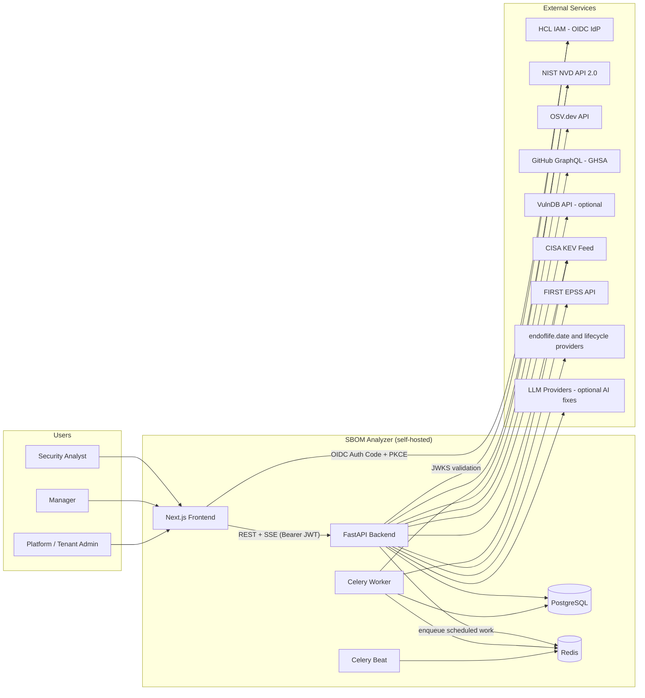

---

# 4. Alternate Design Method Considered

The reference document marks this section "N/A"; for the SBOM Analyzer the following alternatives were considered and rejected. The first three rationales are recorded in repository documentation (README, ADRs, audit reports); where a rationale is inferred from code rather than an explicit decision record, it is marked accordingly.

1. **SaaS scanning platforms (hosted Dependency-Track-style services)** — rejected on data-sovereignty grounds: medical-device SBOMs and their vulnerability posture stay self-hosted. The entire deployment model (self-hosted FastAPI + PostgreSQL + Redis, no outbound telemetry) reflects this. *Rationale inferred from product positioning; no explicit ADR — see OQ-004.*
2. **Single-source (NVD-only) matching** — rejected due to coverage gaps for package-ecosystem advisories. The implemented design is multi-source with alias-based deduplication and per-field precedence (§5.10, Appendix 17.5): OSV/GHSA/VulnDB run first, and NVD runs last as authoritative CVSS/description enrichment over the CVE identifiers the other sources discovered (`app/sources/runner.py:116-126`).
3. **Synchronous in-request scanning for scheduled workloads** — long-running scheduled work is executed by Celery workers (`app/workers/scheduled_analysis.py`), keeping the API responsive. **Current Implementation nuance:** *on-demand* analysis still executes inline in the API process (an asyncio fan-out inside the request; `app/routers/sboms_crud.py:1514,1574`), bounded by a 15/min rate limit; there is no `CELERY_EAGER` mode anywhere in the codebase (the eager-mode "dev convenience" described in earlier planning material was never implemented — searched `task_always_eager`, `CELERY_EAGER`: no hits). **Design Risk:** a long inline scan occupies the API event loop/process (§5.11).
4. **Asynchronous ORM (SQLAlchemy AsyncSession)** — not adopted; the codebase is uniformly synchronous SQLAlchemy behind FastAPI's threadpool, which simplifies the session/tenancy event listeners (`app/db.py:177-241`) at the cost of blocking calls inside some `async def` paths (§5.11, Known Limitation).
5. **Hexagonal architecture for the whole backend** — adopted only for the NVD mirror package (`app/nvd_mirror/` with explicit ports/adapters); the rest of the backend is a layered modular monolith. `app/ports/` exists as an empty placeholder (`__all__ = []`), documenting the intent without implementation.

---

# 5. Software Architecture Description

## 5.1 Software System Architecture

The system comprises a Next.js 16 (App Router, React 19, TanStack Query 5) single-page frontend that calls a FastAPI 0.139 backend directly (no proxy — `frontend/next.config.mjs` is deliberately empty because proxying caused ECONNRESET on 47–120 s analysis calls). The backend is a Python ≥3.11 modular monolith: routers → services → source adapters/metric layer → synchronous SQLAlchemy 2.0 persistence on PostgreSQL (SQLite permitted for development via `ALLOW_SQLITE=true`). Redis brokers a Celery 5.6 worker and a single Celery Beat scheduler for background work (scheduled scans, NVD mirror sync, KEV refresh, cache purges). External integrations are the four vulnerability sources, the KEV/EPSS feeds, the lifecycle provider chain, HCL IAM (OIDC), and optional LLM providers for AI fix suggestions.

**Implementation Reference:** `app/main.py` (app assembly), `frontend/src/lib/api.ts` (API client), `app/workers/celery_app.py` (queue/scheduler), `app/db.py` (engine/session/tenancy).

**Figure 2 — High-Level Component Architecture**

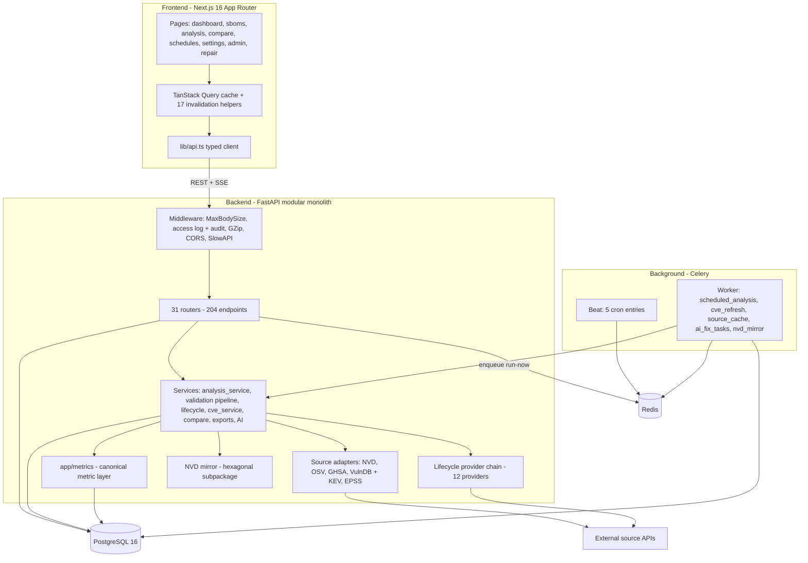

## 5.2 System Integration Architecture

The deployable unit set is: **api** (uvicorn, ≥1 replica), **worker** (Celery, ≥1), **beat** (exactly 1 — duplicate beats double-fire schedules), **PostgreSQL**, **Redis**, and the **frontend** (Next.js, port 3000). All three Python processes are built from the same backend image (`Dockerfile`, non-root user, `EXPOSE 8000`) and differ only in command (`uvicorn app.main:app` vs `scripts/celery_worker.sh` vs `scripts/celery_beat.sh`). The browser talks to FastAPI directly over REST plus three SSE channels; there is no reverse proxy configuration in the repository.

**Operational constraint (Current Implementation):** configuration, including feature flags, is read once per process via the cached `get_settings()` singleton (`app/settings.py:728-741`). **Flags must therefore be set in the environment of every process that consumes them — in particular the Celery worker — and the affected processes restarted after any flag change.** Exceptions that take effect without restart: `API_AUTH_MODE`/`API_AUTH_TOKENS` (read per request), NVD-mirror settings (DB-backed, rebuilt per task), and DB-backed AI credentials.

**Figure 3 — Deployment Architecture**

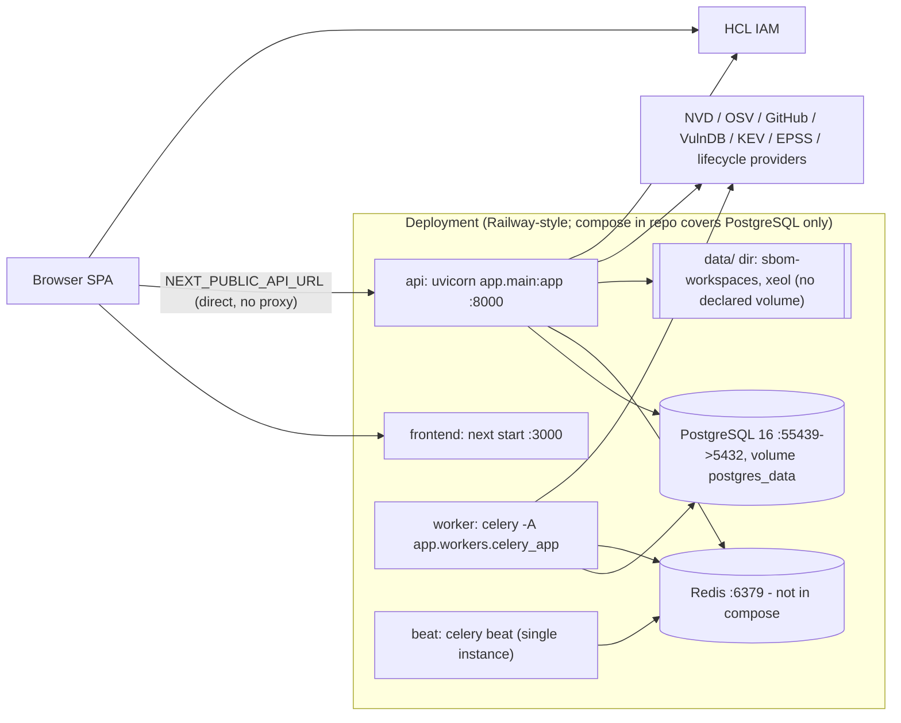

**Known Limitation:** `docker-compose.yml` (425 bytes) provisions **only** `postgres:16`; Redis, worker, beat and the frontend have no compose/K8s/systemd definitions in the repository, and the frontend has no Dockerfile. Database migrations are executed manually (`alembic upgrade head`); the API refuses to boot on a stale schema (§5.6). See §10 of the Open Questions document.

## 5.3 Domain Terms

1. **SBOM** — the uploaded bill-of-materials document (CycloneDX/SPDX), persisted as `sbom_source` with the full document text in `sbom_data`.
2. **Component** — a single entry within an SBOM (identified by PURL, CPE, or name+version), persisted as `sbom_component` with ~25 normalized identity fields.
3. **Analysis Run** — one execution of the matching pipeline against an SBOM (`analysis_run`), carrying status, severity counters and the raw report JSON.
4. **Match** — a candidate pairing of component ↔ advisory with strategy, reason, matched range and confidence. *Matches are not a separate table*: accepted matches become findings carrying `match_strategy`/`match_reason`/`matched_range`/`match_confidence` columns; rejected candidates are counted in `provider_status` JSON and logs only.
5. **Finding** — a confirmed vulnerability association surfaced to the user (`analysis_finding`), unique per `(analysis_run_id, vuln_id, cpe)`.
6. **Advisory / Canonical CVE** — source records normalized into finding dictionaries; the canonical CVE is selected during deduplication (CVE > GHSA > OSV > first alias) with all other identifiers retained in `aliases`. Raw source payloads are cached in `source_response_cache`/`nvd_lookup_cache`; merged CVE details for the modal live in `cve_cache`.
7. **Source Adapter** — per-source client implementing the `VulnSource` protocol (`app/sources/base.py`): `NvdSource`, `OsvSource`, `GhsaSource`, `VulnDbSource`.

## 5.4 Module Description

| Module Name | Description | Make/Buy/Re-Use | Verification/Validation for Buy/Re-use | Remarks |
|---|---|---|---|---|
| SBOM Ingestion & Parsing | Upload endpoint, 9-stage validation pipeline (ADR-0007), format detection, parsers, normalization, repair workspace | Make | In-house pytest suites (`tests/validation/`, 15 files) | Uses re-used libs: jsonschema, lxml+defusedxml, spdx-tools, cyclonedx-python-lib, license-expression |
| Matching Engine (version-range + confidence) | NVD configuration walker, GHSA range evaluator, OSV version-qualified queries, confidence scorer with strategy floors | Make | `tests/sources/` (8 files) + integration tests | Comparator dispatch per ecosystem (semver/PEP 440/Maven/distro-conservative) |
| Source Adapters ×4 (NVD, OSV, GHSA, VulnDB) | Per-source clients consuming external APIs, concurrent fan-out runner | Make (consuming external APIs) | Adapter tests + canned-response fakes (`tests/test_sources_adapters.py`, `mock_external_sources`) | VulnDB implemented but inert without `VULNDB_API_KEY` |
| Enrichment Service — CVSS/EPSS/KEV + NVD backfill | `NvdEnrichmentService` (budgeted, cached, circuit-broken), `CveDetailService`/`cve_cache`, EPSS/KEV caches | Make | `tests/test_nvd_enrichment_service.py`, `test_cve_*`, `test_kev_cache_refresh.py` | NVD runs last to backfill CVSS/description onto CVEs found by other sources |
| Lifecycle Enrichment | 12-provider EOL/EOS chain with decision engine, cache and admin CRUD | Make | `tests/test_lifecycle_*` (6 files) | endoflife.date, Xeol, OpenEoX, registries, deps.dev re-used as data services |
| Scheduler | Cadence computation, due-target resolution, beat tick | Re-use: Celery Beat + Make (resolver) | `test_scheduling_service.py`, `test_schedule_resolver.py`, `test_schedules_api.py` | Beat crontabs hard-coded; beat single-instance |
| Task Queue | Celery over Redis broker/result backend | Re-use: Celery 5.6.3 / Redis | Task tests invoke in-process; no live-broker test | JSON-only serializers; no acks_late/time limits configured (Design Risk §5.11) |
| SSE Progress Streaming | Inline analyze stream (asyncio.Queue); AI-fix progress store (Redis-first, in-memory fallback) polled every 2 s | Make | `test_sboms_analyze_stream.py`, AI progress tests | No Redis pub/sub; compare streaming reserved, not implemented |
| Auth (OIDC/JWKS + RBAC + tenancy) | HCL IAM token validation, permission mapping, ORM tenant isolation | Make + Re-use lib (PyJWT 2.13, cryptography 49) | `test_hcl_iam_auth.py`, `test_rbac_permissions.py`, `test_tenant_isolation.py` | Backend issues no tokens; frontend does OIDC PKCE |
| Audit Trail | Middleware auto-audit + domain writers into `audit_log` (+ credential/remediation/session-event audit tables) | Make | Asserted incidentally in feature tests; no dedicated suite (gap) | Fail-open writes (never block requests) |
| Logging | Structured logging (text console / JSON file, rotating) | Re-use: Python logging + Make config | `test_500_no_leak.py` (leak guard) | uvicorn access log disabled in favour of middleware log |
| Frontend Dashboards | Posture hero, tiles, charts, drill-downs, v4 advanced cards | Make | 75 Vitest suites incl. drill-down integration tests | recharts re-used for charting |
| Export/Reporting | FDA 510(k) XLSX, vulnerability XLSX, CSV, SARIF, PDF, compare exports, SBOM document export | Make | `test_fda_510k_excel_report.py`, `test_sbom_vulnerability_excel_report.py`, `test_match_strategy_export.py` | openpyxl and reportlab re-used |
| NVD Mirror | Hexagonal local NVD corpus mirror with hourly sync | Make | `tests/nvd_mirror/` (15 files) | Default disabled; cache-only pre-pass wired into pipeline |
| AI Fix Generation | Multi-provider LLM fix suggestions, batching, budgets, credential vault | Make + Re-use provider SDK-compatible HTTP | `tests/ai/` (29 files) | Flag-gated, default off; AES-256-GCM key storage |

## 5.5 Segregation of Software

The backend is layered; import direction is enforced for the parsing and validation layers by import-linter contracts (`pyproject.toml [tool.importlinter]`: parsing must not import routers; validation must not import HTTP/services/DB; validation must not use runtime HTTP).

**Figure 4 — Layered Backend Architecture**

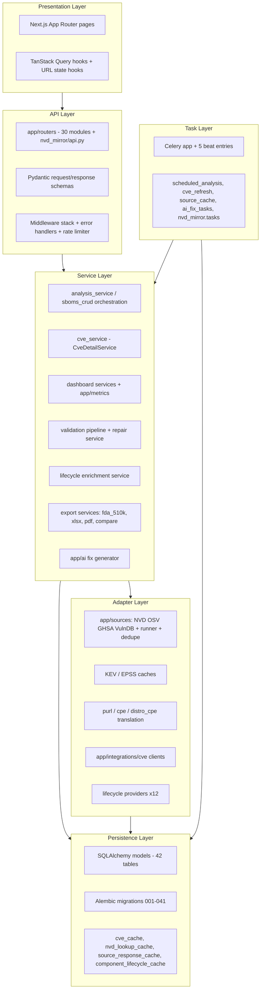

### 5.5.1 API Layer
FastAPI routers (31 registered routers, 204 endpoints — §10), Pydantic v2 request/response schemas, and the middleware stack in exact runtime order (outermost first): `MaxBodySizeMiddleware` (50 MB, pure ASGI, 413), `log_requests` (access log + inline security audit), `GZipMiddleware` (min 1000 bytes), `CORSMiddleware`, `SlowAPIMiddleware` (300/min default, 15/min analyze). Global handlers: catch-all 500 envelope with correlation id (`app/error_handlers.py`), SQLAlchemy pool-timeout → 503 `DATABASE_BUSY`, slowapi 429. **Implementation Reference:** `app/main.py:711-914`, `app/middleware/max_body.py`, `app/rate_limit.py`.

### 5.5.2 Service Layer
Analysis orchestration (`create_auto_report`/`persist_analysis_run` in `app/routers/sboms_crud.py` + `app/services/analysis_service.py`), `CveDetailService` (merged CVE modal payloads into `cve_cache`), dashboard aggregation exclusively through `app/metrics/` (19 modules; conventions A/B/C — §11), validation/repair (`app/validation/pipeline.py`, `app/services/validation_repair_service.py`), lifecycle enrichment (`app/services/lifecycle/`, 28 modules), exports (`app/services/fda_510k_excel_report_service.py`, `sbom_vulnerability_excel_report_service.py`, `compare_export.py`, `app/pdf_report.py`), and the AI subsystem (`app/ai/`).

### 5.5.3 Adapter Layer
NVD/OSV/GHSA/VulnDB clients behind the `VulnSource` protocol with the concurrent runner and cross-source dedupe (`app/sources/`), EPSS/KEV feed caches, PURL parsing and PURL→CPE translation (`app/sources/cpe.py`, `distro_cpe.py`), and the separate CVE-modal client set with per-source circuit breakers (`app/integrations/cve/`).

### 5.5.4 Persistence Layer
SQLAlchemy declarative models — 42 tables across `app/models.py` (39), mixins, and `app/nvd_mirror/db/models.py` (3) — Alembic migrations 001–041, and the cache tables (`cve_cache`, `nvd_lookup_cache`, `source_response_cache`, `component_lifecycle_cache`, `epss_score`, `kev_entry`, `run_cache`, `compare_cache`). Cross-cutting ORM listeners implement soft-delete filtering and tenant isolation (`app/db.py:177-241`).

### 5.5.5 Task Layer
Celery application (`app/workers/celery_app.py`) with five hard-coded beat entries (§5.7) and task modules `scheduled_analysis`, `cve_refresh`, `source_cache`, `ai_fix_tasks`, `nvd_mirror.tasks`. **Known Limitation:** cooperative cancellation points exist only in the AI-fix batch pipeline; analysis runs have no cancellation (§5.10.5).

### 5.5.6 Presentation Layer
Next.js App Router pages (19 routes), TanStack Query hooks with a 17-helper invalidation layer (`frontend/src/lib/queryInvalidation.ts`) guarded by an architectural test, and URL-state hooks `useAnalysisUrlState`, `useCompareUrlState`, `useFindingsFilterFromUrl` (§8.3).

---

## 5.6 Startup and Shutdown Handling

**Startup (FastAPI lifespan, `app/main.py:679-708`, in order):**

1. `setup_logging()` re-applied (uvicorn's dictConfig would otherwise clobber handlers).
2. `init_async_http_client()` — shared `httpx.AsyncClient` (100 connections, 20 keep-alive, 60 s timeout, certifi TLS).
3. Log DB dialect + host/database only (credentials never logged).
4. `_ensure_seed_data()` — first `_verify_schema_is_current()`: compares `alembic_version` against `ScriptDirectory.get_heads()` and **raises `RuntimeError` ("run 'alembic upgrade head'") on mismatch — migrations are never auto-run on PostgreSQL**. On SQLite only, `Base.metadata.create_all` plus an idempotent `_ensure_column` ladder replays columns for pre-Alembic dev databases. Then seeds: Tenant id=1, IAMUser id=1 (`dev-user`), `TENANT_ADMIN` membership, SBOMType rows (CycloneDX, SPDX), lifecycle provider defaults, and `backfill_analytics_tables()`.
5. `_update_sbom_names()` — **unconditional full-table UPDATE** of `analysis_run.sbom_name` from `sbom_source` on every boot (**Design Risk:** slow boot on large tables; concurrent multi-replica boots race; `app/main.py:624-638`).
6. `_reconcile_zombie_ai_fix_batches()` — AI-fix batches stuck in-flight >5 min are marked `failed` at startup.
7. `validate_auth_setup()` — fail-fast auth configuration check (refuses boot when `AUTH_ENABLED=true` without the four `HCL_IAM_*` settings; logs a "protected routes are open" warning when auth is off).

**Shutdown:** lifespan closes the shared async HTTP client; uvicorn/Celery rely on default signal handling. Celery workers have `worker_process_init/shutdown` hooks that create/close the worker's HTTP client.

**Zombie-run handling (Current Implementation — Known Limitation):** the inline analyze endpoints create `PENDING`/`RUNNING` rows before fan-out. If the API process dies mid-run — or the SSE client disconnects (the `asyncio.CancelledError` raised into the generator is not caught by the `except Exception` at `app/routers/sboms_crud.py:1891`) — the row remains active forever. Because the concurrency guard `get_active_analysis_run()` (`app/services/analysis_service.py:153`) has **no age cutoff**, every subsequent analyze request for that SBOM returns `already_running` indefinitely; recovery is a manual SQL update. There is **no detection or cleanup job for stranded `analysis_run` rows** (searched `zombie`, `stale`, `orphan`, `reconcile` — only the AI-fix batch reconciler exists). **Recommended Improvement:** add an age-bounded active-run check and a startup/periodic reaper mirroring `_reconcile_zombie_ai_fix_batches()`. Note that Redis/Celery being down does **not** strand rows on the scheduled path — the scheduled task creates its run row only at completion; enqueue failures on `run-now` return HTTP 502 `broker_unavailable`.

## 5.7 Background Processing Hosting

Celery worker(s) and one Celery Beat process host background work; Redis is broker **and** result backend (`CELERY_BROKER_URL` falling back to `REDIS_URL`). Serializers are JSON-only (no pickle). Beat entries are hard-coded (`app/workers/celery_app.py:59-94`):

| Beat entry | Cadence | Task |
|---|---|---|
| `nvd-mirror-hourly` | hourly at :15 | `nvd_mirror.mirror_nvd` (no-op unless mirror enabled) |
| `analysis-schedule-tick` | every 15 min | `scheduled_analysis.tick` |
| `cve-refresh-kev` | every 6 h at :10 | `cve_refresh.refresh_kev_cache` |
| `cve-cache-purge` | daily 03:30 UTC | `cve_refresh.purge_expired` |
| `source-cache-sweep` | daily 03:45 UTC | `source_cache.sweep_expired` |

**Are Celery/Redis core?** Split verdict (verified): upload validation and **on-demand analysis run inline in the API process and work with Redis down**; Celery/Redis are **mandatory** for scheduled/periodic scans (the product's recurring-scan value), NVD mirror sync, KEV refresh, cache purging/sweeping, and multi-process AI-fix coordination (`POST /api/schedules/{id}/run-now` returns 502 when the broker is down; AI fixes fall back to a documented dev-only inline path). Production deployments must therefore provision Redis + worker + beat. There is **no eager mode**: `task_always_eager`/`CELERY_EAGER` do not appear in the codebase.

**Design Risk (Celery hardening):** `task_acks_late`, task time limits, prefetch/concurrency tuning and dedicated queues are all unset — a worker crash mid-task loses the task (early ack), and one slow task can block others on the default queue. Scheduled runs mitigate with task-level `max_retries=3` + backoff and schedule-level failure backoff (1 h→24 h cap).

## 5.8 Initialization / Configuration Parameters

Configuration is environment-driven via pydantic-settings (`app/settings.py`, `.env` file, case-insensitive) plus a small number of module-level and per-request reads. The complete register (~150 variables with purpose, type, mandatory/optional, default, consumer process, restart requirement, security classification and missing-value behaviour) is the companion document *SBOM_Analyzer_Configuration_Reference*; the operationally critical subset:

| Key (env) | Type | Mandatory | Default | Description / behaviour when missing |
|---|---|---|---|---|
| `DATABASE_URL` | str (secret) | Yes | "" | SQLAlchemy URL. Missing → `RuntimeError` at import unless `ALLOW_SQLITE=true`; PostgreSQL URL without a password is refused. |
| `REDIS_URL` | str | For async paths | `redis://localhost:6379/0` | Celery broker/result backend; scheduled work unusable if unreachable. |
| `CELERY_BROKER_URL` | str | No | "" | Broker override; falls back to `REDIS_URL`. |
| `AUTH_ENABLED` | bool | No | **false** | When false the API fabricates a `dev-user` TENANT_ADMIN context — **development default is fully open**; production must set true. |
| `HCL_IAM_ISSUER` / `HCL_IAM_AUDIENCE` / `HCL_IAM_JWKS_URL` / `HCL_IAM_CLIENT_ID` | str | When `AUTH_ENABLED=true` | "" | Server refuses to start if missing; JWKS URL must be HTTPS. |
| `NVD_API_KEY` | secret | Recommended | "" | Anonymous NVD access continues at slower pacing (6.0 s vs 1.0 s minimum delay). |
| `GITHUB_TOKEN` | secret | For GHSA | "" | GHSA source returns an error row and zero findings when absent. |
| `VULNDB_API_KEY` | secret | For VulnDB | "" | VulnDB adapter emits a warning-only empty result; VULNDB-only endpoint returns 400. |
| `ANALYSIS_SOURCES` | csv | No | `NVD,OSV,GITHUB` | Source selection for analysis runs (`VULNDB` may be appended). |
| `CORS_ORIGINS` | csv | No | `*` | Wildcard default; credentials disabled. Production should restrict. |
| `AI_CONFIG_ENCRYPTION_KEY` | secret | For AI credentials | — | AES-256-GCM master key; credential encrypt/decrypt fails without it. **Missing from `.env.example`** (OQ-021). |
| `NVD_MIRROR_FERNET_KEY` | secret | For mirror secret storage | — | Fernet key; must be identical on api/worker/beat. Missing from `.env.example`. |
| `API_RATE_LIMIT_DEFAULT` / `API_RATE_LIMIT_ANALYZE` | str | No | `300/minute` / `15/minute` | slowapi buckets. |
| Feature flags | bool | No | see Appendix 17.6 | `NVD_VERSION_RANGE_FILTER_ENABLED`, `SOURCE_CACHE_ENABLED`, `DISTRO_CPE_ENABLED`, `AI_FIXES_*`, `CVE_MODAL_ENABLED`, `COMPARE_*`, lifecycle provider flags, `NVD_MIRROR_ENABLED` — all default-off except `CVE_MODAL_ENABLED`/`NVD_ENABLED`. Restart required (Settings singleton). |
| `NEXT_PUBLIC_API_URL` | str (public) | Yes (frontend) | — | Frontend throws at startup if unset (no silent fallback). Build-time inlined. |

Behaviour on missing mandatory configuration is fail-fast at process start (`DATABASE_URL`, HCL IAM set, frontend API URL) rather than degraded operation.

## 5.9 Integration Approach

A target environment stands the system up in this order: (1) provision PostgreSQL and Redis; (2) create the runtime env files from `.env.example` / `frontend/.env.local.example` (adding the two encryption keys noted above); (3) run `python -m alembic upgrade head` against the database — the API verifies but never applies migrations; (4) start api, worker, beat from the backend image; (5) build and start the frontend with `NEXT_PUBLIC_API_URL` pointing at the API origin; (6) place TLS termination/reverse proxy in front (operator-supplied — none ships in the repo). Health checks: `GET /health` (used by `railway.toml`).

**Staged rollout of flag-gated features:** the repository implements the flag mechanics for a staged rollout (all analysis-quality flags default off: version-range filter, source cache, distro CPE; AI fixes additionally have a kill switch and a deterministic `AI_CANARY_PERCENTAGE` cohort hash with 409 for blocked cohorts; NVD rejection telemetry provides the metric signal). Rollout/rollback runbooks exist for AI fixes, compare, CVE modal and SBOM validation (`docs/rollout-*.md`, `docs/runbook-*.md`). **Known Limitation:** the five-phase rollout plan with metric gates referenced by the SDD structure is not recorded as a single consolidated document in the repository — phases are spread across the per-feature runbooks (OQ-005). Rollback = flip the flag off in the affected processes' environment and restart them (worker restart mandatory).

---

## 5.10 Analysis Pipeline Flows

### 5.10.1 SBOM Upload & Parse

`POST /api/sboms/upload` (202 on success) validates **before** any trusted write: rejected SBOMs are never inserted into `sbom_source`; repairable failures are staged in `sbom_validation_sessions` (security-blocked payloads are not staged at all). Persistence is multi-commit: validation session → `sbom_source` (full document text in `sbom_data`) → extracted `sbom_component` rows (deduplicated, duplicates retained with `is_duplicate=true`) → FastAPI `BackgroundTasks` post-upload enrichment (lifecycle sync, embedded-VEX processing, NVD cache warm, completeness score) tracked on `sbom_source.enrichment_status`. Details: §8.3 (upload UX), §10 (endpoint contract), Appendix 17.8 (error codes).

**Figure 5 — SBOM Upload Sequence**

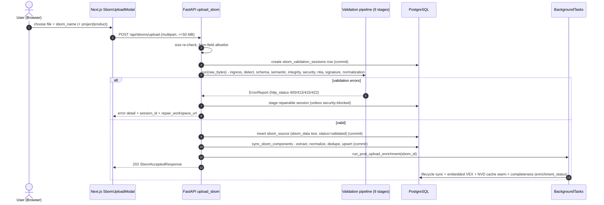

### 5.10.2 On-Demand Analysis Run

Both on-demand entry points execute the pipeline **inline in the API process** (no Celery): `POST /api/sboms/{id}/analyze` (creates the run row only at the end, in a terminal state) and `POST /api/sboms/{id}/analyze/stream` (creates `PENDING` → `RUNNING` up front and streams progress). Order of operations (`create_auto_report`, `app/routers/sboms_crud.py:433`):

1. `get_active_analysis_run()` — bail out with `already_running` if an active run exists (no age bound — §5.6).
2. `extract_components()` + dependency edges; component-level dedup pre-scan (`ComponentDeduplicationService`).
3. `enrich_component_for_osv()` per component; `_augment_components_with_cpe()` derives missing CPEs from PURLs (`trusted_mapping` vs `generated_fallback` provenance).
4. `build_source_adapters(configured_default_sources())` — adapters constructed with bound credentials + optional NVD-mirror cache-only pre-pass.
5. `run_sources_concurrently()` — **OSV, GHSA and VulnDB run concurrently via `asyncio.gather`; NVD runs last, sequentially**, so `NvdSource.query_with_vulnerabilities()` can batch-enrich the CVE identifiers the fast sources already found. Per-source exceptions become error rows and progress events; **one source failure never aborts the run**.
6. `deduplicate_findings()` — cross-source alias merge (pass 1).
7. `filter_unconfirmed_provider_findings()` — drops candidates lacking `applicability_status == "affected"`.
8. `compute_report_status()` — `FINDINGS` when findings exist (even with provider errors; the source label gains a `" (partial)"` suffix), `PARTIAL` only when 0 findings **and** ≥1 provider error, else `OK`.
9. `persist_analysis_run()` — upserts components, canonical-identity dedup (pass 2), inserts `analysis_finding` rows (previous rows of the run deleted first), computes counters from persisted rows (pass 3), sets final status; single commit at the end.

**Figure 6 — On-Demand Analysis Sequence**

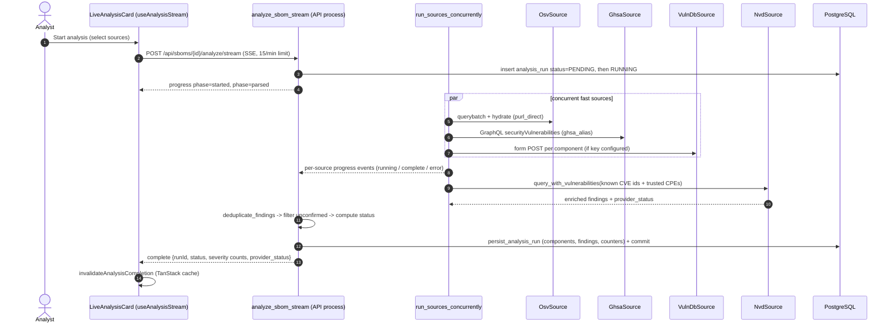

**Figure 7 — Vulnerability Source Execution Flow**

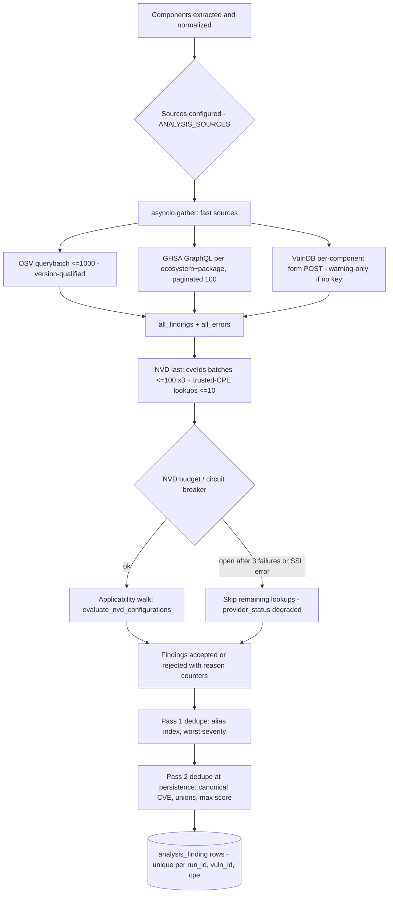

### 5.10.3 Scheduled Daily Scan (Beat → Worker)

Celery Beat fires `scheduled_analysis.tick` every 15 minutes. `find_due_targets()` resolves enabled `analysis_schedule` rows with `next_run_at <= now`, cascading PROJECT/PRODUCT scopes down to member SBOMs (SBOM-scope rows win; PRODUCT beats PROJECT). The tick advances `next_run_at` (catch-up = fast-forward, no backlog) **whether or not** the per-SBOM task succeeds, then enqueues `scheduled_analysis.analyze_sbom` per SBOM (retry ×3, backoff ≤900 s). The task skips when a recent run exists within `min_gap_minutes` (default 60), executes the same `create_auto_report` path as on-demand (`trigger_source="schedule"`), and writes `last_run_status`/`last_run_id`/`consecutive_failures` back to the schedule; failures apply exponential schedule backoff (1 h → 24 h cap).

**Figure 8 — Scheduled Analysis Sequence**

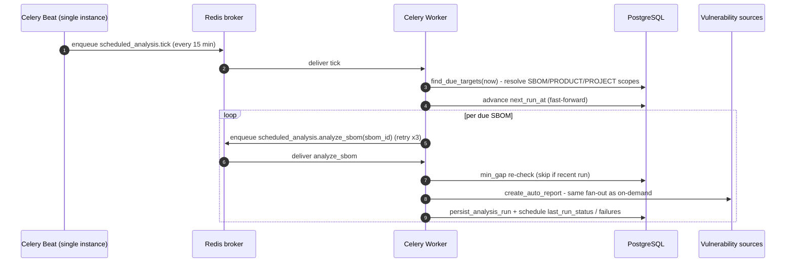

### 5.10.4 Enrichment & NVD Backfill

Enrichment has two distinct phases:

**In-run (write path):** the fast sources supply per-advisory CVSS/severity (OSV via `_best_score_and_vector_from_osv`; GHSA via `advisory.cvss`; severity bucketing CRIT ≥9.0 / HIGH ≥7.0 / MED ≥4.0, env-tunable). NVD then backfills authoritative CVSS scores, vectors, descriptions and CWEs onto the canonical CVE identities discovered by the others — this is the "Debian OSV gap path": a `DEBIAN-CVE-*`/`GHSA-*` observation with no score gets its CVE alias resolved during dedup and its CVSS filled by the NVD batch query. The `NvdEnrichmentService` is budgeted (≤3 batches × 100 CVE ids + ≤10 trusted-CPE lookups per scan), DB-cached (`nvd_lookup_cache`, success/no-result 24 h, failure 60 min), rate-limited process-globally, and guarded by a per-scan circuit breaker (threshold 3; SSL errors open immediately).

**Read-time / periodic (no findings mutation):** EPSS scores are fetched on demand in 100-CVE batches into `epss_score` (24 h TTL, no beat task); the KEV catalog is mirrored into `kev_entry` (24 h TTL + 6-hourly beat force-refresh); `GET /api/runs/{id}/findings-enriched` joins both and computes `risk = cvss × (1 + amplifier×epss) × kev_multiplier`. The CVE detail modal is served by `CveDetailService`, which fans out to OSV+GHSA+NVD+EPSS+KEV clients (per-source circuit breakers, threshold 5 / reset 60 s), merges with deterministic precedence (summary GHSA→OSV→NVD; **CVSS: NVD authoritative**), and caches the merged payload in `cve_cache` (TTL-bucketed: KEV 6 h, recent 24 h, stable 7 d, error 15 min; purged daily by beat).

**Figure 9 — CVE Enrichment Flow**

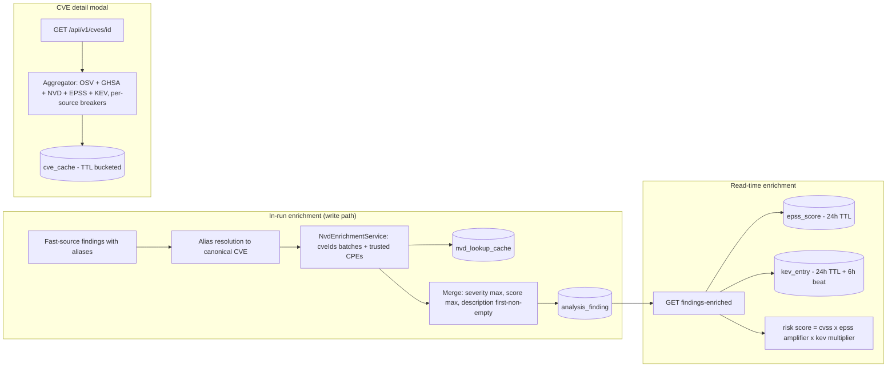

### 5.10.5 Run Cancellation

**Not Implemented.** There is no cancel endpoint, no persisted Celery task id, no `revoke()` call and no `CANCELLED` writer for analysis runs anywhere in the backend (searched `revoke`, `terminate`, `AsyncResult`, `cancel`); the only cancellation machinery belongs to the separate AI-fix batch subsystem (cooperative cancel in `app/ai/batch.py`). Two artefacts anticipate the feature: the frontend maps a `CANCELLED` label (`app/routers/sboms_crud.py:175`; FE status labels) and the SSE generator cancels its internal asyncio task on teardown — neither persists a cancelled state.

**Planned Enhancement (proposed design, not implemented):** persist the Celery task id (scheduled path) or an in-process run handle (inline path) at dispatch; expose `POST /api/runs/{id}/cancel`; insert cooperative checkpoints between pipeline stages; on cancel, mark `run_status=CANCELLED` and emit a terminal SSE event. The state model in Appendix 17.2 reserves `CANCELLED` for this purpose.

### 5.10.6 Incremental Change Feed

**Not Implemented.** No change-feed, webhook, delta or `since=` cursor API exists (searched `changefeed`, `webhook`, `delta`, `since=`). The implemented alternatives are: on-demand **run comparison** (`POST /api/v1/compare`, ADR-0008, cached in `compare_cache`) for "what changed between run A and run B", and the NVD mirror's internal incremental sync (mirror-only, not a findings feed). A findings change feed remains a **Planned Enhancement** recorded in the Open Questions document (OQ-006).

## 5.11 Resource Constraints

| Constraint | Value / mechanism | Reference |
|---|---|---|
| Upload size | 50 MB request cap (ASGI middleware + handler + ingress stage); 200 MB decompressed cap; 100:1 decompression ratio | `app/middleware/max_body.py`, `app/validation/stages/ingress.py` |
| Analysis concurrency | `ANALYSIS_MAX_CONCURRENCY` semaphore = 10 concurrent source calls; analyze endpoints rate-limited 15/min | `app/analysis.py:1213`, `app/rate_limit.py` |
| Findings caps | ≤5,000 findings per CPE query; ≤50,000 per run | `ANALYSIS_MAX_FINDINGS_PER_CPE/TOTAL` |
| NVD budget | ≤3 × 100 `cveIds` batches + ≤10 trusted-CPE lookups per scan; min inter-request delay 1.0 s (keyed) / 6.0 s (anonymous); per-scan breaker threshold 3 | `app/settings.py:40-57`, `app/services/nvd_enrichment_service.py` |
| External API rate limits | NVD 50 req/30 s keyed (5/30 s anonymous); GHSA 5,000 req/h token budget (no client limiter); OSV unthrottled client-side | §8.2; NVD official limits §16 |
| Response caches | `source_response_cache` TTL 4 h (flag-gated), `nvd_lookup_cache` 24 h/24 h/60 min, `cve_cache` 6 h–7 d, EPSS/KEV 24 h, lifecycle 14 d/24 h/30 min/7 d | Appendix 17.6, Data Dictionary |
| DB connection pool | PostgreSQL pool_size 20, max_overflow 20, timeout 30 s (→ 503 `DATABASE_BUSY`), recycle 1800 s, pre-ping on | `app/db.py:82-121`, `app/main.py:720-740` |
| Worker concurrency | Celery defaults (not configured); uvicorn single-process per container (scale by replicas) | `app/workers/celery_app.py`, `Dockerfile` |
| AI budgets | $0.10/request, $5/scan, $5/day org caps; per-provider RPM/concurrency caps | `app/settings.py:391-547` |
| HTTP client | shared httpx pool: 100 connections / 20 keep-alive / 60 s timeout | `app/http_client.py` |

**Known Limitation (event-loop blocking):** the codebase is synchronous SQLAlchemy; several `async def` paths perform blocking work on the event loop — most notably the audit write inside the `log_requests` middleware (per mutating request) and the ORM work inside the inline SSE analyze generator. 35 `async def` endpoints take sync sessions. Under load, a slow database stalls unrelated in-flight requests. **Recommended Improvement:** move the middleware audit write off-loop (threadpool or queue) and convert hot async paths to `def` (threadpool) or async sessions.

## 5.12 Software Dependencies, Assumptions and Constraints

### 5.12.1 Software Dependencies

Backend pins from `requirements.txt` (a full pip freeze; `pyproject.toml` floors match): FastAPI 0.139.0, Starlette 1.3.1, uvicorn[standard] 0.50.1, Python ≥3.11 (Docker base `python:3.11-slim`), SQLAlchemy 2.0.51 (sync), psycopg[binary] 3.3.4, Alembic 1.18.5, Celery 5.6.3, redis 6.4.0, pydantic 2.13.4, pydantic-settings 2.14.2, PyJWT 2.13.0, cryptography 49.0.0, httpx 0.28.1, requests 2.34.2, tenacity 9.1.4, slowapi 0.1.10, openpyxl 3.1.5, reportlab 5.0.0, boto3 1.43.40, python-multipart 0.0.32; validation stack: jsonschema 4.26.0, lxml 6.1.1, defusedxml 0.7.1, ruamel.yaml 0.19.1, packageurl-python 0.17.6, license-expression 30.4.4, spdx-tools 0.8.5, cyclonedx-python-lib 11.11.0. Frontend (`frontend/package.json`): next ^16.2.10, react/react-dom ^19.2.7, typescript ^6.0.3, @tanstack/react-query ^5.101.2, tailwindcss ^3.4.19, zod ^4.4.3, react-hook-form ^7.81.0, recharts ^3.9.2, lucide-react ^1.23.0. Databases: PostgreSQL 16 (compose), SQLite (dev, `ALLOW_SQLITE`). **Node.js version: unpinned — no `engines` field or `.nvmrc` exists (Next 16 implies Node ≥20.9 upstream); recorded as OQ-007.** Full SOUP list: §7.3.

### 5.12.2 Assumptions

- Outbound HTTPS to services.nvd.nist.gov, api.osv.dev, api.github.com, vuldb.com, cisa.gov, api.first.org, endoflife.date and configured lifecycle/LLM providers is permitted from api and worker.
- When VulnDB is enabled, credentials are valid and the subscription active (currently not the case in this deployment — the adapter is inert).
- Uploaded SBOMs conform to their declared spec versions (CycloneDX 1.4–1.6, SPDX 2.2/2.3); non-conforming documents are rejected or staged for repair rather than silently accepted.
- HCL IAM is reachable and issues RS256-signed JWTs with `exp`, `sub`, role and tenant claims; the JWKS endpoint is HTTPS.
- Operators run Alembic migrations before starting the API and restart worker/beat after configuration changes.

### 5.12.3 Constraints

- Self-hosted only; no multi-region or SaaS control plane.
- Alembic `stamp` must not be used to hide a revision mismatch: the startup check compares `alembic_version` to the script heads and stamping a database that does not actually have the head schema produces undetected drift and runtime failures. The repository's de-facto policy is forward-only from revision 033 (its `downgrade()` raises `RuntimeError` — "Restore from a pre-migration backup instead"); 013 and 032 also have no-op downgrades. Back up the database before production migrations (§11).
- Boolean server defaults use `sa.true()`/`sa.false()` for cross-database (PostgreSQL/SQLite) portability — verified in migrations 002, 004, 020, 022–025, 032, 034, 039, 041 and `app/models_mixins.py`.
- PostgreSQL and SQLite are the only supported dialects; any other dialect raises `RuntimeError` at startup (`app/main.py:329-335`).
- Celery Beat must run as exactly one instance.

---

# 6. OS Features

The reference document covers DPAPI here; the Analyzer has no Windows-specific OS dependency. OS-level services actually used:

- **Container runtime / process supervision:** the backend ships as a Linux container (`python:3.11-slim`, non-root `appuser`); Railway (`railway.toml`) or an operator-supplied supervisor restarts it (`restartPolicyType=ON_FAILURE`). No systemd units ship in the repository.
- **Filesystem:** large uploaded SBOMs and repair drafts are stored under `SBOM_WORKSPACE_STORAGE_DIR` (`./data/sbom-workspaces/<uuid4>/original.sbom`, `repair-draft.sbom`); the optional local Xeol database lives under `data/xeol/`. Paths are server-generated UUIDs (no user input → traversal-safe). **Known Limitation:** no volume mapping is declared for `data/` in any deploy artefact — on container platforms these files are ephemeral unless the operator mounts a volume.
- **TLS termination:** delegated to the hosting environment (no nginx/proxy config in repo); the application serves plain HTTP on :8000/:3000. Outbound TLS uses certifi CA bundles (`REQUESTS_CA_BUNDLE`/`SSL_CERT_FILE` overrides supported).
- **Time:** all schedule computation is UTC (Celery `enable_utc`, schedule `hour_utc`).

Otherwise: Not Applicable — the application uses no OS keyrings, DPAPI, or platform crypto stores; secrets come from environment variables and two application-level encryption stores (§14.2).

# 7. Hardware & Software Platforms

## 7.1 Hardware

Not Applicable — no dedicated hardware. Minimum server sizing is not documented in the repository (`TBD`, OQ-008); as deployed, the footprint is: api (single uvicorn process), ≥1 Celery worker, 1 beat, PostgreSQL 16, Redis, frontend (Node). Guidance for initial sizing must come from load testing (no performance test evidence exists beyond validation-latency benchmarks).

## 7.2 Software

Development environment (verified from `scripts/bootstrap.sh`/`bootstrap.ps1` and configs): Windows/PowerShell or Linux/macOS shells; **Python 3.11**; **Node 20** (bootstrap installs Node 20; no engine pin — OQ-007); **PostgreSQL 16** (compose, host port 55439); **Redis** (default `redis://localhost:6379/0`); package managers pip + npm (`npm ci`); quality tooling ruff ≥0.9, mypy ≥1.14, import-linter ≥2.0, pytest 9.1.1, Vitest 4.1.10. IDE is unconstrained.

## 7.3 Software Of Unknown Provenance (SOUP)

Third-party components with exact versions (backend from the `requirements.txt` freeze; frontend from `package.json` ranges). This table lists the direct, load-bearing SOUP items; the full freeze (100+ packages including transitives) is the authoritative inventory.

| SOUP item | Version | Role |
|---|---|---|
| FastAPI / Starlette | 0.139.0 / 1.3.1 | HTTP framework |
| uvicorn[standard] | 0.50.1 | ASGI server |
| SQLAlchemy | 2.0.51 | ORM (synchronous) |
| psycopg[binary] | 3.3.4 | PostgreSQL driver |
| Alembic | 1.18.5 | Schema migrations |
| Celery / kombu / billiard | 5.6.3 / freeze | Task queue |
| redis (client) | 6.4.0 | Broker client |
| pydantic / pydantic-settings | 2.13.4 / 2.14.2 | Validation & settings |
| PyJWT | 2.13.0 | JWT validation |
| cryptography | 49.0.0 | AES-GCM/Fernet, JWKS |
| httpx / requests / tenacity | 0.28.1 / 2.34.2 / 9.1.4 | Outbound HTTP + retry |
| slowapi | 0.1.10 | Rate limiting |
| jsonschema | 4.26.0 | SBOM schema validation |
| lxml / defusedxml / xmltodict | 6.1.1 / 0.7.1 / 1.0.4 | XML parsing (hardened path + legacy) |
| spdx-tools / cyclonedx-python-lib | 0.8.5 / 11.11.0 | SBOM tooling |
| packageurl-python / license-expression | 0.17.6 / 30.4.4 | PURL & license parsing |
| ruamel.yaml | 0.19.1 | YAML (aliases.yml) |
| openpyxl / reportlab | 3.1.5 / 5.0.0 | XLSX / PDF generation |
| boto3 | 1.43.40 | AWS SDK (declared; no direct consumer found — see OQ-009) |
| python-multipart / python-dotenv / certifi | 0.0.32 / 1.2.2 / 2026.6.17 | Upload parsing / env / CA roots |
| next / react | ^16.2.10 / ^19.2.7 | Frontend framework |
| @tanstack/react-query | ^5.101.2 | Client data layer |
| typescript / tailwindcss / zod / react-hook-form / recharts / lucide-react | ^6.0.3 / ^3.4.19 / ^4.4.3 / ^7.81.0 / ^3.9.2 / ^1.23.0 | FE tooling/UI |
| **Test-only:** pytest 9.1.1, pytest-asyncio 1.4.0, pytest-benchmark 5.2.3, **hypothesis 6.156.1** | as listed | Verification |
| Vitest / @testing-library/react / vitest-axe / jsdom | 4.1.10 / 16.3.2 / 0.1.0 / 29.1.1 | FE verification |

Notes: (1) **hypothesis is declared** in both `pyproject.toml [dev]` and `requirements.txt` — the earlier "undeclared despite being required by the test suite" finding from planning material is resolved and no longer accurate. (2) **Known Limitation:** the dev extra `httpx2>=2.5.0` (+ `httpcore2` in the freeze) uses non-standard forked package names with no documented provenance — flagged as a supply-chain review item (OQ-010). (3) No automated dependency scanning (Dependabot/Renovate/pip-audit) exists — **Design Risk** for a security product; §14. (4) Pre-upgrade snapshots (`requirements.before-upgrade.txt`, `pyproject.before-upgrade.toml`, locked 2026-04-14) document the last dependency-upgrade wave.

---

# 8. Interface Description

## 8.1 Internal Interface Features

**REST API between frontend and backend.** The browser calls FastAPI directly (`NEXT_PUBLIC_API_URL`; no proxy). There is **no single global prefix or uniform versioning**: most resources are unversioned `/api/...`; newer surfaces (CVE detail, compare v2, AI usage/credentials/fixes) are `/api/v1/...`; dashboards mount at `/dashboard/...`, health at `/` and `/health`, legacy analyzers at `/analyze-sbom-*`, and the NVD-mirror admin at `/admin/nvd-mirror/...` (**Known Limitation** — prefix inconsistency recorded as OQ-011). Auth header contract: `Authorization: Bearer <JWT>` plus `X-Tenant-ID: <tenant>` on every call; the client injects both from sessionStorage (`frontend/src/lib/api.ts:94-109`). Error envelope: FastAPI `detail` (string, or object with `code`/`error_code` + `message`); unhandled errors → 500 `{"detail":{"code":"internal_error","message":"Internal server error.","correlation_id":...}}`. Conditional GET (ETag/304) on dashboard endpoints; `Idempotency-Key` supported on analyze POSTs (in-process cache, TTL 24 h). Complete endpoint contracts: §10 and the API Inventory companion.

**SSE streaming interface.** Three server-sent-event surfaces exist:

| Surface | Route | Server mechanism |
|---|---|---|
| Analysis progress | `POST /api/sboms/{id}/analyze/stream` | Inline `asyncio.Queue` bridged to `StreamingResponse` in the API process; events `progress`/`complete`/`error`; headers `Cache-Control: no-cache`, `X-Accel-Buffering: no`; no heartbeat |
| AI batch progress | `GET /api/v1/runs/{id}/ai-fixes/batches/{batch_id}/stream` | Sync generator polling a progress store every 2 s (max 600 s); store is Redis-first with in-memory fallback (in-memory is correct only single-process) |
| AI run progress (deprecated) | `GET /api/v1/runs/{id}/ai-fixes/stream` | Same store; RFC 9745 deprecation headers |

**Authentication on SSE — P0 gap and fix design.** Server-side, all three routes sit behind router-level `enforce_request_access` like any other endpoint. Client-side, **none of the three frontend streaming clients sends credentials**: the analyze stream is a fetch-POST whose headers omit `Authorization`/`X-Tenant-ID` (`frontend/src/hooks/useAnalysisStream.ts:125-144`), and both AI surfaces use native `EventSource` (cannot set headers; `withCredentials:false`; no token query parameter). The system currently functions only because the development default is `AUTH_ENABLED=false`. **With auth enabled, the analyze stream fails outright (no fallback), while the AI surfaces silently degrade to their authenticated 2-second polling fallback.** **Recommended Improvement (the fix designed here):** (1) analyze stream — add `getAuthHeaders()` to the fetch call (fetch-based SSE can carry headers; server change: none); (2) AI streams — replace `EventSource` with the same fetch-based SSE reader so headers carry the JWT, or issue a short-lived one-time stream token as a query parameter validated by `enforce_request_access`; (3) add unmount cleanup for the analyze stream (`cancel()` is currently only wired to the UI Cancel button — navigating away leaks the reader); (4) define token-expiry behaviour mid-stream (re-authenticate on `error` and resume by polling run state). Until then, deployments enabling auth must expect SSE degradation.

**Figure 10 — SSE Progress Flow**

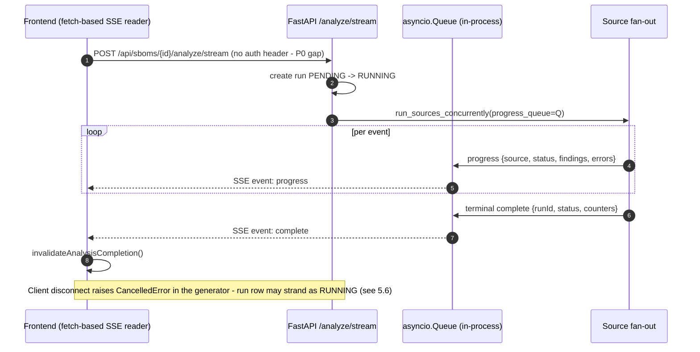

**Authentication flow (internal contract).** The backend never issues tokens. The frontend performs OIDC Authorization Code + PKCE (S256) against HCL IAM (hand-rolled, Web Crypto; CSRF `state` validated), stores access/id/refresh tokens in sessionStorage, refreshes proactively 60 s before `exp`, and sends `Authorization: Bearer` per call. The backend validates via PyJWT + `PyJWKClient` (JWKS cached 300 s): RS256 only (HS\* rejected), signature/`exp`/`nbf`/`iss`/`aud` verified, `exp`+`sub` required; then `get_current_tenant_context` upserts the `IAMUser`, resolves tenant membership + `X-Tenant-ID`, and caches the context per `(sub, tenant, iat)` for ≤120 s. `enforce_request_access` maps path+method → permission and 403s on insufficient permission. 401 → client clears tokens and redirects to login; 403 → `/access-denied`.

**Figure 11 — Authentication Flow**

```mermaid
sequenceDiagram
  autonumber
  actor U as User
  participant FE as Next.js (AuthGuard, useAuth)
  participant IAM as HCL IAM (OIDC IdP)
  participant API as FastAPI (core/security.py)
  participant DB as PostgreSQL

  U->>FE: open app (unauthenticated)
  FE->>IAM: redirect - authorization code + PKCE S256 + state
  IAM-->>FE: /auth/callback?code=...&state=...
  FE->>IAM: POST token endpoint (code + verifier)
  IAM-->>FE: access / id / refresh tokens (sessionStorage)
  FE->>API: request + Authorization Bearer + X-Tenant-ID
  API->>IAM: fetch JWKS (cached 300 s)
  API->>API: validate RS256 signature, exp, nbf, iss, aud
  API->>DB: upsert IAMUser, resolve tenant membership
  API->>API: permission_for_request(path, method) -> has_permission?
  alt permitted
    API-->>FE: 200 + response (tenant-scoped ORM queries)
  else missing permission
    API-->>FE: 403 "Insufficient permission" -> /access-denied
  end
  Note over FE: proactive refresh 60 s before exp; 401 -> clear tokens + re-login
```

**Celery task contracts.** Tasks are JSON-serialized with stable names: `scheduled_analysis.tick` (no args), `scheduled_analysis.analyze_sbom(sbom_id, schedule_id)` (retry ×3, backoff ≤900 s), `nvd_mirror.mirror_nvd` (autoretry on `NvdRemoteError` ×3), `cve_refresh.refresh_kev_cache`, `cve_refresh.purge_expired`, `source_cache.sweep_expired`, plus AI-fix tasks (`app/workers/ai_fix_tasks.py`). All ride the default queue; results backend = broker. Workers build a `minimal_background_context()` for tenancy.

## 8.2 External Interface Features

### 8.2.1 NVD API

- **Endpoint:** `https://services.nvd.nist.gov/rest/json/cves/2.0` (CVE API 2.0). Requests: `cveIds=` batches (≤100, ≤3 batches/scan) for backfill and `cpeName=` lookups (≤10/scan) for trusted CPEs only (`sbom_provided`, `official_nvd_cpe`, `manual_verified`, `trusted_mapping`); heuristic `generated_fallback` CPEs are never sent (counted as skipped).
- **API key:** `NVD_API_KEY` sent as `apiKey` header; missing key → anonymous mode with 6.0 s minimum inter-request delay (1.0 s keyed). Official limits: 5 req/30 s anonymous, 50 req/30 s keyed.
- **Rate limits / retry / backoff:** process-global rate limiter honouring `Retry-After` on 429/502/503/504 via deferral; **no blind retries** in the production client; timeouts connect 5 s / read 20 s.
- **Error handling:** typed errors (`NvdRateLimitedError`, `NvdTemporarilyUnavailableError`, `NvdTimeoutError`, `NvdSslError`, `NvdProviderError`) map to cache statuses; 404 → empty result. Per-scan circuit breaker (threshold 3; SSL error opens immediately) → remaining lookups skipped, `provider_status: degraded`, scan continues.
- **Caching:** `nvd_lookup_cache` (success 24 h / no-result 24 h / failure 60 min), sha256-hashed identifiers, algorithm-versioned (`nvd-applicability-v2`).
- **Applicability:** every raw record passes `evaluate_nvd_configurations` (version-range walk of `configurations[].nodes[].cpeMatch`); rejections counted by reason (`NvdRejectionTracker`).
- Optional **NVD mirror** (default off): hexagonal local corpus (`app/nvd_mirror/`) synced hourly (windows ≤119 days, tenacity retries 5×, Fernet-encrypted API key in DB); the pipeline uses a **cache-only** mirror pre-pass; the facade's 5-branch mirror-vs-live decision (fresh/stale/error) governs the admin query path.

### 8.2.2 OSV API

- **Endpoints:** `POST /v1/querybatch` (≤1000 queries; PURL-preferred, name+ecosystem fallback; version-qualified), `GET /v1/vulns/{id}` hydration under a 10-way semaphore, and a per-component `POST /v1/query` fallback when batch+hydration yield nothing.
- **Auth:** none. **Pagination:** n/a. **Rate limiting / retries / breaker:** none client-side (**Known Limitation** — a flapping OSV degrades scans with only per-batch error rows).
- **Ecosystem coverage:** PURL type drives the query; Maven/npm/Debian heuristics enrich components pre-query (`enrich_component_for_osv`).
- **Debian advisories:** OSV returns `DEBIAN-CVE-*`/distro IDs whose CVE aliases are resolved during dedup; NVD backfills CVSS (the "Debian OSV gap path", §5.10.4).
- **Normalized result:** `vuln_id` (often GHSA/PYSEC for PyPI), verbatim `aliases`, severity bucketed from CVSS extraction, `fixed_versions` from range events, `applicability_status="affected"` (`osv_version_qualified_query`), `match_strategy="purl_direct"`.
- **Caching:** `source_response_cache` (flag `SOURCE_CACHE_ENABLED`, TTL 4 h; empty results cached; per-run force-refresh).

### 8.2.3 GHSA (GitHub Advisory)

- **Endpoint:** GitHub GraphQL `securityVulnerabilities(ecosystem, package, first:100, after)` per unique (ecosystem, package) derived from PURL type (npm→NPM, pypi→PIP, cargo→RUST, hex→ELIXIR, …); components without a mappable PURL are skipped.
- **Token:** `GITHUB_TOKEN` required; missing → zero findings + explicit error row ("GitHub token not configured … drop GITHUB from ANALYSIS_SOURCES").
- **Pagination:** cursor-based, page size 100, **no page cap** (Known Limitation: pathological packages could loop; NVD paths are capped, GHSA is not).
- **Version matching:** local, via `evaluate_applicability` on `vulnerableVersionRange` tokens and a fixed-version fallback; non-affected candidates dropped pre-emit and logged.
- **Caching:** `source_response_cache` with a versionless PURL key + `:github-applicability-v3` suffix so applicability-algorithm changes invalidate old entries; applicability re-evaluated on every cache hit. Retries/breaker: none (5,000 req/h budget assumed).

### 8.2.4 VulnDB

- **Endpoint:** `https://vuldb.com/?api` form-POST (`apikey`, `version=3`, `search`, `limit=5`); per-component (deduped, ≤100 components), search = CPE else `"name version"` else name; optional fixed inter-request delay; timeout 30 s; no retries/breaker; no version matching at all (findings carry component identity verbatim — **Known Limitation**).
- **Credential/config failure mode:** a missing key yields a warning-only empty result per run (`{"warning":"Missing API key env: VULNDB_API_KEY"}`); an invalid key yields payload-level errors. **Diagnostic rule from planning material — confirmed by design:** because the adapter fails uniformly (per-component transport/payload errors when misconfigured), a **1:1 error-to-component ratio indicates uniform adapter/credential failure, not per-component matching errors.**
- **Operational status:** implemented, registered, selected via `ANALYSIS_SOURCES` in this deployment, but **inert (empty `VULNDB_API_KEY`)**; behaviour against the live VulDB v3 API is unverified by tests (OQ-012). `POST /analyze-sbom-vulndb` returns 400 without a key.

### 8.2.5 EPSS Feed

- **Endpoint:** `https://api.first.org/data/v1/epss?cve=…`, batches of 100, timeout 20 s; no auth.
- **Ingestion:** on-demand per-CVE with 24 h TTL into `epss_score` (`db.merge` upsert); deliberately **no bulk sync and no beat task**; CVEs absent from the API response are returned as 0.0 for that request but not cached as zero. Failures → warning + 0.0 defaults.
- **Consumption:** read-time risk scoring (`risk = cvss × (1 + amplifier×epss) × kev_multiplier`), dashboard exploitation metrics, CVE modal.

### 8.2.6 CISA KEV Feed

- **Endpoint:** `KEV_FEED_URL` (CISA known_exploited_vulnerabilities.json). Full-catalog mirror into `kev_entry` with upsert + deletion of removed rows; TTL 24 h with read-path `refresh_if_stale()`, 6-hourly beat force-refresh, 5-minute failure-retry suppression, single-flight lock; never raises (falls back to cached rows). Consumed by risk scoring, dashboard KEV metrics and the CVE modal.

### 8.2.7 Lifecycle (EOL/EOS) Providers

Lifecycle enrichment is **decoupled from vulnerability analysis**: it runs at upload/edit/conversion time via background tasks and on-demand refresh endpoints, never inside analysis runs. A priority-ordered 12-provider chain (manual 0 → vendor 10 → OpenEoX 20 → endoflife.date 30 → Xeol 40 → registry 50 → deps.dev 60 → OSV 70 → repo-health 80) runs sequentially per component identity with per-provider 5 s timeouts, an in-memory circuit breaker (3 failures → 15 min cooldown) and early stop on high-confidence dated results; a decision engine picks the winner (manual override > vendor authority > status priority EOL 90 > EOS 85 > EOF 80 > Deprecated 70 > Unsupported 65 > EOL-Soon 60 > Possibly-Unmaintained 30 > Supported 10 > Unknown 0, then confidence). Identifiers passed per provider: component name/version/ecosystem (all), PURL + `distro=` qualifier (endoflife.date OS-release mapping; Debian release also inferred from `+debNuM` version suffixes; Ubuntu only via qualifier/name — no version inference), CPE (normalizer fallback), repository URL (repo-health). Results persist to `sbom_component.lifecycle_*` columns and the `component_lifecycle_cache` (TTLs: known 14 d, Unknown 24 h, provider-failure 30 min, Deprecated 7 d; stale-preserve rule keeps a known cached status over a fresh Unknown). Components legitimately end `Lifecycle: Unknown` when no provider recognises the product (not in `PRODUCT_SLUGS`/`aliases.yml`, no registry deprecation signal, OSV provider is Unknown by design, vendor skeleton provider, circuit open, or timeout). Provider enablement is DB-configurable (`lifecycle_provider_configs`, admin UI); defaults enable redhat/vendor/endoflife.date/registry/deps.dev/OSV/repo-health and disable custom-vendor-records/OpenEoX/Xeol-API/Xeol-DB. **Known Limitations:** RHEL dates are hard-coded (will go stale); the bundled 49 MB `data/xeol/1/xeol.db` appears unused at runtime (provider disabled, no sync job — OQ-013); OpenEoX has no configured feed (OASIS has published no spec yet).

**Figure 12 — Lifecycle EOL/EOS Enrichment Flow**

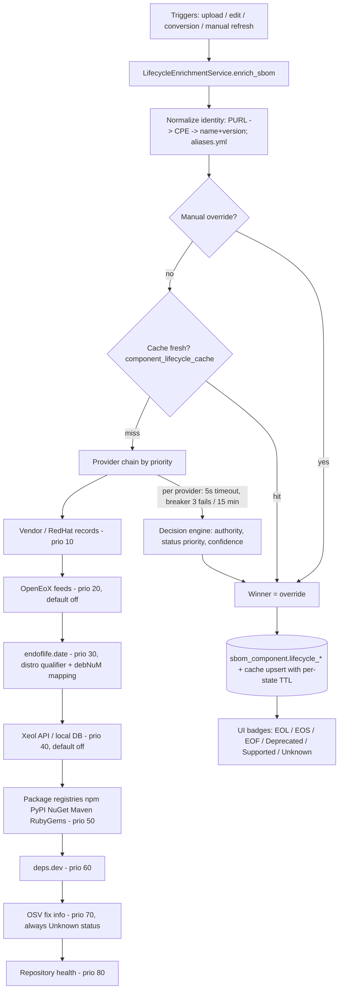

## 8.3 User Interface Features

The frontend is a Next.js App Router SPA (19 routes; client components under a single layout; no server-side auth middleware — route protection is the client-side `AuthGuard`). Key behaviours (all Current Implementation, verified in `frontend/src`):

- **Analysis list with URL-driven filters:** `/analysis` consumes `useAnalysisUrlState` (params `project`, `sbom`, `status`, `tab`; `status` canonicalized through `canonicalRunStatus()` on read **and** write). Run detail `/analysis/[id]` consumes `useFindingsFilterFromUrl` (`severity`, `kev`, `fix`, `epss`, `review`, `globalCount`).
- **Severity drill-down — end-to-end wiring confirmed:** the dashboard donut (`SeverityChart.tsx`) receives `onSliceClick` + `interactiveSeverities`; a slice click resolves the run richest in that severity (`topRunForSeverity` over weighted per-SBOM buckets) and pushes `/analysis/{runId}?severity=CRITICAL&globalCount=N`; the destination seeds the `['findings-enriched', id, severity]` query and the API `?severity=` param; a `DrilldownReconciliationBanner` explains run-count vs portfolio-count deltas; without `onSliceClick` the chart falls back to `/analysis?tab=runs&status=FINDINGS&severity=X`. Integration-tested (`dashboard-drilldown.integration.test.tsx`, run-detail drill-down test). The severity URL contract is canonical UPPERCASE (`severityParam.ts`).
- **Findings detail:** sortable findings table with severity+confidence chips, CVSS meter (+`cvss_version`), EPSS percentile chip, KEV badge, risk score, match_reason/strategy badges, expandable description/CWE/fix versions; client-side source/strategy/reason filters and saved presets; CVE detail modal (flag `cve_modal_enabled`) with alias chip swap, exploitation section and fix table.
- **Manager Dashboard:** backbone query `['dashboard-summary']` → `GET /dashboard/summary` (14 sections, single round trip) feeding: **Total SBOMs Stored** (`sboms_total`), **Total Applications Scanned** (`applications_scanned_total` — distinct projects with completed runs), **Total SBOMs Analysed** (`sboms_analysed_total` — distinct SBOMs with ≥1 completed run); **Vulnerability by Threat Level** severity donut (convention A — latest run per SBOM); **Vulnerability by Age** pie with date-range filter (`/dashboard/vulnerability-age?window=`); **fix trend** chart with granularity + application filter (`/dashboard/trend`, convention B per period); posture hero with KEV/high-EPSS/critical/fix-available signals (each clickable → drill-down); lifetime stats; v4 cards (forecast, exploitation outlook, remediation, CVSS×EPSS risk matrix, portfolio treemap); Copilot briefing panel (flag-gated). The four "resolved definitions" the structure asks to record are exactly the cited metric functions (§11 conventions).
- **SBOM management:** list with search/project/product/analysis-state/validation filters and client pagination (25/page, persisted); upload modal (single file picker `.json/.xml/.spdx`, paste-JSON ≤5 MB/20k lines; **no drag-drop or per-file progress bar**; validation-failure card with stage/error counts and auto-open of the repair workspace); SBOM detail tabs (Overview/Components/Normalization/Versions/Runs) with server-paginated components table showing lifecycle badges + per-component refresh/override, VEX statements (upload/discover/override + history), raw viewer, SPDX→CycloneDX conversion card, revalidate, exports.
- **Export actions (UI-offered):** run PDF/CSV/SARIF; runs-list JSON (client-stitched ≤5000); compare markdown/csv/json; SBOM original/document export (format + export_mode), vulnerability XLSX, lifecycle CSV/ZIP, VEX JSON/CSV/ZIP; project-level FDA 510(k) XLSX dialog.
- **Loading/empty/error states:** per-tile skeletons, empty-state illustrations, error alerts; global error boundary (`error.tsx`), `loading.tsx`, `not-found.tsx`. **Pagination:** client-side on lists (25 default), server-side for components and enriched findings (1000/page stitched, `X-Total-Count`).
- **Search and filtering:** text search on SBOM/run tables; server-side severity filter on findings; schedules filters (scope/state/search).
- **Responsive/accessibility:** mobile drawer sidebar / fixed rail on md+; skip-link, focus-trapped dialogs, aria labelling, ⌘K command palette, keyboard cheatsheet; dark mode via class + CSS variables; 4 axe test suites.
- **Live progress:** SSE-driven `LiveAnalysisCard` (per-source status), global AI-batch progress pill with SSE→polling degradation; fire-and-forget "background analysis" with sessionStorage pending markers reconciled after refresh (`usePendingAnalysisRecovery`).

---

# 9. Security Features and Threat Mitigation

Detailed security risk management is maintained outside this SDD. Refer to:

- `SBOM_Security_Risk_Management_Plan.docx` — **TBD: not present in this repository** (OQ-014)
- `SBOM_Threat_Modelling.docx` — **TBD: not present in this repository** (OQ-014)
- `SBOM_Security_Risk_Analysis.xlsx` — **TBD: not present in this repository** (OQ-014)

Pending those documents, the following threat→control mapping records **only controls confirmed in the repository** (residual gaps are stated, not assumed mitigated). Implemented control detail: §14.

| Threat | Confirmed control(s) | Residual gap / Design Risk |
|---|---|---|
| Malicious SBOM upload | 9-stage validation before any trusted write; rejected documents quarantined in TTL-bound repair sessions; security stage blocks prototype-pollution keys and >1 MB embedded blobs; security-blocked payloads never staged | — |
| Oversized SBOM upload | 50 MB ASGI cap (declared + streamed byte counting), handler re-check, 200 MB decompressed cap, 100:1 ratio cap | No nginx-level cap ships (operator proxy expected) |
| XML entity attacks (XXE) | defusedxml pre-screen (DTD/entity/external → E083–E085) then hardened lxml (`resolve_entities=False, no_network=True, huge_tree=False`) | Legacy extraction path (`xmltodict`/stdlib ET in `app/parsing/`) is not defused — reachable only for already-validated or safety-gated content |
| JSON parser abuse | Capped decoder at parse time: depth 64, arrays ≤1e6, strings ≤64 KB, embedded blobs ≤1 MB, forbidden `__proto__/constructor/prototype` | — |
| SQL injection | ORM-only data paths; raw `text()` confined to startup helpers with hardcoded identifiers; identifier validation in sequence resync | Raw startup SQL bypasses tenancy listeners (maintenance-only paths) |
| Stored XSS via component names | React 19 default escaping; single `dangerouslySetInnerHTML` is a static theme script; no user HTML rendering | **No CSP / security headers anywhere**; no backend sanitisation — defence rests on React escaping |
| SSRF via external URLs | VEX discovery URL guard rejects literal private/loopback/link-local/reserved IPs; AI custom endpoints restricted to https or localhost http | **DNS-rebinding & redirect gap:** hostnames resolving to private IPs pass; `follow_redirects=True` not re-validated per hop |
| Credential exposure | AES-256-GCM at rest (AI keys), Fernet (NVD mirror key), lifecycle secrets encrypted+masked; preview-only read APIs; DB URL password masked in logs; `.env` gitignored and docker-ignored | Source API keys (`NVD_API_KEY`, `GITHUB_TOKEN`, `VULNDB_API_KEY`, Xeol) are plain env vars (12-factor, but outside the encrypted stores) |
| Unauthorized analysis access | Router-level `enforce_request_access` with path→permission map (`analysis:run`, `sbom:*`, `dashboard:read` …); fine-grained `require_permission` on admin routes | Dev default `AUTH_ENABLED=false` = open with admin permissions; `/docs`, `/openapi.json` public; `/api/analysis/config` + `/api/types` only behind legacy `require_auth` |
| Cross-tenant data access | Real tenancy: `TenantOwnedMixin` on 21 tables; ORM listener injects `tenant_id` filter on every SELECT; `before_flush` blocks cross-tenant writes; `X-Tenant-ID` validated against memberships | Tenant scoping uneven on a few admin/global surfaces (API Inventory notes) |
| Vulnerability-source poisoning | Multi-source consensus with per-field precedence; NVD authoritative for CVSS; VEX documents stored with provenance/evidence; applicability gates on version ranges | Upstream data is not signature-verified; SBOM signature stage is a stub (flag hard-off) |
| Dependency compromise (platform's own supply chain) | Fully pinned `requirements.txt` freeze + lockfiles; pre-upgrade snapshots | **No Dependabot/Renovate/pip-audit/npm-audit automation and no CI** — notable for a product whose job is SBOM scanning |
| DoS via large analyses | 15/min analyze rate limit; finding caps (5k/CPE, 50k/run); source concurrency semaphore 10; NVD budgets + breaker; lifecycle timeouts/breakers; AI budget caps; DB pool caps + 503 handler | Inline on-demand analysis consumes API-process capacity (§5.11); rate-limit key trusts first `X-Forwarded-For` hop (spoofable without a trusted proxy) |
| Redis or Celery compromise | JSON-only task serialization (no pickle RCE) | Redis unauthenticated/no TLS by default and absent from compose; broker compromise = task injection/result tampering |

---

# 10. Individual Functional Block Explanation

Functional blocks: SBOM Management APIs · Analysis Run APIs (trigger, status; cancel is **Not Implemented**) · Findings & Vulnerability APIs (incl. VEX and remediation tracking) · CVE Detail & Enrichment services · Source Adapter internals (NVD, OSV, GHSA, VulnDB — §8.2) · Scheduling (Beat) · Dashboard/Metrics APIs · Export/Reporting · Authentication & Authorization · Logging / Audit Trail / Notification / Error Handling · AI Remediation (adjacent subsystem) · NVD Mirror administration.

## 10.1 Global Description

### 10.1.1 Audit Trail

**Current Implementation.** Storage: `audit_log` (tenant-owned, append-only). Captured attributes per row: `action` (e.g. `sbom.upload`, `project.soft_delete`, `tenant.switch`, `export.download`, `api.post`), `entity_type`/`entity_id` and `target_kind`/`target_id` (module/entity identification), `old_value`/`new_value` (JSON), `detail` (≤240 chars), `metadata_json`, `user_id` (string) + `user_ref_id` (FK→`iam_users`), `tenant_id`, `ip_address` (first X-Forwarded-For hop), `user_agent`, `created_at`. This satisfies the reference attribute list (Action, ModuleName→entity_type, FieldName/OldValue/NewValue→old/new JSON, Description→detail, CreatedBy→user_id, CreatedOn→created_at). Writers: (1) middleware auto-audit for every successful mutating request, `/api/auth/me` login-mapping, tenant switches and export downloads; (2) canonical `write_audit_log()` service; (3) domain writers (deletes, version control, lifecycle overrides, tenant membership with old/new values). Adjacent audit tables: `ai_credential_audit_log`, `vulnerability_remediation_audit`, `sbom_validation_session_events`, `component_lifecycle_override_audit`, `vex_override_audit`. **Known Limitations:** audit writes are fail-open (swallowed on error) and execute synchronously inside async middleware (§5.11); no dedicated audit test suite exists.

### 10.1.2 Logging

Framework: Python `logging` configured by `app/logger.py` (`setup_logging()`), namespaced `sbom.<module>`. Sinks: stdout (colour text on TTY) and optional rotating file (`LOG_FILE`, 10 MB × 5) — file output always JSON (ts/level/logger/message/module/func/line + extras). Levels via `LOG_LEVEL` (INFO default); httpx/httpcore/urllib3/asyncio forced to WARNING unless DEBUG. Request logging by middleware (arrival + completion with duration; ≥400 → WARNING; uvicorn access log disabled). Filtering/hygiene: DB URL password masked, analysis errors pass `_redact_sensitive_text`, bearer tokens never logged (rate-limit key is a sha256 prefix), 500 envelope leaks nothing (locked by `tests/test_500_no_leak.py`).

### 10.1.3 Notification

**Not Implemented.** There is no notification subsystem: no email/webhook/Slack integration, no scan-complete or scan-failed event fan-out to external channels (searched `webhook`, `smtp`, `notification` — no hits). In-app signals exist instead: SSE progress events, toast notifications driven by mutation lifecycle, dashboard "What's New" deltas, and `analysis_schedule.last_run_status`/`consecutive_failures` for schedule health. External notification channels are a **Planned Enhancement** (OQ-015).

### 10.1.4 Error Handling

The Analyzer's equivalent of the reference `FrameworkResult` is a small set of structured `detail` envelopes plus a per-domain error taxonomy:

| Layer | Envelope / mechanism |
|---|---|
| Unhandled exception | 500 `{"detail":{"code":"internal_error","message":"Internal server error.","correlation_id":"<12-hex>"}}`; traceback server-side only, linked by correlation id |
| DB pool exhaustion | 503 `{"detail":{"error_code":"DATABASE_BUSY","message":"Database is busy. Please retry shortly."}}` |
| Oversize body | 413 `{"detail":{"code":"payload_too_large",...}}` (middleware, pre-routing) |
| Rate limit | 429 (slowapi default handler) |
| Validation failure (upload) | `report.http_status` (413 > 415 > 422 > 400 precedence) with `{code:"sbom_validation_failed", session_id, repair_workspace_url, failed_stage, entries:[{code,severity,stage,path,message,remediation,spec_reference,can_ai_fix}], ...}` |
| Domain errors | `HTTPException` with string or `{code,message}` details (quoted per endpoint in §10.2+) |
| Per-source errors (analysis) | Never abort the run; aggregated into `query_errors` → `query_error_count`, `provider_status[]` (NVD: status/cache hits/failures/breaker/rejections by reason), `" (partial)"` source-label suffix |
| Validation error codes | `E001`–`E089`, `W100`–`W121` catalogued in Appendix 17.8 (single source of truth `_CODE_TABLE`, `app/validation/errors.py`) |

HTTP error mapping for 4xx keeps FastAPI defaults (422 `RequestValidationError` untouched). Frontend maps the envelopes into typed `HttpError {status, code, detail}` with 401→re-login and 403→access-denied behaviours.

## 10.2 Per-Endpoint Documentation

The following subsections document **every implemented HTTP endpoint (204 route functions across 29 router files, verified equal to the raw decorator count; plus 34 runtime alias routes registered via `add_api_route` for validation-session compatibility paths)** using the reference five-row table. Grouping follows the functional blocks; the one-line-per-endpoint index is Appendix table in the companion *SBOM_Analyzer_API_Inventory* (same content, standalone document). Auth notation: **Protected** = router-level `enforce_request_access` (401 unauthenticated / 403 "Insufficient permission"); **Public** = no auth dependency; route-level `require_permission("...")` noted where present.


### 10.2.1 Health and Diagnostics (`app/routers/health.py`, router prefix: none)

#### GET /

| Field | Details |
| --- | --- |
| Function Signature | GET / → `def service_info() -> dict` in `app/routers/health.py` |
| Description | Service banner: name, version, docs/health URLs. Used as a root reachability check. |
| Input Parameters | None |
| Return Values | Ad-hoc dict `{service: "sbom-analyzer-api", version, docs_url: "/docs", health_url: "/health"}`; 200 JSON |
| Validation and Error Messages | None — never raises |

Auth: **Public** (router intentionally registered without auth).

#### GET /health

| Field | Details |
| --- | --- |
| Function Signature | GET /health → `def health(db: Session = Depends(get_db)) -> dict` in `app/routers/health.py` |
| Description | Liveness/readiness probe. Reports DB connectivity (dialect) and NVD-mirror freshness (enabled, last_success_at, watermark, stale, counters). Designed to never 500 — subsystem failures degrade to `{"available": false}`. |
| Input Parameters | None |
| Return Values | Ad-hoc dict `{status: "ok", database: {available, dialect}, nvd_mirror: {enabled, last_success_at, watermark, stale, counters} or {available: false, error}}`; 200 JSON |
| Validation and Error Messages | None — all internal errors are caught and reported in-body |

Auth: **Public**.

#### GET /api/analysis/config

| Field | Details |
| --- | --- |
| Function Signature | GET /api/analysis/config → `def get_analysis_config() -> dict` in `app/routers/health.py` |
| Description | Exposes the effective multi-source analysis configuration (NVD/OSV/GHSA/VulDB endpoints, timeouts, retry/delay tuning, CVSS thresholds, finding caps, concurrency) plus feature flags (`github_configured`, `nvd_key_configured`, `vulndb_configured`, `cve_modal_enabled`, `ai_fixes_enabled`, `ai_default_provider`, `ai_ui_config_enabled`). Secret values are never returned — only env-var *names* (e.g. `nvd_api_key_env: "NVD_API_KEY"`) and boolean configured-flags. |
| Input Parameters | None |
| Return Values | Ad-hoc config dict (~30 keys, see `public_analysis_config()`); 200 JSON |
| Validation and Error Messages | None raised; default-provider resolution failures fall back to env value (logged warning) |

Auth: **Protected** via route-level `dependencies=[Depends(require_auth)]` (401s per `require_auth`; no tenant/permission check).

#### GET /api/types

| Field | Details |
| --- | --- |
| Function Signature | GET /api/types → `def list_sbom_types(db)` in `app/routers/health.py` |
| Description | Lists SBOM type lookup rows (CycloneDX, SPDX, …) for upload/edit dropdowns, ordered by typename. |
| Input Parameters | None |
| Return Values | `list[SBOMTypeOut]` — `{id, typename, type_details?, created_on?, created_by?, modified_on?, modified_by?}`; 200 JSON |
| Validation and Error Messages | None raised |

Auth: **Protected** via route-level `dependencies=[Depends(require_auth)]`.

---

### 10.2.2 SBOM Management (`app/routers/sboms_crud.py` prefix `/api`; `app/routers/sbom_upload.py` prefix `/api/sboms`; `app/routers/sbom_versions.py` prefix `/api/sboms`; `app/routers/sbom.py` mounted at `/api/sboms`; `app/routers/sbom_validation_sessions.py` three routers)

All endpoints in this group are **Protected** (router-level `enforce_request_access`).

#### GET /api/sboms/{sbom_id}

| Field | Details |
| --- | --- |
| Function Signature | GET /api/sboms/{sbom_id} → `def get_sbom(sbom_id, include_raw, context, db)` in `app/routers/sboms_crud.py` |
| Description | Fetch a single SBOM (tenant-scoped) with workspace/repair fields and latest-analysis summary attached. Raw document body omitted unless requested. |
| Input Parameters | Path `sbom_id: int`; query `include_raw: bool = false` ("Include full raw SBOM document content in the response") |
| Return Values | `SBOMSourceOut` — key fields: `id, sbom_name, sbom_data?, sbom_type, projectid/project_id, project_name, product_id, product_name, component_count, sbom_version, status ('validated'|'failed'|'quarantined'|'pending'), failed_stage, validation_errors[], error_count, warning_count, validated_at, workspace_id, validation_session_id, repair_workspace_url, workspace_available, latest_analysis: LatestAnalysisOut {run_id, status, result, finding_count, critical/high/medium/low_count, risk_score, risk_level, started_at, completed_at, error_message}`; 200 |
| Validation and Error Messages | 404 `"SBOM not found"` when id missing for tenant |

#### POST /api/sboms/{sbom_id}/workspace

| Field | Details |
| --- | --- |
| Function Signature | POST /api/sboms/{sbom_id}/workspace → `def create_sbom_workspace(sbom_id, context, db)` in `app/routers/sboms_crud.py` |
| Description | Gets or creates (backfills) a repair workspace/validation session for a legacy SBOM so it can be edited in the repair UI. |
| Input Parameters | Path `sbom_id: int`; no body |
| Return Values | Workspace response dict from `WorkspaceBackfillService.create_response` (session id, `repair_workspace_url`, `created` flag, workspace fields); 200 |
| Validation and Error Messages | 404 `"SBOM not found"`; 403 `"Insufficient permission"` unless caller has `sbom:repair:update` (`require_permission`) |

#### GET /api/sboms/{sbom_id}/stats

| Field | Details |
| --- | --- |
| Function Signature | GET /api/sboms/{sbom_id}/stats → `def get_sbom_document_stats(sbom_id, context, db)` in `app/routers/sboms_crud.py` |
| Description | Document-level statistics for the SBOM viewer header (size, lines, component/dependency counts, hash). |
| Input Parameters | Path `sbom_id: int` |
| Return Values | `SbomDocumentStatsResponse` — `{sbom_id, sbom_name, format, spec_version, file_size_bytes, line_count, parsed_component_count, component_count, component_total_rows, duplicate_component_count, dependency_count, relationship_count, content_sha256, validation_status}`; 200 |
| Validation and Error Messages | 404 `"SBOM not found"` |

#### GET /api/sboms/{sbom_id}/raw

| Field | Details |
| --- | --- |
| Function Signature | GET /api/sboms/{sbom_id}/raw → `def get_sbom_raw_chunk(sbom_id, offset, limit, context, db)` in `app/routers/sboms_crud.py` |
| Description | Paged (chunked) read of the raw SBOM document for the in-app viewer — avoids shipping multi-MB bodies at once. |
| Input Parameters | Path `sbom_id: int`; query `offset: int ≥ 0` (default 0), `limit: int` 1..`MAX_RAW_CHUNK_LIMIT` (default `DEFAULT_RAW_CHUNK_LIMIT`, from `app/services/sbom_document_service.py`) |
| Return Values | `SbomRawChunkResponse` — `{sbom_id, offset, limit, total_lines, lines: list[str], preview, truncated}`; 200 |
| Validation and Error Messages | 404 `"SBOM not found"`; 404 `"SBOM has no stored document content"`; 422 auto (FastAPI) for out-of-range offset/limit |

#### GET /api/sboms/{sbom_id}/download

| Field | Details |
| --- | --- |
| Function Signature | GET /api/sboms/{sbom_id}/download → `def download_sbom_original(sbom_id, context, db)` in `app/routers/sboms_crud.py` |
| Description | Streams the stored SBOM document as a file download (XML or JSON detected from content); writes an `sbom.download` audit-log row. |
| Input Parameters | Path `sbom_id: int` |
| Return Values | `StreamingResponse`, media type `application/xml` or `application/json`, `Content-Disposition: attachment; filename="<sbom_name>.<ext>"`; 200 (file download, non-JSON envelope) |
| Validation and Error Messages | 404 `"SBOM not found"` (also when no `sbom_data` stored) |

#### POST /api/sboms

| Field | Details |
| --- | --- |
| Function Signature | POST /api/sboms → `def create_sbom(payload, background_tasks, context, db)` in `app/routers/sboms_crud.py` |
| Description | Create an SBOM from a JSON payload (no auto-analysis). Resolves project/product assignment, enforces global name uniqueness, runs the 8-stage validation pipeline *before* insert; failed uploads are staged into `sbom_validation_sessions` instead of `sbom_source`. Component sync + post-upload enrichment run after commit (enrichment as background task). |
| Input Parameters | Body `SBOMSourceCreate` — `{sbom_name: str (required), sbom_data?: str, sbom_type?: int, projectid?/project_id?: int, product_id?: int, sbom_version?: str, created_by?: str, productver?/product_version?: str}` (aliases accepted via model_validator) |
| Return Values | `SBOMSourceOut`; **201 Created** |
| Validation and Error Messages | 404 `"SBOM type not found"`; 409 `{code: "duplicate_name", message: "An SBOM with name '<name>' already exists."}` (preflight and on `IntegrityError`); 409 `{code: "integrity_error", message: "Integrity constraint violated while creating SBOM."}`; validation failure → `report.http_status` (400/422 per stage) with structured detail `{code: "sbom_validation_failed", message: "SBOM '<name>' did not pass validation; N error(s) at stage '<stage>'.", sbom_id, status, failed_stage, error_count, warning_count, entries[], truncated}`; 500 `{code: "db_error", message: "Internal database error while creating SBOM."}`; 500 `{code: "unexpected", message: "Unexpected error while creating SBOM."}` |

#### GET /api/sboms

| Field | Details |
| --- | --- |
| Function Signature | GET /api/sboms → `def get_sbom_details(user_id, status_filter, stage, page, page_size, cursor, response, context, db)` in `app/routers/sboms_crud.py` |
| Description | Tenant-scoped SBOM list with filters and dual pagination (offset or keyset). Each row carries workspace fields + latest-analysis rollup (batched queries). Sets `X-Total-Count` and `X-Next-Cursor` response headers. |
| Input Parameters | Query: `user_id?: str` (regex `^[A-Za-z0-9_.-]{1,64}$`), `status?: str` (alias of `status_filter`; one of validated/failed/quarantined/pending), `stage?: str` (ingress/detect/schema/semantic/integrity/security/ntia/signature), `page: int ≥1` (default 1), `page_size: int` 1..500 (default 50), `cursor?: int` (keyset: id < cursor, desc; overrides page) — **pagination: offset + keyset** |
| Return Values | `list[SBOMSourceOut]`; headers `X-Total-Count`, `X-Next-Cursor` (when full page); 200 |
| Validation and Error Messages | 422 `"Query parameter 'user_id' must not be empty or whitespace."`; 422 `"Invalid 'user_id'. Allowed: letters, digits, '_', '-', '.'; length 1–64 characters."`; 422 `"status must be one of ['failed', 'pending', 'quarantined', 'validated']"`; 422 `"stage must be one of [...]"`; 422 `"cursor must be >= 1"`; 500 `"Internal database error while fetching SBOMs."` |

#### GET /api/sboms/{sbom_id}/components

| Field | Details |
| --- | --- |
| Function Signature | GET /api/sboms/{sbom_id}/components → `def get_sbom_components(sbom_id, include_duplicates, duplicate_only, dedupe_group_id, normalized_name, normalized_purl, page, page_size, search, sort_by, sort_order, context, db)` in `app/routers/sboms_crud.py` |
| Description | Paged, searchable, sortable component list for an SBOM, with Stage-9 dedupe filters (duplicates only, group id, normalized name/purl). |
| Input Parameters | Path `sbom_id: int (>0)`; query `include_duplicates: bool=false`, `duplicate_only: bool=false`, `dedupe_group_id?: str`, `normalized_name?: str`, `normalized_purl?: str`, `page ≥1` (default 1), `page_size` 1..1000 (default 100), `search?: str`, `sort_by: str="name"` (name/version/component_type/license/lifecycle_status), `sort_order: str="asc"` — **pagination: offset** |
| Return Values | `SBOMComponentListResponse` — `{items: list[SBOMComponentListItem], total_count, unique_count, duplicate_count, include_duplicates, page, page_size}`; 200 |
| Validation and Error Messages | 422 `"'sbom_id' must be a positive integer (>= 1)."`; 400 `"Unsupported sort_by value: <v>"`; 400 `"Unsupported sort_order value: <v>"`; 404 `"SBOM not found"`; 500 `"Internal database error while fetching SBOM components."` |

#### POST /api/sboms/{sbom_id}/components/reprocess

| Field | Details |
| --- | --- |
| Function Signature | POST /api/sboms/{sbom_id}/components/reprocess → `def reprocess_sbom_components(sbom_id, context, db)` in `app/routers/sboms_crud.py` |
| Description | Re-runs validation and re-extracts/re-syncs component rows from the stored document (for legacy rows or after repair). Updates validation status columns; audit-logged (`sbom.components.reprocess`). |
| Input Parameters | Path `sbom_id: int (>0)`; no body |
| Return Values | Ad-hoc dict `{sbom_id, component_extraction_status, component_extraction_error, component_count, format, spec_version}`; 200 |
| Validation and Error Messages | 422 positive-int check (as above); 404 `"SBOM not found"`; 400 `{code: "sbom_data_missing", message: "Cannot reprocess components because this SBOM has no stored document content."}`; 422 `{code: "sbom_validation_failed", message: "Cannot reprocess components until SBOM validation passes.", status, failed_stage, entries}`; 422 `{code: "unsupported_sbom_format", message: <skip reason>}`; 500 `{code: "db_error", message: "Failed to reprocess SBOM components."}`; 500 `{code: "component_extraction_failed", message: "Component extraction failed."}` |

#### POST /api/sboms/{sbom_id}/normalize-deduplicate

| Field | Details |
| --- | --- |
| Function Signature | POST /api/sboms/{sbom_id}/normalize-deduplicate → `def normalize_deduplicate_sbom(sbom_id, force, context, db)` in `app/routers/sboms_crud.py` |
| Description | Runs (or re-runs with `force=true`) Stage-9 normalization + deduplication over the SBOM's components; returns the stored dedupe report. Skips work and returns `status: "unchanged"` if a report already exists and `force` is false. |
| Input Parameters | Path `sbom_id: int (>0)`; query `force: bool=false` |
| Return Values | Ad-hoc dict `{sbom_id, status: "completed"|"unchanged", component_count?, report}`; 200 |
| Validation and Error Messages | 403 unless permission `sbom:update`; 422 positive-int; 404 `"SBOM not found"`; 400 `{code: "sbom_data_missing", message: "SBOM has no stored content."}`; 422 `{code: "unsupported_sbom_format", ...}`; 500 `{code: "normalization_failed", message: "Normalization failed."}` |

#### GET /api/sboms/{sbom_id}/dedupe-report

| Field | Details |
| --- | --- |
| Function Signature | GET /api/sboms/{sbom_id}/dedupe-report → `def get_sbom_dedupe_report(sbom_id, context, db)` in `app/routers/sboms_crud.py` |
| Description | Returns the persisted Stage-9 dedupe report; empty-report shape when none exists. |
| Input Parameters | Path `sbom_id: int (>0)` |
| Return Values | Report dict `{duplicates_found, duplicates_merged, conflicts[], ref_mapping{}, remapped_dependencies{}}`; 200 |
| Validation and Error Messages | 422 positive-int; 404 `"SBOM not found"`; 500 `"Internal database error while fetching dedupe report."` |

#### GET /api/sboms/{sbom_id}/normalization-report

| Field | Details |
| --- | --- |
| Function Signature | GET /api/sboms/{sbom_id}/normalization-report → `def get_sbom_normalization_report(sbom_id, context, db)` in `app/routers/sboms_crud.py` |
| Description | Alias of the dedupe report — delegates directly to `get_sbom_dedupe_report`. |
| Input Parameters | Path `sbom_id: int (>0)` |
| Return Values | Same report dict as above; 200 |
| Validation and Error Messages | Same as dedupe-report endpoint |

#### PATCH /api/sboms/{sbom_id}

| Field | Details |
| --- | --- |
| Function Signature | PATCH /api/sboms/{sbom_id} → `def update_sbom(sbom_id, payload, context, db)` in `app/routers/sboms_crud.py` |
| Description | Partial update of SBOM metadata (name, description, versions, project/product reassignment). Project/product change is propagated to related `AnalysisRun` rows and audit-logged (`sbom.product_changed`, `sbom.update`). |
| Input Parameters | Path `sbom_id: int`; body `SbomPatchRequest` — `{project_id?: int, product_id?: int, name?: str, product_name?: str, product_version?: str, sbom_version?: str, description?: str, change_reason?: str}` (all optional, `exclude_unset`) |
| Return Values | `SBOMSourceOut`; 200 |
| Validation and Error Messages | 404 `"SBOM not found"`; 400 `"Invalid project_id format"` (non-int or ≤0); 400 `"Invalid product_id format"`; 500 `{code: "internal_error", message: "Internal server error."}` |

#### GET /api/sboms/{sbom_id}/delete-impact

| Field | Details |
| --- | --- |
| Function Signature | GET /api/sboms/{sbom_id}/delete-impact → `def sbom_delete_impact(sbom_id, db)` in `app/routers/sboms_crud.py` |
| Description | Pre-delete impact report: every dependent row (runs, findings, components, descendants) a permanent delete would remove. |
| Input Parameters | Path `sbom_id: int (ge=1)` |
| Return Values | Impact dict from `SBOMDeleteService.get_delete_impact` (counts per dependent entity, descendant SBOMs); 200 |
| Validation and Error Messages | 404 `"SBOM not found"` (from `LookupError`) |

#### DELETE /api/sboms/{sbom_id}

| Field | Details |
| --- | --- |
| Function Signature | DELETE /api/sboms/{sbom_id} → `def delete_sbom(sbom_id, confirm, permanent, context, db)` in `app/routers/sboms_crud.py` |
| Description | Two-phase delete. Without `confirm=yes` (and not permanent) returns a `pending_confirmation` payload instead of deleting. `permanent=false` (default) soft-deletes (marks SBOM + runs/components/findings inactive, recoverable); `permanent=true` hard-deletes with dependency conflict detection. |
| Input Parameters | Path `sbom_id: int`; query `confirm: str="no"` ("Set to 'yes' to confirm deletion"; accepts yes/y case-insensitive), `permanent: bool=false` |
| Return Values | 200 with either `{status: "pending_confirmation", message: "This operation will delete the SBOM and all related analysis data. To proceed, resend the request with confirm=yes (and add permanent=true to bypass soft delete).", example}` or the service's delete-result dict |
| Validation and Error Messages | 400 `"Invalid sbom_id. It must be a positive integer."`; 404 `"SBOM not found"`; 409 `{code: "sbom_delete_conflict", message: <exc.message>, blocking_dependencies, delete_impact?}`; 500 `{code: "internal_error", message: "Internal server error."}` |

#### POST /api/sboms/{sbom_id}/restore

| Field | Details |
| --- | --- |
| Function Signature | POST /api/sboms/{sbom_id}/restore → `def restore_sbom(sbom_id, context, db)` in `app/routers/sboms_crud.py` |
| Description | Restores a soft-deleted SBOM (Phase 3.4 admin recovery). Non-cascading — children must be restored individually. Audit-logged (`sbom.restore`). |
| Input Parameters | Path `sbom_id: int (ge=1)` |
| Return Values | `{status: "restored", id}` or `{status: "already_active", id}`; 200 |
| Validation and Error Messages | 404 `"SBOM not found"` (searched with `include_deleted=True`) |

#### POST /api/sboms/{sbom_id}/revalidate

| Field | Details |
| --- | --- |
| Function Signature | POST /api/sboms/{sbom_id}/revalidate → `def revalidate_sbom(sbom_id, db)` in `app/routers/sboms_crud.py` |
| Description | Idempotently re-runs the 8-stage validator against stored `sbom_data` and persists the resulting status columns; brings legacy rows onto the current status convention. |
| Input Parameters | Path `sbom_id: int (>0)` |
| Return Values | `SBOMSourceOut` on clean report; 200. On error-bearing report: 4xx (`report.http_status`) with `{code: "sbom_validation_failed", message: "SBOM '<name>' did not pass validation; N error(s) at stage '<stage>'.", sbom_id, status, failed_stage, error_count, warning_count, entries, truncated}` |
| Validation and Error Messages | 422 positive-int; 404 `"SBOM not found"`; 400 `{code: "sbom_data_missing", message: "Cannot revalidate this SBOM — no document body is stored on the row. Re-upload the SBOM to populate it."}`; 500 `{code: "db_error", message: "Failed to persist revalidation."}` |

#### POST /api/sboms/{sbom_id}/analyze

| Field | Details |
| --- | --- |
| Function Signature | POST /api/sboms/{sbom_id}/analyze → `async def run_analysis_for_sbom(request, response, sbom_id, force_refresh, idempotency_key, db)` in `app/routers/sboms_crud.py` |
| Description | Triggers a synchronous multi-source vulnerability analysis (NVD/OSV/GHSA/VulDB fan-out via `create_auto_report`) and persists the run. Returns the existing run (HTTP 200 instead of 201) if one is already active. Supports `Idempotency-Key` header replay. Rate-limited (`analyze_route_limit`). |
| Input Parameters | Path `sbom_id: int`; query `force_refresh: bool=false` (bypass source-response cache, refresh entries); header `Idempotency-Key?: str` |
| Return Values | `AnalysisRunOut` — `{id, sbom_id, project_id, product_id, product_name, run_status, sbom_name, source, trigger_source, started_on, completed_on, duration_ms, total_components, components_with_cpe, total_findings, critical/high/medium/low/unknown_count, query_error_count, raw_report?, metrics?}`; **201 Created** (200 when an active run already exists) |
| Validation and Error Messages | 404 `"SBOM not found"`; 500 `"Unable to generate analysis report"` (analysis failure or empty report); 429 via SlowAPI rate limit |

#### POST /api/sboms/{sbom_id}/analyze/stream

| Field | Details |
| --- | --- |
| Function Signature | POST /api/sboms/{sbom_id}/analyze/stream → `async def analyze_sbom_stream(request, sbom_id, payload, idempotency_key, context, db)` in `app/routers/sboms_crud.py` |
| Description | Runs multi-source analysis streaming per-source progress via **SSE** (`text/event-stream`). Event types: `progress` (phases started/parsed; per-source running/complete/error), `complete` (runId + severity counts + provider_status), `error` (fatal). Creates the `AnalysisRun` row up front (PENDING→RUNNING→final). Idempotency-Key replays cached `complete` events. Rate-limited. |
| Input Parameters | Path `sbom_id: int`; body `AnalyzeStreamPayload {sources?: list[str]}` (defaults to configured sources); header `Idempotency-Key?: str` |
| Return Values | `StreamingResponse` media type `text/event-stream` (headers `Cache-Control: no-cache`, `X-Accel-Buffering: no`); `complete` event payload: `{runId, status, total, critical, high, medium, low, unknown, errors, duration_ms, provider_status}`; always HTTP 200 (errors delivered as SSE events) |
| Validation and Error Messages | SSE `error` event `{message: "SBOM <id> not found", code: 404}`; SSE `error` `"SBOM parse failed: <exc>"` (code 400); SSE `error` with `mark_failed(<exc>)` (code 500, run marked ERROR); `complete` with `status: "already_running"`, message `"Analysis is already running for this SBOM."`; 429 via rate limit |

#### GET /api/sboms/{sbom_id}/analysis-runs

| Field | Details |
| --- | --- |
| Function Signature | GET /api/sboms/{sbom_id}/analysis-runs → `def list_sbom_analysis_runs(sbom_id, page, page_size, context, db)` in `app/routers/sboms_crud.py` |
| Description | Paged list of analysis runs for one SBOM, newest first (tenant-scoped). |
| Input Parameters | Path `sbom_id: int`; query `page ≥1` (default 1), `page_size` 1..500 (default 50) — **pagination: offset** |
| Return Values | `list[AnalysisRunOut]`; 200 |
| Validation and Error Messages | 404 `"SBOM not found"` |

#### POST /api/sboms/upload

| Field | Details |
| --- | --- |
| Function Signature | POST /api/sboms/upload → `async def upload_sbom(background_tasks, request, response, file, sbom_name, project_id, product_id, sbom_type, sbom_version, product_version, productver, created_by, context, strict_ntia, db)` in `app/routers/sbom_upload.py` |
| Description | Canonical multipart SBOM ingress (ADR-0007). Runs the 8-stage validation pipeline before any DB write; rejected SBOMs are staged only in `sbom_validation_sessions` for repair, never inserted into `sbom_source`. On success creates a validation session + SBOMSource row, syncs components, and schedules background enrichment. Emits a `Warning: 299 - "product_id will become required in a future version."` header when the default product was used. |
| Input Parameters | Multipart form: `file: UploadFile` (required, "SBOM document (SPDX or CycloneDX)"), `sbom_name: str` (required, 1–255 chars), `project_id?: int`, `product_id?: int`, `sbom_type?: int`, `sbom_version?: str`, `product_version?/productver?: str`, `created_by?: str`; query `strict_ntia: bool=false` ("Promote NTIA warnings to hard errors.") |
| Return Values | `SbomAcceptedResponse` (defined in the router) — `{status: "valid"|"valid_with_warnings", workspace_id, validation_session_id, repair_workspace_url, sbom_id, sbom_name, sbom_version, product_version, project_id, product_id, product_name, project_name, spec, spec_version, detected_format, detected_spec_version, detection_confidence, detection_evidence, file_size_bytes, total_lines, sha256, is_large_file, full_editor_allowed, components, validation_errors[], validation_warnings[], warnings[], info[], enrichment_status: "pending", validation_status, message: "SBOM uploaded successfully. Enrichment is running in background."}`; **202 Accepted** |
| Validation and Error Messages | 422 `{code: "unsupported_form_fields", message: "Unsupported upload form field(s). Use snake_case request fields.", fields}`; 404 `"SBOM type not found"`; 413 with entry `SBOM_VAL_E001_SIZE_EXCEEDED`, message `"Uploaded body of N bytes exceeds MAX_UPLOAD_BYTES (M)."`; validation failure → `report.http_status` (400/413/415/422 per stage) with `build_validation_failed_detail` structure; 422 `{code: "workspace_blocked", message: <blocked_reason>}`; 500 `{code: "internal_error", message: "Failed to persist SBOM."}` |

Auth: **Protected**.

#### GET /api/sboms/{sbom_id}/risk-summary

| Field | Details |
| --- | --- |
| Function Signature | GET /api/sboms/{sbom_id}/risk-summary → `def get_sbom_risk_summary(sbom_id, db)` in `app/routers/sbom.py` (router mounted with prefix `/api/sboms` in `app/main.py`) |
| Description | CVSS + EPSS + KEV composite risk summary computed from the latest analysis run's findings (`app/services/risk_score.py`). |
| Input Parameters | Path `sbom_id: int` |
| Return Values | Ad-hoc dict `{sbom_id, run_id, total_risk_score: float, risk_band: "CRITICAL"|..., components[], worst_finding, kev_count, epss_avg, methodology}`; 200 |
| Validation and Error Messages | 404 `"SBOM not found"`; 404 `"No analysis run found for this SBOM"` |

Auth: **Protected**.

#### GET /api/sboms/{sbom_id}/validation-report

| Field | Details |
| --- | --- |
| Function Signature | GET /api/sboms/{sbom_id}/validation-report → `def get_sbom_validation_report(sbom_id, db, context)` in `app/routers/sbom.py` |
| Description | Returns the persisted 8-stage validation report (entries enriched with stage numbers, pre-computed severity/stage summaries). For failed/quarantined rows lacking a repair session it lazily re-runs validation and creates one. Also serves the frontend's JSON-download affordance. |
| Input Parameters | Path `sbom_id: int` |
| Return Values | `ValidationReportResponse` — `{sbom_id, filename, status, failed_stage, error_count, warning_count, info_count, entries: list[ValidationErrorEntry {code, severity, stage, stage_number, path, message, remediation, spec_reference}], validated_at, spec_detected, spec_version_detected, severity_summary{}, stage_summary{}, truncated, session_id, workspace_id, validation_session_id, repair_workspace_url, validation_status, can_edit}`; 200 |
| Validation and Error Messages | 404 `"SBOM not found"` |

Auth: **Protected**.

#### GET /api/sboms/{sbom_id}/info

| Field | Details |
| --- | --- |
| Function Signature | GET /api/sboms/{sbom_id}/info → `def get_sbom_info(sbom_id, db)` in `app/routers/sbom.py` |
| Description | Parsed metadata about the stored SBOM without running analysis: format, spec version, component count, ecosystems (from purls), purl/cpe presence, 5-name component preview. |
| Input Parameters | Path `sbom_id: int` |
| Return Values | Ad-hoc dict `{sbom_id, format: "CycloneDX"|"SPDX"|"Unknown", spec_version, component_count, ecosystems[], has_purls, has_cpes, components_preview[]}`; 200 |
| Validation and Error Messages | 404 `"SBOM not found"`; 400 `"SBOM has no data stored"`; 400 `"Invalid SBOM JSON: <err>"` |

Auth: **Protected**.

#### POST /api/sboms/{id}/edit

| Field | Details |
| --- | --- |
| Function Signature | POST /api/sboms/{id}/edit → `def edit_sbom_endpoint(id, payload, background_tasks, user_id, db)` in `app/routers/sbom_versions.py` |
| Description | Manually edits SBOM components/metadata/dependencies and creates a **new version** row (lineage via `parent_id`). Lifecycle overrides in the payload are re-enriched in a background task. |
| Input Parameters | Path `id: int`; query `user_id?: str`; body `SbomEditPayload` — `{metadata?: dict, components: list[ComponentEditPayload], change_summary: str = "Manual edit via UI"}` |
| Return Values | `SBOMSourceOut` (the new version row); 200 |
| Validation and Error Messages | 400 with `str(ValueError)` from `edit_sbom` service (e.g. unknown SBOM, invalid update) |

Auth: **Protected**.

#### GET /api/sboms/{id}/versions

| Field | Details |
| --- | --- |
| Function Signature | GET /api/sboms/{id}/versions → `def get_sbom_versions(id, db)` in `app/routers/sbom_versions.py` |
| Description | Returns all versions in the SBOM's lineage chain (walks to root ancestor, collects all descendants), ordered by id. |
| Input Parameters | Path `id: int` |
| Return Values | `list[SBOMSourceOut]`; 200 |
| Validation and Error Messages | 404 `"SBOM with ID {id} not found."` |

Auth: **Protected**.

#### GET /api/sboms/compare-versions

| Field | Details |
| --- | --- |
| Function Signature | GET /api/sboms/compare-versions → `def compare_sbom_versions(version_a, version_b, db)` in `app/routers/sbom_versions.py` |
| Description | Compares two SBOM version rows and returns added / removed / changed components (`version_control_service.compare_versions`). |
| Input Parameters | Query `version_a: int` (required), `version_b: int` (required) |
| Return Values | `dict[str, Any]` diff (added/removed/changed component lists); 200 |
| Validation and Error Messages | 404 `"One or both of the specified SBOM versions were not found."` |

Auth: **Protected**.

#### POST /api/sboms/{id}/restore/{version_id}

| Field | Details |
| --- | --- |
| Function Signature | POST /api/sboms/{id}/restore/{version_id} → `def restore_sbom_version(id, version_id, user_id, db)` in `app/routers/sbom_versions.py` |
| Description | Restores a previous version by cloning it as the new head version of the lineage. |
| Input Parameters | Path `id: int`, `version_id: int`; query `user_id?: str` |
| Return Values | `SBOMSourceOut` (restored head); 200 |
| Validation and Error Messages | 400 with `str(ValueError)` from `restore_version` service |

Auth: **Protected**.

#### POST /api/sboms/{id}/lifecycle/refresh

| Field | Details |
| --- | --- |
| Function Signature | POST /api/sboms/{id}/lifecycle/refresh → `def refresh_sbom_lifecycle(id, force, db)` in `app/routers/sbom_versions.py` |
| Description | Re-runs provider-backed lifecycle enrichment (endoflife.date, npm, PyPI, etc.) for every component of the SBOM. |
| Input Parameters | Path `id: int`; query `force: bool=true` (force refresh, bypass cache) |
| Return Values | Enrichment summary dict from `LifecycleEnrichmentService.enrich_sbom`; 200 |
| Validation and Error Messages | None raised in router (service-level errors propagate to global 500 handler) |

Auth: **Protected**.

#### GET /api/sboms/{id}/lifecycle

| Field | Details |
| --- | --- |
| Function Signature | GET /api/sboms/{id}/lifecycle → `def list_sbom_lifecycle(id, page, page_size, db)` in `app/routers/sbom_versions.py` |
| Description | Paginated lifecycle findings (status, EOL/EOS/EOF dates, recommendations) for the SBOM's non-duplicate components. |
| Input Parameters | Path `id: int`; query `page ≥1` (default 1), `page_size` 1..200 (default 25) — **pagination: offset (in-memory slice)** |
| Return Values | Ad-hoc dict `{sbom_id, page, page_size, total, items: list[component_lifecycle_dict]}`; 200 |
| Validation and Error Messages | 404 `"SBOM not found"` |

Auth: **Protected**.

#### GET /api/sboms/{id}/lifecycle/report

| Field | Details |
| --- | --- |
| Function Signature | GET /api/sboms/{id}/lifecycle/report → `def get_sbom_lifecycle_report(id, format, report_type, db)` in `app/routers/sbom_versions.py` |
| Description | Detailed lifecycle report for export/evidence views. `format=csv` returns a CSV attachment; `format=openeox` returns an OpenEoX JSON attachment; default JSON body. |
| Input Parameters | Path `id: int`; query `format: str="json"` (regex `^(json|csv|openeox)$`), `report_type?: str` ("all, unsupported, eol_eos_eof, or deprecated") |
| Return Values | JSON report dict (200) · `text/csv` attachment `sbom_{id}_lifecycle[{_type}].csv` · `application/json` attachment `sbom_{id}_lifecycle.openeox.json` |
| Validation and Error Messages | 422 auto for format outside the regex; service errors propagate |

Auth: **Protected**.

#### GET /api/sboms/{id}/reports/lifecycle-pack

| Field | Details |
| --- | --- |
| Function Signature | GET /api/sboms/{id}/reports/lifecycle-pack → `def get_lifecycle_report_pack(id, db)` in `app/routers/sbom_versions.py` |
| Description | ZIP bundle download: `lifecycle.json`, `lifecycle.openeox.json`, plus CSVs (all / unsupported / eol_eos_eof / deprecated). |
| Input Parameters | Path `id: int` |
| Return Values | `application/zip` attachment `sbom_{id}_lifecycle_reports.zip`; 200 (file download) |
| Validation and Error Messages | None in router |

Auth: **Protected**.

#### POST /api/sboms/{id}/convert/cyclonedx

| Field | Details |
| --- | --- |
| Function Signature | POST /api/sboms/{id}/convert/cyclonedx → `def convert_spdx_to_cyclonedx_endpoint(id, background_tasks, user_id, db)` in `app/routers/sbom_versions.py` |
| Description | Converts a validated SPDX SBOM to CycloneDX, persists the converted document as a related SBOM record, and schedules post-conversion enrichment. |
| Input Parameters | Path `id: int`; query `user_id?: str` |
| Return Values | `SbomConversionResponse` — `{source_sbom_id, converted_sbom_id, source_format: "SPDX", target_format: "CycloneDX", status/conversion_status: "completed"|"completed_with_warnings", enrichment_status: "pending", message: "Converted to CycloneDX. Lifecycle enrichment is running in background.", warnings[], errors[], conversion_report{}}`; 200 |
| Validation and Error Messages | 404 `"SBOM with ID {id} not found."`; 400 `"SBOM format is '<fmt>'; only SPDX SBOMs can be converted to CycloneDX."`; 400 `"SBOM must pass validation before conversion."`; 400 `str(ValueError)` from converter |

Auth: **Protected**.

#### GET /api/sboms/{id}/conversion-report

| Field | Details |
| --- | --- |
| Function Signature | GET /api/sboms/{id}/conversion-report → `def get_conversion_report(id, db)` in `app/routers/sbom_versions.py` |
| Description | Returns the SPDX→CycloneDX conversion report for an SBOM (from either side of the conversion pair). |
| Input Parameters | Path `id: int` |
| Return Values | `SbomConversionReportResponse` — `{source_format, target_format, converted_at, converted_by, source_sbom_id, converted_sbom_id, conversion_status, enrichment_status, package_count, component_count, mapped_relationships, unmapped_relationships, warnings[], errors[], unmapped_fields[], component_mapping{}, relationship_mapping[], conversion_report{}}`; 200 |
| Validation and Error Messages | 404 `"SBOM with ID {id} not found."`; 404 `"No conversion report found for this SBOM."` |

Auth: **Protected**.

#### GET /api/sboms/{sbom_id}/reports/vulnerabilities.xlsx

| Field | Details |
| --- | --- |
| Function Signature | GET /api/sboms/{sbom_id}/reports/vulnerabilities.xlsx → `def export_sbom_vulnerabilities_excel(sbom_id, include_duplicates, severity, package_name, db)` in `app/routers/sbom_versions.py` |
| Description | Excel export of the SBOM's latest stored vulnerability findings, with optional severity/package filters. |
| Input Parameters | Path `sbom_id: int`; query `include_duplicates: bool=false`, `severity?: str`, `package_name?: str` |
| Return Values | `StreamingResponse`, media type `application/vnd.openxmlformats-officedocument.spreadsheetml.sheet`, attachment `sbom-{id}-vulnerability-report.xlsx`; 200 (file download) |
| Validation and Error Messages | 404 with `str(SbomNotFoundError)` |

Auth: **Protected**.

#### GET /api/sboms/{id}/export

| Field | Details |
| --- | --- |
| Function Signature | GET /api/sboms/{id}/export → `def export_sbom(id, format, export_mode, include_duplicates, db)` in `app/routers/sbom_versions.py` |
| Description | Exports the SBOM document: native format, converted CycloneDX (for SPDX-origin rows), lifecycle-enriched, or normalized (Stage-9 dedupe applied to the document). `format=conversion-report` downloads the conversion report JSON. Content is re-validated before export. |
| Input Parameters | Path `id: int`; query `format: str="native"` (native/json/xml/CycloneDX/SPDX/conversion-report + aliases cdx, cyclonedx-json, spdx-json, tag-value), `export_mode: str="original"` (original/converted/enriched/normalized), `include_duplicates: bool=false` |
| Return Values | `Response` with media type per format (`application/vnd.cyclonedx+json`, `application/spdx+json`, `text/spdx`, `application/xml`, `application/json`), `Content-Disposition: attachment; filename="<name>[_converted|_enriched|_original].<ext>"`; 200 (file download) |
| Validation and Error Messages | 400 `"Unsupported export format '<v>'. Supported formats: native, json, xml, CycloneDX, SPDX, conversion-report."`; 400 `"Unsupported export mode '<v>'. Supported modes: converted, enriched, normalized, original."`; 404 `"SBOM with ID {id} has no data."`; 404 `"No conversion report available for this SBOM."`; 404 `"No CycloneDX conversion exists for this SPDX SBOM. Run conversion first."`; 404 `"Converted CycloneDX SBOM not found."`; 400 `"Unsupported SBOM conversion from <a> to <b>. ..."` (three variants); 400 `"Normalized export mode is only supported for JSON formatted SBOMs."`; 400 `"Normalized export mode not supported for standard <std>."`; 422 `"Stored SBOM JSON is invalid: <exc>"`; 422 `"Stored SBOM JSON is invalid and cannot be exported: <exc>"`; 422 `{message: "Stored SBOM failed validation and cannot be exported.", errors[]}` |

Auth: **Protected**.

#### GET /api/sboms/{id}/lifecycle/diagnostics

| Field | Details |
| --- | --- |
| Function Signature | GET /api/sboms/{id}/lifecycle/diagnostics → `def get_sbom_lifecycle_diagnostics(id, db)` in `app/routers/sbom_versions.py` |
| Description | Lifecycle enrichment diagnostics: component/enriched/unknown counts, provider vs cache hit counts, and up to 10 sample unknown / matched components with evidence. |
| Input Parameters | Path `id: int` |
| Return Values | Ad-hoc dict `{component_count, components_enriched, unknown_count, provider_hit_count, cache_hit_count, provider_failure_count, sample_unknown_components[], sample_matched_components[]}`; 200 |
| Validation and Error Messages | 404 `"SBOM not found"` |

Auth: **Protected**.

### 10.2.3 SBOM Management — Validation / Repair Workspaces (`app/routers/sbom_validation_sessions.py`)

Canonical prefix `/api/sbom-validation-sessions`. **Every endpoint below is also registered verbatim under two alias prefixes** via `add_api_route` (34 alias registrations, lines 406–440): `/api/validation-sessions/...` (`compat_router`) and `/api/sbom-workspaces/...` (`workspace_router`). Same handler, params, auth, and errors — only the prefix differs. All **Protected**. Common service-level errors (from `app/services/validation_repair_service.py`): 404 `"Validation session not found"`, 403 `"This validation session is not editable"`.

#### GET /api/sbom-validation-sessions/{session_id}

| Field | Details |
| --- | --- |
| Function Signature | GET /api/sbom-validation-sessions/{session_id} → `def get_validation_session(session_id, context, db)` in `app/routers/sbom_validation_sessions.py` |
| Description | Fetch one repair workspace/validation session (tenant-scoped) as a dict. |
| Input Parameters | Path `session_id: str` (UUID-ish string id) |
| Return Values | `session_to_dict(...)` — session id, sbom_name, validation_status, detected_format/version, original/stored size + sha256, total_lines, can_edit, latest_error_report_json, imported_sbom_id, timestamps; 200 |
| Validation and Error Messages | 404 `"Validation session not found"` |

#### GET /api/sbom-validation-sessions/{session_id}/content

| Field | Details |
| --- | --- |
| Function Signature | GET .../{session_id}/content → `def get_validation_session_content(session_id, source, offset, limit, context, db)` in `app/routers/sbom_validation_sessions.py` |
| Description | Byte-chunked read of the session's original or repair-draft content for the repair editor. |
| Input Parameters | Path `session_id: str`; query `source: str="repair_draft"` (regex `^(original|repair_draft|repair)$`), `offset ≥0` (default 0), `limit` 1..1048576 (default 65536) — **pagination: byte offset/limit** |
| Return Values | Chunk dict from `content_chunk_for_source` (content slice + offsets/total); 200 |
| Validation and Error Messages | 404 `"Validation session not found"`; 422 auto for bad source/offset/limit |

#### GET /api/sbom-validation-sessions/{session_id}/content/chunk

| Field | Details |
| --- | --- |
| Function Signature | GET .../{session_id}/content/chunk → `def get_validation_session_content_chunk(...)` in `app/routers/sbom_validation_sessions.py` |
| Description | Exact alias of `/content` (same handler body, kept for older frontend paths). |
| Input Parameters | Identical to `/content` |
| Return Values | Identical to `/content`; 200 |
| Validation and Error Messages | Identical to `/content` |

#### GET /api/sbom-validation-sessions/{session_id}/content-lines

| Field | Details |
| --- | --- |
| Function Signature | GET .../{session_id}/content-lines → `def get_validation_session_content_lines(session_id, source, start_line, line_count, context, db)` in `app/routers/sbom_validation_sessions.py` |
| Description | Line-oriented chunk read (editor virtualisation) of original/repair content. |
| Input Parameters | Path `session_id: str`; query `source` as above, `start_line ≥1` (default 1), `line_count` 1..5000 (default 500) — **pagination: line window** |
| Return Values | Lines dict from `content_lines_for_source`; 200 |
| Validation and Error Messages | 404 `"Validation session not found"`; 422 auto |

#### GET /api/sbom-validation-sessions/{session_id}/content/lines

| Field | Details |
| --- | --- |
| Function Signature | GET .../{session_id}/content/lines → `def get_validation_session_content_lines_alias(...)` in `app/routers/sbom_validation_sessions.py` |
| Description | Exact alias of `/content-lines`. |
| Input Parameters | Identical to `/content-lines` |
| Return Values | Identical; 200 |
| Validation and Error Messages | Identical |

#### GET /api/sbom-validation-sessions/{session_id}/download-original

| Field | Details |
| --- | --- |
| Function Signature | GET .../{session_id}/download-original → `def download_original_validation_session(session_id, context, db)` in `app/routers/sbom_validation_sessions.py` |
| Description | Streams the originally-uploaded file (pre-repair) as an attachment; audit-logged (`sbom.validation_session.download_original`). Filename sanitised against header injection. |
| Input Parameters | Path `session_id: str` |
| Return Values | `StreamingResponse` with stored media type, `Content-Disposition: attachment; filename="<original>"`; 200 (file download) |
| Validation and Error Messages | 404 `"Validation session not found"` |

#### GET /api/sbom-validation-sessions/{session_id}/download-repair-draft

| Field | Details |
| --- | --- |
| Function Signature | GET .../{session_id}/download-repair-draft → `def download_repair_draft_validation_session(session_id, context, db)` in `app/routers/sbom_validation_sessions.py` |
| Description | Streams the current repair draft as an attachment; audit-logged (`sbom.validation_session.download_repair_draft`). |
| Input Parameters | Path `session_id: str` |
| Return Values | `StreamingResponse` attachment; 200 (file download) |
| Validation and Error Messages | 404 `"Validation session not found"` |

#### GET /api/sbom-validation-sessions/{session_id}/search

| Field | Details |
| --- | --- |
| Function Signature | GET .../{session_id}/search → `def search_validation_session(session_id, q, source, limit, context, db)` in `app/routers/sbom_validation_sessions.py` |
| Description | Full-text search inside the session content (original or repair draft) returning match locations for the editor. |
| Input Parameters | Path `session_id: str`; query `q: str` (required, 1..256 chars), `source` as above, `limit` 1..1000 (default 100) |
| Return Values | Match list dict from `service.search`; 200 |
| Validation and Error Messages | 404 `"Validation session not found"`; 422 auto for q length |

#### PATCH /api/sbom-validation-sessions/{session_id}

| Field | Details |
| --- | --- |
| Function Signature | PATCH .../{session_id} → `def update_validation_session(session_id, payload, context, db, x_user_id)` in `app/routers/sbom_validation_sessions.py` |
| Description | Updates session content and/or project assignment (repair editing save path). |
| Input Parameters | Path `session_id: str`; header `X-User-Id?: str`; body `SessionUpdateRequest {current_content?: str, project_id?: int}` |
| Return Values | `session_to_dict(...)`; 200 |
| Validation and Error Messages | 404 `"Validation session not found"`; 403 `"This validation session is not editable"`; 404 `"Project not found"` |

#### PUT /api/sbom-validation-sessions/{session_id}/repair-draft

| Field | Details |
| --- | --- |
| Function Signature | PUT .../{session_id}/repair-draft → `def save_repair_draft(session_id, payload, context, db, x_user_id)` in `app/routers/sbom_validation_sessions.py` |
| Description | Saves the full repair draft with optimistic-concurrency check on `base_version` (session `updated_at`); audit-logged (`sbom.validation_session.repair_draft_saved`). |
| Input Parameters | Path `session_id: str`; header `X-User-Id?`; body `RepairDraftRequest {content: str (required), base_version?: str}` |
| Return Values | `session_to_dict(...)` (with new stored_size_bytes/sha256/total_lines); 200 |
| Validation and Error Messages | 409 `"Repair draft was modified by another request"`; 404/403 as above |

#### POST /api/sbom-validation-sessions/{session_id}/validate

| Field | Details |
| --- | --- |
| Function Signature | POST .../{session_id}/validate → `def validate_session(session_id, strict_ntia, verify_signature, context, db, x_user_id)` in `app/routers/sbom_validation_sessions.py` |
| Description | Re-runs the 8-stage validator against the repair draft; persists a new error report and status; audit-logged (`sbom.validation_session.revalidated`). |
| Input Parameters | Path `session_id: str`; query `strict_ntia: bool=false`, `verify_signature: bool=false`; header `X-User-Id?` |
| Return Values | `session_to_dict(...)` including `validation_status` + latest error report; 200 |
| Validation and Error Messages | 404 `"Validation session not found"` |

#### POST /api/sbom-validation-sessions/{session_id}/revalidate

| Field | Details |
| --- | --- |
| Function Signature | POST .../{session_id}/revalidate → `def revalidate_session(...)` in `app/routers/sbom_validation_sessions.py` |
| Description | Identical behavior to `/validate` (duplicate route kept for naming compat). |
| Input Parameters | Identical to `/validate` |
| Return Values | Identical; 200 |
| Validation and Error Messages | Identical |

#### POST /api/sbom-validation-sessions/{session_id}/import

| Field | Details |
| --- | --- |
| Function Signature | POST .../{session_id}/import → `def import_session(session_id, background_tasks, strict_ntia, verify_signature, project_required, context, db, x_user_id)` in `app/routers/sbom_validation_sessions.py` |
| Description | Imports a repaired (now-passing) session into `sbom_source` as a real SBOM; schedules post-upload enrichment; audit-logged (`sbom.validation_session.imported`). |
| Input Parameters | Path `session_id: str`; query `strict_ntia: bool=false`, `verify_signature: bool=false`, `project_required: bool=false`; header `X-User-Id?` |
| Return Values | `SBOMSourceOut` (the new SBOM row); 200 |
| Validation and Error Messages | 404 `"Validation session not found"`; 400 `"Project assignment is required to import this SBOM"`; 422 `"Cannot import until validation passes"`; 404 `"Project not found"`; 404 `"SBOM type not found"`; 409 `"Failed to import SBOM due to an integrity conflict"`; 500 `"Failed to import repaired SBOM"` |

#### POST /api/sbom-validation-sessions/{session_id}/ai/suggest-fixes

| Field | Details |
| --- | --- |
| Function Signature | POST .../{session_id}/ai/suggest-fixes → `async def suggest_fixes(session_id, payload, context, db, x_user_id)` in `app/routers/sbom_validation_sessions.py` |
| Description | Asks the configured AI provider for repair suggestions (patches) targeting the session's validation errors. Refuses to touch security/signature-stage failures. |
| Input Parameters | Path `session_id: str`; header `X-User-Id?`; body `AiSuggestRequest {user_instruction?: str}` (optional) |
| Return Values | Suggestion payload (proposed patches + rationale) from `service.suggest_fixes`; 200 |
| Validation and Error Messages | 403 `"AI fixes are disabled for this validation session"`; 403 `"AI fixes cannot modify security or signature failures"`; 503 `"No AI provider is configured"`; 503 `"AI provider failed to generate repair suggestions"`; 502 `"AI provider returned malformed repair suggestions"`; 404 session not found |

#### POST /api/sbom-validation-sessions/{session_id}/apply-patch

| Field | Details |
| --- | --- |
| Function Signature | POST .../{session_id}/apply-patch → `def apply_patch(session_id, payload, strict_ntia, verify_signature, context, db, x_user_id)` in `app/routers/sbom_validation_sessions.py` |
| Description | Applies structured (JSON-pointer style) patches to the repair draft, then revalidates. |
| Input Parameters | Path `session_id: str`; query `strict_ntia`, `verify_signature` (bool, default false); header `X-User-Id?`; body `ApplyPatchRequest {patches: list[dict]}` |
| Return Values | `session_to_dict(...)`; 200 |
| Validation and Error Messages | 403 `"This validation session is not editable"`; 404 session not found |

#### POST /api/sbom-validation-sessions/{session_id}/repair/patches

| Field | Details |
| --- | --- |
| Function Signature | POST .../{session_id}/repair/patches → `def apply_line_patches(session_id, payload, context, db, x_user_id)` in `app/routers/sbom_validation_sessions.py` |
| Description | Applies line-level patch operations to the draft (editor diff save); audit-logged (`sbom.validation_session.patch_created`). |
| Input Parameters | Path `session_id: str`; header `X-User-Id?`; body `ApplyLinePatchRequest {patches: list[dict]}` |
| Return Values | `session_to_dict(...)`; 200 |
| Validation and Error Messages | 403 `"This validation session is not editable"`; 422 `"Unsupported line patch operation"`; 404 session not found |

#### GET /api/sbom-validation-sessions/{session_id}/history

| Field | Details |
| --- | --- |
| Function Signature | GET .../{session_id}/history → `def session_history(session_id, context, db)` in `app/routers/sbom_validation_sessions.py` |
| Description | Returns the session's edit/validation history entries. |
| Input Parameters | Path `session_id: str` |
| Return Values | History list from `service.history`; 200 |
| Validation and Error Messages | 404 `"Validation session not found"` |

**Alias routes** (registered with `add_api_route`, not decorators — 34 additional runtime paths): each of the 17 endpoints above also exists as `GET|PATCH|PUT|POST /api/validation-sessions/{session_id}[...]` and `/api/sbom-workspaces/{session_id}[...]` with identical contracts.

### 10.2.4 Analysis Runs (`app/routers/runs.py` prefix `/api`; `app/routers/analyze_endpoints.py` no prefix; `app/routers/analysis.py` mounted at `/api/analysis-runs`; `app/routers/compare.py` prefix `/api/v1`)

All **Protected**.

#### GET /api/runs

| Field | Details |
| --- | --- |
| Function Signature | GET /api/runs → `def list_analysis_runs(sbom_id, project_id, product_id, run_status, page, page_size, cursor, response, db)` in `app/routers/runs.py` |
| Description | List analysis runs with filters and dual pagination. LEFT OUTER join to SBOM names so orphaned runs (deleted SBOM) still appear. `run_status` is normalised to canonical ADR-0001 names (legacy PASS/FAIL matched on OK/FINDINGS). Sets `X-Total-Count` / `X-Next-Cursor` headers. |
| Input Parameters | Query: `sbom_id?/project_id?/product_id?: str` (lenient int coercion — empty/NaN/undefined/null treated as unset), `run_status?: str`, `page ≥1` (default 1), `page_size` 1..500 (default 50), `cursor?: int` (keyset id < cursor desc) — **pagination: offset + keyset** |
| Return Values | `list[AnalysisRunOut]` (see key fields in SBOM group); 200 |
| Validation and Error Messages | 422 `[{loc: ["query","int"], msg: "not a valid integer: '<v>'"}]`; 422 `[... msg: "must be >= 1"]`; 422 `"cursor must be >= 1"` |

#### GET /api/runs/aggregate

| Field | Details |
| --- | --- |
| Function Signature | GET /api/runs/aggregate → `def runs_aggregate_endpoint(sbom_id, project_id, db)` in `app/routers/runs.py` |
| Description | One-round-trip aggregate for the Analysis Runs page tiles (total runs, per-outcome buckets, total findings) computed via the metric layer (`app/metrics/runs_aggregate`, Convention C). Declared before `/runs/{run_id}` for path-matching order. |
| Input Parameters | Query `sbom_id?: str`, `project_id?: str` (lenient int coercion) |
| Return Values | `RunsAggregateOut` — `{total_runs, by_outcome: RunsAggregateBuckets {no_issues (OK), with_findings (FINDINGS), source_errors (PARTIAL), failed (ERROR), other}, total_findings}`; 200 |
| Validation and Error Messages | 422 lenient-int messages as above |

#### GET /api/runs/recent

| Field | Details |
| --- | --- |
| Function Signature | GET /api/runs/recent → `def list_recent_runs(limit, db)` in `app/routers/runs.py` |
| Description | Most recent runs (any status) for the compare-picker's default open state (ADR-0008 §5 Region 1), with SBOM/project/product names joined. |
| Input Parameters | Query `limit: int` 1..50 (default 20) |
| Return Values | `list[RunSummary]` — `{id, sbom_id, sbom_name, project_id, project_name, product_id, product_name, run_status (uppercased), completed_on, started_on, total_findings, total_components}`; 200 |
| Validation and Error Messages | 422 auto for limit bounds |

#### GET /api/runs/search

| Field | Details |
| --- | --- |
| Function Signature | GET /api/runs/search → `def search_runs(q, limit, db)` in `app/routers/runs.py` |
| Description | Compare-picker autocomplete: substring match on sbom_name / project_name / product_name, or exact run id when `q` is numeric. Empty `q` behaves like `/runs/recent`. |
| Input Parameters | Query `q: str=""` ("Substring match on sbom_name, project_name, or run id"), `limit` 1..50 (default 20) |
| Return Values | `list[RunSummary]`; 200 |
| Validation and Error Messages | 422 auto for limit bounds |

#### GET /api/runs/{run_id}

| Field | Details |
| --- | --- |
| Function Signature | GET /api/runs/{run_id} → `def get_analysis_run(run_id, db)` in `app/routers/runs.py` |
| Description | Fetch a single run with canonical finding metrics attached (`metrics` computed via `app/metrics/findings.canonical_finding_metrics_for_run`). |
| Input Parameters | Path `run_id: int` |
| Return Values | `AnalysisRunOut` incl. `metrics: dict`; 200 |
| Validation and Error Messages | 404 `"Analysis run not found"` |

#### POST /analyze-sbom-nvd

| Field | Details |
| --- | --- |
| Function Signature | POST /analyze-sbom-nvd → `async def analyze_sbom_nvd(request, payload, idempotency_key, db)` in `app/routers/analyze_endpoints.py` (router has **no prefix** — path is at server root) |
| Description | Legacy ad-hoc NVD-only analysis of an SBOM referenced by id or name. Shares `_run_legacy_analysis`: dedupe → CPE augment → adapter fan-out → `persist_analysis_run` (trigger_source="api"). Rate-limited; Idempotency-Key supported. Returns already-running envelope when a run is active. |
| Input Parameters | Body `AnalysisByRefNVD {sbom_id?: int, sbom_name?: str, results_per_page: int = DEFAULT_RESULTS_PER_PAGE}`; header `Idempotency-Key?` |
| Return Values | Flat `AnalysisRunOut`-shaped dict + legacy `summary.findings.bySeverity` block; or `{status: "already_running", message: "Analysis is already running for this SBOM.", run_id, ...counts}`; 200 |
| Validation and Error Messages | 422 `"Provide 'sbom_id' or 'sbom_name' in request body"`; 404 `str(ValueError)` from SBOM loader (missing/invalid SBOM); 400 `"No components detected in SBOM."`; 400 `"No supported sources requested. Got [...]"`; 429 rate limit |

#### POST /analyze-sbom-github

| Field | Details |
| --- | --- |
| Function Signature | POST /analyze-sbom-github → `async def analyze_sbom_github(request, payload, idempotency_key, db)` in `app/routers/analyze_endpoints.py` |
| Description | Legacy ad-hoc GitHub Security Advisory (GHSA) analysis by SBOM id/name; same shared runner and semantics as NVD variant. |
| Input Parameters | Body `AnalysisByRefGitHub {sbom_id?: int, sbom_name?: str, first: int = 100}`; header `Idempotency-Key?` |
| Return Values | Same envelope as `/analyze-sbom-nvd`; 200 |
| Validation and Error Messages | Same as `/analyze-sbom-nvd` |

#### POST /analyze-sbom-osv

| Field | Details |
| --- | --- |
| Function Signature | POST /analyze-sbom-osv → `async def analyze_sbom_osv(request, payload, idempotency_key, db)` in `app/routers/analyze_endpoints.py` |
| Description | Legacy ad-hoc OSV analysis by SBOM id/name. |
| Input Parameters | Body `AnalysisByRefOSV {sbom_id?: int, sbom_name?: str, hydrate: bool = true}`; header `Idempotency-Key?` |
| Return Values | Same envelope; 200 |
| Validation and Error Messages | Same as `/analyze-sbom-nvd` |

#### POST /analyze-sbom-vulndb

| Field | Details |
| --- | --- |
| Function Signature | POST /analyze-sbom-vulndb → `async def analyze_sbom_vulndb(request, payload, idempotency_key, db)` in `app/routers/analyze_endpoints.py` |
| Description | Legacy ad-hoc VulDB/VulnDB analysis by SBOM id/name; requires the VulnDB credential to be configured. |
| Input Parameters | Body `AnalysisByRefVulnDb {sbom_id?: int, sbom_name?: str}`; header `Idempotency-Key?` |
| Return Values | Same envelope; 200 |
| Validation and Error Messages | Same as `/analyze-sbom-nvd` plus 400 `"VULNDB_API_KEY is required for VulDB-only analysis."` |

#### POST /analyze-sbom-consolidated

| Field | Details |
| --- | --- |
| Function Signature | POST /analyze-sbom-consolidated → `async def analyze_sbom_consolidated(request, payload, idempotency_key, db)` in `app/routers/analyze_endpoints.py` |
| Description | Legacy ad-hoc combined NVD + GHSA + OSV + VulDB analysis by SBOM id/name. |
| Input Parameters | Body `AnalysisByRefConsolidated {sbom_id?: int, sbom_name?: str, results_per_page: int, first: int = 100, osv_hydrate: bool = true}`; header `Idempotency-Key?` |
| Return Values | Same envelope; 200 |
| Validation and Error Messages | Same as `/analyze-sbom-nvd` |

#### GET /api/analysis-runs/compare  **[DEPRECATED]**

| Field | Details |
| --- | --- |
| Function Signature | GET /api/analysis-runs/compare → `def compare_analysis_runs(response, run_a, run_b, db)` in `app/routers/analysis.py` (router mounted with prefix `/api/analysis-runs` in `app/main.py:893`) |
| Description | **Deprecated** v1 run diff by `vuln_id` set (ADR-0008 successor: `POST /api/v1/compare`). Emits RFC 9745/8594 headers on every response: `Deprecation: true`, `Sunset: Wed, 31 Dec 2026 23:59:59 GMT`, `Link: </api/v1/compare>; rel="successor-version"`; increments an in-process telemetry counter + WARNING log. Known identity-collision bug intentionally left (fixed only in v2). |
| Input Parameters | Query `run_a: int` (required, "First run ID"), `run_b: int` (required) |
| Return Values | Ad-hoc dict `{run_a: {id, sbom_name, completed_on}, run_b: {...}, new_findings[], resolved_findings[], common_findings[], severity_delta {critical, high, medium, low}}`; 200 |
| Validation and Error Messages | 404 `{error_code: "COMPARE_V1_E001_RUN_NOT_FOUND", message: "Run <id> not found", run_id, retryable: false}` (either run); 409 `{error_code: "COMPARE_V1_E002_RUN_NOT_READY", message: "Run <id> status=<STATUS> is not comparable", run_id, status, retryable: true}` when either run is not in `COMPARABLE_RUN_STATUSES` |

#### POST /api/v1/compare

| Field | Details |
| --- | --- |
| Function Signature | POST /api/v1/compare → `def compare_runs(request, body, db)` in `app/routers/compare.py` |
| Description | v2 run diff (ADR-0008): per-finding events with attribution, posture deltas, and component diffs. Cache-backed (`compare_cache`, keyed by sha256 of the run-id pair) — reads fresh cache, computes when stale. Rate limited `30/minute`. |
| Input Parameters | Body `CompareRequest {run_a_id: int (>0), run_b_id: int (>0)}` (extra fields forbidden) |
| Return Values | `CompareResult` — `{cache_key (64-hex), run_a/run_b: RunSummary, relationship: RunRelationship {same_project, same_sbom, days_between}, posture: PostureDelta, findings: list[FindingDiffRow], components: list[ComponentDiffRow], computed_at, schema_version}`; 200 |
| Validation and Error Messages | Structured envelope `{error_code, message, retryable}` from `CompareError` mapping: `RunNotFoundError` (404, + run_id), `RunNotReadyError` (409, + run_id/status, retryable true), `SameRunError` (400/409 per `exc.http_status`); 422 auto for non-positive ids; 429 rate limit |

Auth: **Protected**.

#### POST /api/v1/compare/{cache_key}/export

| Field | Details |
| --- | --- |
| Function Signature | POST /api/v1/compare/{cache_key}/export → `def export_compare(request, cache_key, body, db)` in `app/routers/compare.py` |
| Description | Re-serialises a cached compare result into markdown, CSV, or JSON download. Cache-only — never recomputes. Rate limited `10/minute`. Corrupt cache rows are deleted on read. |
| Input Parameters | Path `cache_key: str` (64-char hex); body `CompareExportRequest {format: "markdown"|"csv"|"json"}` |
| Return Values | `Response` attachment (media type per format), `Content-Disposition: attachment; filename="..."`; 200 (file download) |
| Validation and Error Messages | 400 `{error_code: ERR_COMPARE_BAD_REQUEST, message: "cache_key must be a 64-char hex string", retryable: false}`; 404 `{error_code: "COMPARE_E006_CACHE_MISS", message: "compare result not in cache; re-run POST /api/v1/compare first", retryable: true}`; 503 `{error_code: "COMPARE_E007_CACHE_CORRUPT", message: "cached compare result was corrupt and has been discarded; re-run POST /api/v1/compare", retryable: true}`; 429 rate limit |

Auth: **Protected**.

---

### 10.2.5 Findings (findings listing in `app/routers/runs.py`; remediation tracking in `app/routers/remediation.py`; VEX in `app/routers/vex.py`)

All **Protected**.

#### GET /api/runs/{run_id}/findings

| Field | Details |
| --- | --- |
| Function Signature | GET /api/runs/{run_id}/findings → `def list_run_findings(run_id, severity, page, page_size, response, db)` in `app/routers/runs.py` |
| Description | Paged findings for a run via the canonical metric layer (`canonical_findings_for_run` + `canonicalize_finding_rows`), optional severity filter, each row joined with its project-level remediation record (default `{status: "Open"}` stub when none). Headers `X-Total-Count`, `X-Unfiltered-Total-Count`. |
| Input Parameters | Path `run_id: int`; query `severity?: str` (normalised uppercase), `page ≥1` (default 1), `page_size` 1..1000 (default 100) — **pagination: offset (in-memory)** |
| Return Values | `list[AnalysisFindingOut]` — `{id, analysis_run_id, component_id, vuln_id, source, title, description, severity, score, vector, published_on, reference_url, cwe, cpe, component_name, component_version, fixed_versions (raw JSON str), attack_vector, cvss_version, aliases (JSON str), remediation: VulnerabilityRemediationOut|stub}`; 200 |
| Validation and Error Messages | 404 `"Analysis run not found"` |

#### GET /api/runs/{run_id}/findings-enriched

| Field | Details |
| --- | --- |
| Function Signature | GET /api/runs/{run_id}/findings-enriched → `def list_run_findings_enriched(run_id, severity, page, page_size, response, db)` in `app/routers/runs.py` |
| Description | Same surface as `/findings` but each row enriched with per-CVE exploit-likelihood signals: `in_kev` (CISA KEV), `epss` + `epss_percentile` (max across CVE aliases), composite `risk_score = cvss × (1 + EPSS_AMPLIFIER·epss) × KEV_MULTIPLIER`, `cve_aliases`. KEV/EPSS lookups batched and memoized (24h DB cache + 60s in-process). |
| Input Parameters | Same as `/findings` |
| Return Values | `list[dict]` (AnalysisFindingOut fields + `in_kev: bool, epss: float, epss_percentile: float|null, risk_score: float, cve_aliases: list[str], remediation`); headers `X-Total-Count`, `X-Unfiltered-Total-Count`; 200 |
| Validation and Error Messages | 404 `"Analysis run not found"` |

#### GET /api/remediation/project/{project_id}

| Field | Details |
| --- | --- |
| Function Signature | GET /api/remediation/project/{project_id} → `def get_project_remediations(project_id, db)` in `app/routers/remediation.py` |
| Description | All remediation tracking records for a project. |
| Input Parameters | Path `project_id: int` |
| Return Values | `list[VulnerabilityRemediationOut]` — `{id, project_id, vuln_id, component_name, component_version, status, owner, due_date, resolution_date, fix_notes, fixed_version, updated_on, ...}`; 200 |
| Validation and Error Messages | None raised in router |

#### GET /api/remediation/finding/{finding_id}

| Field | Details |
| --- | --- |
| Function Signature | GET /api/remediation/finding/{finding_id} → `def get_finding_remediation(finding_id, db)` in `app/routers/remediation.py` |
| Description | Resolves the remediation record for one finding (looked up by project + vuln_id + component name/version). |
| Input Parameters | Path `finding_id: int` |
| Return Values | `VulnerabilityRemediationOut`; 200 |
| Validation and Error Messages | 404 `"Finding with ID {finding_id} not found."`; 400 `"Finding is not associated with a project."`; 404 `"No remediation record found for this finding."` |

#### GET /api/remediation/{remediation_id}/history

| Field | Details |
| --- | --- |
| Function Signature | GET /api/remediation/{remediation_id}/history → `def get_remediation_history(remediation_id, db)` in `app/routers/remediation.py` |
| Description | Append-only change history (audit rows) for a remediation record. |
| Input Parameters | Path `remediation_id: int` |
| Return Values | `list[VulnerabilityRemediationAuditOut]`; 200 (empty list allowed if record exists) |
| Validation and Error Messages | 404 `"Remediation record with ID {remediation_id} not found."` |

#### POST /api/remediation

| Field | Details |
| --- | --- |
| Function Signature | POST /api/remediation → `def upsert_remediation(payload, project_id, user_id, db)` in `app/routers/remediation.py` |
| Description | Create-or-update a remediation tracking record (status, owner, due date, fix notes, fixed version) for a vulnerability within a project. |
| Input Parameters | Query `project_id: int` (required), `user_id?: str`; body `VulnerabilityRemediationUpsert` (vuln_id, component_name, component_version, status, owner, due_date, fix_notes, fixed_version, ...; `exclude_unset` applied) |
| Return Values | `VulnerabilityRemediationOut`; 200 |
| Validation and Error Messages | 400 with `str(ValueError)` from `create_or_update_remediation` |

#### POST /api/sboms/{sbom_id}/vex

| Field | Details |
| --- | --- |
| Function Signature | POST /api/sboms/{sbom_id}/vex → `def upload_vex_document(sbom_id, payload, context, db)` in `app/routers/vex.py` (router has no prefix; paths declared absolute) |
| Description | Imports a CycloneDX-VEX / OpenVEX-style exploitability document and stores per-vulnerability statements for the SBOM. |
| Input Parameters | Path `sbom_id: int`; body free-form `dict` — `{document?: dict (or the document itself), source_type?: str="uploaded", source_name?: str="Uploaded VEX", source_url?, author?, uploaded_by?}` |
| Return Values | Import summary from `import_vex_document` (statement counts); 200 |
| Validation and Error Messages | None in router; service-level errors propagate |

#### GET /api/sboms/{sbom_id}/vex

| Field | Details |
| --- | --- |
| Function Signature | GET /api/sboms/{sbom_id}/vex → `def get_vex_statements(sbom_id, db)` in `app/routers/vex.py` |
| Description | Lists stored VEX statements for an SBOM. |
| Input Parameters | Path `sbom_id: int` |
| Return Values | Statement list from `list_vex_statements`; 200 |
| Validation and Error Messages | None in router |

#### GET /api/sboms/{sbom_id}/vex/report

| Field | Details |
| --- | --- |
| Function Signature | GET /api/sboms/{sbom_id}/vex/report → `def get_vex_report(sbom_id, format, report_type, db)` in `app/routers/vex.py` |
| Description | Detailed VEX evidence report; JSON body or CSV attachment (`sbom_{id}_vex[{_type}].csv`). `report_type` filters by status (unrecognised values are ignored → unfiltered). |
| Input Parameters | Path `sbom_id: int`; query `format: str="json"` (regex `^(json|csv)$`), `report_type?: str` (affected, not_affected, fixed, under_investigation, unknown, remediation_action) |
| Return Values | JSON report dict (200) or `text/csv` attachment |
| Validation and Error Messages | 422 auto for format regex |

#### GET /api/sboms/{sbom_id}/reports/vex-pack

| Field | Details |
| --- | --- |
| Function Signature | GET /api/sboms/{sbom_id}/reports/vex-pack → `def get_vex_report_pack(sbom_id, db)` in `app/routers/vex.py` |
| Description | ZIP download bundling `vex.json` + per-status CSVs (affected / not_affected / fixed / under_investigation / unknown / remediation_action). |
| Input Parameters | Path `sbom_id: int` |
| Return Values | `application/zip` attachment `sbom_{id}_vex_reports.zip`; 200 (file download) |
| Validation and Error Messages | None in router |

#### POST /api/sboms/{sbom_id}/vex/discover

| Field | Details |
| --- | --- |
| Function Signature | POST /api/sboms/{sbom_id}/vex/discover → `def discover_vex_documents(sbom_id, force, db)` in `app/routers/vex.py` |
| Description | Discovers and imports vendor-hosted VEX documents for the SBOM's components (non-blocking with respect to upload). |
| Input Parameters | Path `sbom_id: int`; query `force: bool=false` |
| Return Values | Discovery/import summary dict; 200 |
| Validation and Error Messages | None in router |

#### PATCH /api/components/{component_id}/vulnerabilities/{vulnerability_id}/vex-override

| Field | Details |
| --- | --- |
| Function Signature | PATCH /api/components/{component_id}/vulnerabilities/{vulnerability_id}/vex-override → `def patch_vex_override(component_id, vulnerability_id, payload, context, db)` in `app/routers/vex.py` |
| Description | Applies an audited manual VEX override (status/justification/impact/action/fixed_version/mitigation) for one component+vulnerability pair. |
| Input Parameters | Path `component_id: int`, `vulnerability_id: str`; body free-form dict incl. `updated_by`/`changed_by` |
| Return Values | Statement dict `{id, component_id, vulnerability_id, status, justification, impact_statement, action_statement, fixed_version, mitigation, source_name, source_url, confidence, created_at}`; 200 |
| Validation and Error Messages | Service-level errors propagate |

#### GET /api/components/{component_id}/vulnerabilities/{vulnerability_id}/vex-override/history

| Field | Details |
| --- | --- |
| Function Signature | GET .../vex-override/history → `def get_vex_override_history(component_id, vulnerability_id, db)` in `app/routers/vex.py` |
| Description | Audit history of manual VEX overrides for a component+vulnerability pair. |
| Input Parameters | Path `component_id: int`, `vulnerability_id: str` |
| Return Values | `{component_id, vulnerability_id, history: [{id, old_value, new_value, reason, evidence_url, changed_by, changed_at}]}`; 200 |
| Validation and Error Messages | None in router |

---

### 10.2.6 Export and Reporting (`app/routers/analysis.py` mounted at `/api/analysis-runs`; `app/routers/pdf.py` prefix `/api`; `app/routers/reports.py` prefix `/api/projects`)

All **Protected**. (SBOM-document export, Excel vulnerability report, lifecycle/VEX packs are documented in their owning groups above.)

#### GET /api/analysis-runs/{run_id}/export/sarif

| Field | Details |
| --- | --- |
| Function Signature | GET /api/analysis-runs/{run_id}/export/sarif → `def export_sarif(run_id, db)` in `app/routers/analysis.py` |
| Description | Exports run findings as SARIF 2.1.0 (GitHub Code Scanning / VS Code / Azure DevOps). Severity→level mapping CRITICAL/HIGH→error, MEDIUM→warning, LOW→note. Includes provenance properties (`match_strategy`, `match_reason`, `matched_range`, `match_confidence`) and `cve_aliases`. |
| Input Parameters | Path `run_id: int` |
| Return Values | `application/json` attachment `sbom_findings_{run_id}.sarif` (SARIF `$schema` 2.1.0, tool driver "SBOM-Analyzer"); 200 (file download) |
| Validation and Error Messages | 404 `"Analysis run not found"` |

#### GET /api/analysis-runs/{run_id}/export/csv

| Field | Details |
| --- | --- |
| Function Signature | GET /api/analysis-runs/{run_id}/export/csv → `def export_csv(run_id, db)` in `app/routers/analysis.py` |
| Description | Exports all findings of a run as CSV ordered by score desc; 19 columns incl. cve aliases (semicolon-joined), purl, provenance columns appended at the end for back-compat. |
| Input Parameters | Path `run_id: int` |
| Return Values | `text/csv` attachment `sbom_findings_{run_id}.csv`; 200 (file download) |
| Validation and Error Messages | 404 `"Analysis run not found"` |

#### POST /api/pdf-report

| Field | Details |
| --- | --- |
| Function Signature | POST /api/pdf-report → `async def create_pdf_report_by_run_id(payload, db)` in `app/routers/pdf.py` |
| Description | Generates a PDF vulnerability report for a run and returns it as a download. Tries the `RunCache` first, falls back to reconstructing a consolidated-style run dict from `AnalysisRun` + `AnalysisFinding` rows. `.pdf` extension is appended if missing. |
| Input Parameters | Body `PdfReportByIdRequest {runId: int, title?: str = "SBOM Vulnerability Report", filename?: str = "sbom_report.pdf"}` (defined in the router) |
| Return Values | `Response` media type `application/pdf`, `Content-Disposition: attachment; filename="<name>.pdf"`; 200 (file download) |
| Validation and Error Messages | 404 `"Run {run_id} not found."`; 500 `{code: "internal_error", message: "Internal server error."}` on PDF generation failure |

Auth: **Protected**.

#### POST /api/projects/{project_id}/reports/fda-510k-sbom/export

| Field | Details |
| --- | --- |
| Function Signature | POST /api/projects/{project_id}/reports/fda-510k-sbom/export → `def export_fda_510k_sbom_report(project_id, payload, request, context, db)` in `app/routers/reports.py` |
| Description | Builds and downloads the final FDA 510(k) SBOM Excel workbook for selected project SBOMs (findings + lifecycle run selections per SBOM). Audit-logged (`report.fda_510k_sbom.export`). |
| Input Parameters | Path `project_id: int`; body `Fda510kReportExportRequest {selections: list[Fda510kReportSelectionIn {sbom_id: int>0, findings_analysis_run_id?: int>0, lifecycle_analysis_run_id?: int>0}] (min 1), metadata: Fda510kReportMetadataIn {device_name*, manufacturer_sponsor*, device_software_version*, author_of_sbom_data*, prepared_by* (required non-blank via validator "Required final-report metadata is missing."), submission_type = "510(k)", submission_number?, product_code_regulation_number?, sbom_version?, date_prepared?, reviewed_approved_by?, date_approved?, ...}}` |
| Return Values | `StreamingResponse` Excel media type (`application/vnd.openxmlformats-officedocument.spreadsheetml.sheet`) attachment; 200 (file download) |
| Validation and Error Messages | 409 with `Fda510kIncompleteAnalysisError.detail()` (structured: SBOMs missing required completed analyses); 400 `str(Fda510kReportError)`; 422 validator `"Required final-report metadata is missing."` |

Auth: **Protected**.

---

### 10.2.7 Administration — Projects and Products (`app/routers/projects.py` prefix `/api`; `app/routers/products.py` prefix `/api`)

All **Protected**.

#### POST /api/projects

| Field | Details |
| --- | --- |
| Function Signature | POST /api/projects → `def create_project(payload, context, db)` in `app/routers/projects.py` |
| Description | Creates a project; enforces globally unique `project_name`. |
| Input Parameters | Body `ProjectCreate {project_name: str (required), project_details?: str, project_status: int|str = 1 (1/'Active' or 0/'Inactive', coerced), created_by?: str}` |
| Return Values | `ProjectOut` — `{id, project_name, project_details, project_status (1/0), created_on, created_by, modified_on, modified_by, sbom_count}`; **201 Created** |
| Validation and Error Messages | 400 `"Project with this name already exists"`; 400 `"Duplicate project name not allowed"` (IntegrityError); 500 `{code: "internal_error", message: "Internal server error."}` |

#### GET /api/projects/{project_id}

| Field | Details |
| --- | --- |
| Function Signature | GET /api/projects/{project_id} → `def get_project_details(project_id, context, db)` in `app/routers/projects.py` |
| Description | Fetch one project (tenant-scoped). |
| Input Parameters | Path `project_id: int (>0)` |
| Return Values | `ProjectOut`; 200 |
| Validation and Error Messages | 422 `"'id' must be a positive integer (>= 1)."`; 404 `"Project not found"`; 500 `"Internal database error while fetching project details."` |

#### GET /api/projects

| Field | Details |
| --- | --- |
| Function Signature | GET /api/projects → `def list_projects(db)` in `app/routers/projects.py` |
| Description | Lists all projects ordered by id desc (no pagination, no tenant filter in handler — tenant scoping applied by model-level query hooks). |
| Input Parameters | None |
| Return Values | `list[ProjectOut]`; 200 |
| Validation and Error Messages | None raised |

#### PATCH /api/projects/{project_id}

| Field | Details |
| --- | --- |
| Function Signature | PATCH /api/projects/{project_id} → `def update_project(project_id, payload, context, db)` in `app/routers/projects.py` |
| Description | Partial project update (name, details, status); stamps modified_on/by. |
| Input Parameters | Path `project_id: int (>0)`; body `ProjectUpdate {project_name?, project_details?, project_status?: int|str, modified_by?}` (exclude_unset + exclude_none) |
| Return Values | `ProjectOut`; 200 |
| Validation and Error Messages | 422 positive-int; 422 `"No updatable fields provided in payload."`; 404 `"Project not found"`; 500 `"Internal database error while updating project."` |

#### GET /api/projects/{project_id}/delete-impact

| Field | Details |
| --- | --- |
| Function Signature | GET /api/projects/{project_id}/delete-impact → `def project_delete_impact(project_id, db)` in `app/routers/projects.py` |
| Description | Pre-flight cascade preview for the delete-confirmation modal: counts of active dependent SBOMs, components, runs, findings, schedules. |
| Input Parameters | Path `project_id: int (ge=1)` |
| Return Values | `{project_id, project_name, sboms, components, runs, findings, schedules}`; 200 |
| Validation and Error Messages | 404 `"Project not found"` |

#### DELETE /api/projects/{project_id}

| Field | Details |
| --- | --- |
| Function Signature | DELETE /api/projects/{project_id} → `def delete_project(project_id, confirm, permanent, context, db)` in `app/routers/projects.py` |
| Description | Two-phase delete like SBOM delete. Unconfirmed → `pending_confirmation` payload. Soft delete cascades tombstones through the ownership tree; permanent delete manually walks findings→runs→components→analysis-reports→SBOMs then hard-deletes the project. Audit-logged (`project.soft_delete` / `project.permanent_delete`). |
| Input Parameters | Path `project_id: int`; query `confirm: str="no"` ("Set to 'yes' to confirm deletion"), `permanent: bool=false` |
| Return Values | 200 with `{status: "pending_confirmation", message: "This will delete the Project. Re-send with confirm=yes to proceed (and add permanent=true to bypass soft delete).", example}` or `{status: "deleted", permanent, cascaded_count?, message: "Project <id> moved to deleted (recoverable)." | "Project <id> permanently deleted."}` |
| Validation and Error Messages | 404 `"Project not found"`; 500 `"Internal database error during permanent delete."`; 500 `"Internal database error during soft delete."` |

#### POST /api/projects/{project_id}/restore

| Field | Details |
| --- | --- |
| Function Signature | POST /api/projects/{project_id}/restore → `def restore_project(project_id, user_id, db)` in `app/routers/projects.py` |
| Description | Restores a soft-deleted project (non-cascading; children restored individually). Audit-logged (`project.restore`). |
| Input Parameters | Path `project_id: int (ge=1)`; query `user_id?: str` |
| Return Values | `{status: "restored", id}` or `{status: "already_active", id}`; 200 |
| Validation and Error Messages | 404 `"Project not found"` |

#### POST /api/projects/{project_id}/products

| Field | Details |
| --- | --- |
| Function Signature | POST /api/projects/{project_id}/products → `def create_product(payload, project_id, context, db)` in `app/routers/products.py` |
| Description | Creates a product under a project with normalized-name uniqueness per project and auto-generated unique slug. Audit-logged (`product.created`). |
| Input Parameters | Path `project_id: int (ge=1)`; body `ProductCreate {name: str 1..255 (required), description?, product_key?, vendor?, category?, status?: str="active", latest_version?, metadata_json?: dict}` |
| Return Values | `ProductRead` — `{id, tenant_id, project_id, name, normalized_name, slug, description, product_key, vendor, category, status, latest_version, metadata_json, created_by, created_at, updated_at, is_active, deleted_at, sbom_count, latest_sbom_id, latest_sbom_version}`; **201 Created** |
| Validation and Error Messages | 404 `"Project not found"`; 409 `"Product name already exists in this project"` |

#### GET /api/projects/{project_id}/products

| Field | Details |
| --- | --- |
| Function Signature | GET /api/projects/{project_id}/products → `def list_project_products(project_id, context, db)` in `app/routers/products.py` |
| Description | Lists active products of a project (name asc) with per-product SBOM counts and latest-SBOM info. |
| Input Parameters | Path `project_id: int (ge=1)` |
| Return Values | `ProductListResponse {items: list[ProductSummary {id, project_id, name, slug, description, vendor, category, status, sbom_count, latest_sbom_id, latest_sbom_version}], total}`; 200 |
| Validation and Error Messages | 404 `"Project not found"` |

#### GET /api/products/{product_id}

| Field | Details |
| --- | --- |
| Function Signature | GET /api/products/{product_id} → `def get_product(product_id, context, db)` in `app/routers/products.py` |
| Description | Fetch one product (tenant-scoped) with summary counts. |
| Input Parameters | Path `product_id: int (ge=1)` |
| Return Values | `ProductRead`; 200 |
| Validation and Error Messages | 404 `"Product not found"` |

#### PATCH /api/products/{product_id}

| Field | Details |
| --- | --- |
| Function Signature | PATCH /api/products/{product_id} → `def update_product(payload, product_id, context, db)` in `app/routers/products.py` |
| Description | Partial product update; renames re-check uniqueness and regenerate slug. Audit-logged (`product.updated`). |
| Input Parameters | Path `product_id: int (ge=1)`; body `ProductUpdate` (all optional: name 1..255, description, product_key, vendor, category, status, latest_version, metadata_json) |
| Return Values | `ProductRead`; 200 |
| Validation and Error Messages | 404 `"Product not found"`; 409 `"Product name already exists in this project"` |

#### DELETE /api/products/{product_id}

| Field | Details |
| --- | --- |
| Function Signature | DELETE /api/products/{product_id} → `def delete_product(product_id, context, db)` in `app/routers/products.py` |
| Description | Soft-deactivates a product (is_active=false + deleted_at) — refused while active SBOMs reference it. Audit-logged (`product.deleted`). |
| Input Parameters | Path `product_id: int (ge=1)` |
| Return Values | `{status: "deleted", product_id}`; 200 |
| Validation and Error Messages | 404 `"Product not found"`; 409 `"Product has SBOMs. Move SBOMs before deleting the product."` |

#### GET /api/products/{product_id}/sboms

| Field | Details |
| --- | --- |
| Function Signature | GET /api/products/{product_id}/sboms → `def list_product_sboms(product_id, context, db)` in `app/routers/products.py` |
| Description | Lists active SBOMs belonging to a product, newest first. |
| Input Parameters | Path `product_id: int (ge=1)` |
| Return Values | `list[SBOMSourceOut]`; 200 |
| Validation and Error Messages | 404 `"Product not found"` |

---

### 10.2.8 Dashboard (`app/routers/dashboard_main.py` prefix `/dashboard`; `app/routers/dashboard_advanced.py` prefix `/dashboard`; `app/routers/dashboard.py` mounted at `/dashboard`)

All **Protected**; all GET. Note: these paths have **no `/api` prefix**. Every numeric comes from the metric layer (`app/metrics/`), per the CLAUDE.md conventions. Several endpoints support conditional requests via `maybe_not_modified` (`app/etag.py`): they set `ETag` + `Cache-Control: private, max-age=5` and return **304** on `If-None-Match` hit (marked "ETag/304" below).

#### GET /dashboard/stats

| Field | Details |
| --- | --- |
| Function Signature | GET /dashboard/stats → `def dashboard_stats(request, response, db)` in `app/routers/dashboard_main.py` |
| Description | Home-dashboard KPI counts (locked definitions in `docs/dashboard-metrics-spec.md` §3). ETag/304. |
| Input Parameters | None |
| Return Values | `{total_active_projects, total_sboms, total_findings, total_distinct_vulnerabilities}` + backwards-compat aliases; 200 or 304 |
| Validation and Error Messages | None raised |

#### GET /dashboard/recent-sboms

| Field | Details |
| --- | --- |
| Function Signature | GET /dashboard/recent-sboms → `def dashboard_recent_sboms(limit, db)` in `app/routers/dashboard_main.py` |
| Description | Most recently uploaded SBOMs for the home dashboard list. |
| Input Parameters | Query `limit: int` 1..50 (default 5) |
| Return Values | `list[{id, sbom_name, created_on}]`; 200 |
| Validation and Error Messages | 422 auto for limit bounds |

#### GET /dashboard/activity

| Field | Details |
| --- | --- |
| Function Signature | GET /dashboard/activity → `def dashboard_activity(request, response, db)` in `app/routers/dashboard_main.py` |
| Description | Active (uploaded in last 30 days) vs stale SBOM counts for the activity doughnut. ETag/304. |
| Input Parameters | None |
| Return Values | `{active_30d, stale}`; 200 or 304 |
| Validation and Error Messages | None raised |

#### GET /dashboard/severity

| Field | Details |
| --- | --- |
| Function Signature | GET /dashboard/severity → `def dashboard_severity(request, response, db)` in `app/routers/dashboard_main.py` |
| Description | Severity distribution scoped to latest-successful-run-per-SBOM (Convention A). UNKNOWN returned separately (not a severity tier, ADR-0001). ETag/304. |
| Input Parameters | None |
| Return Values | Severity buckets dict `{CRITICAL, HIGH, MEDIUM, LOW, UNKNOWN}`; 200 or 304 |
| Validation and Error Messages | None raised |

#### GET /dashboard/posture

| Field | Details |
| --- | --- |
| Function Signature | GET /dashboard/posture → `def dashboard_posture(request, response, db)` in `app/routers/dashboard_main.py` |
| Description | Single-round-trip posture envelope for the v2 hero: severity distribution, KEV count (alias-aware), high-EPSS count, total/distinct findings, `net_7day` deltas with `is_first_period`, server-computed `headline_state` / `primary_action`. v1 fields preserved. ETag/304. |
| Input Parameters | None |
| Return Values | `DashboardPostureResponse` (`app/schemas_dashboard.py`) — severity buckets, kev_count, high_epss_count, total_findings, distinct_vulnerabilities, net_7day, headline_state, primary_action, ...; 200 or 304 |
| Validation and Error Messages | None raised |

#### GET /dashboard/vulnerability-age

| Field | Details |
| --- | --- |
| Function Signature | GET /dashboard/vulnerability-age → `def dashboard_vulnerability_age(period, date_from, date_to, db)` in `app/routers/dashboard_main.py` |
| Description | "Vulnerability by Age" pie: findings in latest-run scope bucketed by CVE age; `period` narrows the scan-date observation window (rolling day/week/month/year, or custom ISO bounds). |
| Input Parameters | Query `period: Literal["all","day","week","month","year","custom"]="all"`, `date_from?: str` (ISO, custom only), `date_to?: str` |
| Return Values | `VulnerabilityAgeResponse` — `{buckets: {…age buckets…}, total, period, ...}`; 200 |
| Validation and Error Messages | 422 auto for period outside the Literal set |

#### GET /dashboard/lifetime

| Field | Details |
| --- | --- |
| Function Signature | GET /dashboard/lifetime → `def dashboard_lifetime(request, response, db)` in `app/routers/dashboard_main.py` |
| Description | Cumulative "Your Analyzer, So Far" metrics (Convention B/C growth counters), in-process cached 15 min keyed by (max run id, run count, sbom count). Adds `runs_completed_total` and `runs_distinct_dates`. ETag/304. |
| Input Parameters | None |
| Return Values | `LifetimeMetrics` (schemas_dashboard) + `runs_completed_total`, `runs_distinct_dates`; 200 or 304 |
| Validation and Error Messages | None raised |

#### GET /dashboard/lifecycle

| Field | Details |
| --- | --- |
| Function Signature | GET /dashboard/lifecycle → `def get_dashboard_lifecycle(db)` in `app/routers/dashboard_main.py` |
| Description | Component lifecycle metrics tile (EOL / upcoming EOS / unsupported / stale counts + summary). |
| Input Parameters | None |
| Return Values | `{...lifecycle_summary, eol_components, eos_upcoming, unsupported, stale_count}`; 200 |
| Validation and Error Messages | None raised |

#### GET /dashboard/vex

| Field | Details |
| --- | --- |
| Function Signature | GET /dashboard/vex → `def get_dashboard_vex(db)` in `app/routers/dashboard_main.py` |
| Description | VEX exploitability rollup for the dashboard (`vex_dashboard_summary`). |
| Input Parameters | None |
| Return Values | VEX summary dict (statement/status counts); 200 |
| Validation and Error Messages | None raised |

#### GET /dashboard/health

| Field | Details |
| --- | --- |
| Function Signature | GET /dashboard/health → `def get_dashboard_health(db)` in `app/routers/dashboard_main.py` |
| Description | SBOM data-health tile: average completeness score, missing-metadata count, outdated-components count. (Not a liveness probe — see `/health`.) |
| Input Parameters | None |
| Return Values | `{completeness_score, missing_metadata, outdated_components}`; 200 |
| Validation and Error Messages | None raised |

#### GET /dashboard/remediation-stats

| Field | Details |
| --- | --- |
| Function Signature | GET /dashboard/remediation-stats → `def get_dashboard_remediation_stats(db)` in `app/routers/dashboard_main.py` |
| Description | Remediation progress tile: status counts, aging count, SLA buckets. |
| Input Parameters | None |
| Return Values | `{status_counts, aging_count, sla: {overdue, due_soon, ok}}`; 200 |
| Validation and Error Messages | None raised |

#### GET /dashboard/summary

| Field | Details |
| --- | --- |
| Function Signature | GET /dashboard/summary → `def get_dashboard_summary(request, response, db)` in `app/routers/dashboard_main.py` |
| Description | Mega-aggregate combining posture, lifecycle, health, VEX, vulnerability_age, trend, forecast, exploitation, remediation, remediation_stats, risk_map, risk_matrix, recent_sboms in one DB session — replaces 15+ concurrent dashboard requests. |
| Input Parameters | None |
| Return Values | Composite dict with one key per panel (shapes match the individual endpoints above/below); 200 |
| Validation and Error Messages | None raised |

#### GET /dashboard/forecast

| Field | Details |
| --- | --- |
| Function Signature | GET /dashboard/forecast → `def dashboard_forecast(request, response, history_days, horizon_days, db)` in `app/routers/dashboard_advanced.py` |
| Description | OLS-projected distinct-active findings trajectory with `insufficient_history` flag and velocity `anomaly` envelope. ETag/304. |
| Input Parameters | Query `history_days: int` 14..90 (default 30, "OLS fit window."), `horizon_days: int` 7..60 (default 14, "Projection length.") |
| Return Values | Forecast payload from `metrics.findings_forecast`; 200 or 304 |
| Validation and Error Messages | 422 auto for bounds |

#### GET /dashboard/exploitation

| Field | Details |
| --- | --- |
| Function Signature | GET /dashboard/exploitation → `def dashboard_exploitation(request, response, db)` in `app/routers/dashboard_advanced.py` |
| Description | Portfolio exploitation outlook: EPSS-composed probability ≥1 in-scope CVE exploited within 30 days, with coverage + top drivers. ETag/304. |
| Input Parameters | None |
| Return Values | Payload from `metrics.portfolio_exploitation_outlook`; 200 or 304 |
| Validation and Error Messages | None raised |

#### GET /dashboard/remediation

| Field | Details |
| --- | --- |
| Function Signature | GET /dashboard/remediation → `def dashboard_remediation(request, response, db)` in `app/routers/dashboard_advanced.py` |
| Description | MTTR / SLA / velocity envelope (`metrics.remediation_summary`). ETag/304. |
| Input Parameters | None |
| Return Values | Remediation summary payload; 200 or 304 |
| Validation and Error Messages | None raised |

#### GET /dashboard/risk-map

| Field | Details |
| --- | --- |
| Function Signature | GET /dashboard/risk-map → `def dashboard_risk_map(request, response, db)` in `app/routers/dashboard_advanced.py` |
| Description | Treemap cells, one per analysed SBOM (`metrics.portfolio_risk_map`). ETag/304. |
| Input Parameters | None |
| Return Values | Risk-map payload; 200 or 304 |
| Validation and Error Messages | None raised |

#### GET /dashboard/risk-matrix

| Field | Details |
| --- | --- |
| Function Signature | GET /dashboard/risk-matrix → `def dashboard_risk_matrix(request, response, limit, db)` in `app/routers/dashboard_advanced.py` |
| Description | Impact × exploitability scatter (`metrics.portfolio_risk_matrix`). ETag/304. |
| Input Parameters | Query `limit: int` 10..1000 (default 300, "Max scatter points.") |
| Return Values | Scatter payload; 200 or 304 |
| Validation and Error Messages | 422 auto for bounds |

#### GET /dashboard/trend

| Field | Details |
| --- | --- |
| Function Signature | GET /dashboard/trend → `def dashboard_trend(request, response, days, granularity, application_ids, db)` in `app/routers/dashboard.py` (mounted at `/dashboard`, `app/main.py:905`) |
| Description | Findings trend chart. Legacy path (no `granularity`): zero-filled daily severity counts + annotations. Manager path (`granularity` set): period-bucketed distinct-active snapshots filtered to `application_ids` with fix_available/resolved overlays (annotations omitted). |
| Input Parameters | Query `days: int` 1..365 (default 30), `granularity?: Literal["day","week","month","year"]`, `application_ids?: list[int]` |
| Return Values | `FindingsTrendResponse` (schemas_dashboard) — `{days, points[]/series[] {date, critical, high, medium, low, unknown, total}, annotations[], avg_total, earliest_run_date, runs_total, runs_distinct_dates, granularity, schema_version}`; 200 |
| Validation and Error Messages | 422 auto for bounds/Literal; annotation build failures degrade to `[]` (logged) |

---

### 10.2.9 Schedules (`app/routers/schedules.py`, prefix `/api`)

All **Protected**. Shared body schema `ScheduleUpsert` (`app/schemas.py`): `{cadence: "DAILY"|"WEEKLY"|"BIWEEKLY"|"MONTHLY"|"QUARTERLY"|"CUSTOM" (required), cron_expression?: str (only when CUSTOM, 5-field), day_of_week?: int 0..6, day_of_month?: int 1..28, hour_utc: int 0..23 = 2, timezone: str = "UTC" (display only), enabled: bool = true, min_gap_minutes: int 0..1440 = 60, modified_by?: str}`. Shared response `ScheduleOut` (serialized dict): `{id, scope, project_id, product_id, sbom_id, cadence, cron_expression, day_of_week, day_of_month, hour_utc, timezone, enabled, next_run_at, last_run_at, last_run_status, last_run_id, consecutive_failures, min_gap_minutes, created_on/by, modified_on/by}`. Spec validation failures raise 422 with `str(ScheduleValidationError)`.

#### POST /api/projects/{project_id}/schedule

| Field | Details |
| --- | --- |
| Function Signature | POST /api/projects/{project_id}/schedule → `def upsert_project_schedule(payload, project_id, db)` in `app/routers/schedules.py` |
| Description | Create-or-replace the single PROJECT-scope schedule for a project; recomputes `next_run_at`. |
| Input Parameters | Path `project_id: int (ge=1)`; body `ScheduleUpsert` (full write, non-partial) |
| Return Values | `ScheduleOut`; **201 Created** (also on update — upsert) |
| Validation and Error Messages | 404 `"Project not found"`; 422 `str(ScheduleValidationError)` (e.g. invalid cadence/cron) |

#### GET /api/projects/{project_id}/schedule

| Field | Details |
| --- | --- |
| Function Signature | GET /api/projects/{project_id}/schedule → `def get_project_schedule(project_id, db)` in `app/routers/schedules.py` |
| Description | Fetch the project-scope schedule. |
| Input Parameters | Path `project_id: int (ge=1)` |
| Return Values | `ScheduleOut`; 200 |
| Validation and Error Messages | 404 `"Project not found"`; 404 `"No schedule configured for this project"` |

#### PATCH /api/projects/{project_id}/schedule

| Field | Details |
| --- | --- |
| Function Signature | PATCH /api/projects/{project_id}/schedule → `def patch_project_schedule(payload, project_id, db)` in `app/routers/schedules.py` |
| Description | Partial update of the project schedule; re-validates combined spec, refreshes `next_run_at`. |
| Input Parameters | Path `project_id: int (ge=1)`; body `ScheduleUpsert` (partial, exclude_unset) |
| Return Values | `ScheduleOut`; 200 |
| Validation and Error Messages | 404 `"Project not found"`; 404 `"No schedule configured for this project"`; 422 spec validation |

#### DELETE /api/projects/{project_id}/schedule

| Field | Details |
| --- | --- |
| Function Signature | DELETE /api/projects/{project_id}/schedule → `def delete_project_schedule(project_id, permanent, user_id, db)` in `app/routers/schedules.py` |
| Description | Soft-deletes (default) or hard-deletes the project schedule; audit-logged (`schedule.soft_delete` / `schedule.permanent_delete`). |
| Input Parameters | Path `project_id: int (ge=1)`; query `permanent: bool=false`, `user_id?: str` |
| Return Values | `{status: "deleted", permanent, id}` or `{status: "no_schedule"}`; 200 |
| Validation and Error Messages | 404 `"Project not found"` |

#### POST /api/products/{product_id}/schedule

| Field | Details |
| --- | --- |
| Function Signature | POST /api/products/{product_id}/schedule → `def upsert_product_schedule(payload, product_id, db)` in `app/routers/schedules.py` |
| Description | Create-or-replace the PRODUCT-scope schedule. |
| Input Parameters | Path `product_id: int (ge=1)`; body `ScheduleUpsert` |
| Return Values | `ScheduleOut`; **201 Created** |
| Validation and Error Messages | 404 `"Product not found"`; 422 spec validation |

#### GET /api/products/{product_id}/schedule

| Field | Details |
| --- | --- |
| Function Signature | GET /api/products/{product_id}/schedule → `def get_product_schedule(product_id, db)` in `app/routers/schedules.py` |
| Description | Fetch the product-scope schedule. |
| Input Parameters | Path `product_id: int (ge=1)` |
| Return Values | `ScheduleOut`; 200 |
| Validation and Error Messages | 404 `"Product not found"`; 404 `"No schedule configured for this product"` |

#### PATCH /api/products/{product_id}/schedule

| Field | Details |
| --- | --- |
| Function Signature | PATCH /api/products/{product_id}/schedule → `def patch_product_schedule(payload, product_id, db)` in `app/routers/schedules.py` |
| Description | Partial update of the product schedule. |
| Input Parameters | Path `product_id: int (ge=1)`; body `ScheduleUpsert` (partial) |
| Return Values | `ScheduleOut`; 200 |
| Validation and Error Messages | 404 `"Product not found"`; 404 `"No schedule configured for this product"`; 422 spec validation |

#### DELETE /api/products/{product_id}/schedule

| Field | Details |
| --- | --- |
| Function Signature | DELETE /api/products/{product_id}/schedule → `def delete_product_schedule(product_id, permanent, user_id, db)` in `app/routers/schedules.py` |
| Description | Soft/hard delete of the product schedule; audit-logged. |
| Input Parameters | Path `product_id: int (ge=1)`; query `permanent: bool=false`, `user_id?: str` |
| Return Values | `{status: "deleted", permanent, id}` or `{status: "no_schedule"}`; 200 |
| Validation and Error Messages | 404 `"Product not found"` |

#### POST /api/sboms/{sbom_id}/schedule

| Field | Details |
| --- | --- |
| Function Signature | POST /api/sboms/{sbom_id}/schedule → `def upsert_sbom_schedule(payload, sbom_id, db)` in `app/routers/schedules.py` |
| Description | Create-or-replace an SBOM-level schedule override (opts the SBOM out of project cascade). |
| Input Parameters | Path `sbom_id: int (ge=1)`; body `ScheduleUpsert` |
| Return Values | `ScheduleOut`; **201 Created** |
| Validation and Error Messages | 404 `"SBOM not found"`; 422 spec validation |

#### GET /api/sboms/{sbom_id}/schedule

| Field | Details |
| --- | --- |
| Function Signature | GET /api/sboms/{sbom_id}/schedule → `def get_sbom_schedule(sbom_id, db)` in `app/routers/schedules.py` |
| Description | Effective schedule for an SBOM after inheritance resolution; `inherited=true` when it comes from PROJECT/PRODUCT scope (UI renders "Inherits from project" badge). |
| Input Parameters | Path `sbom_id: int (ge=1)` |
| Return Values | `ScheduleResolved` — `{inherited: bool, schedule: ScheduleOut|null}`; 200 |
| Validation and Error Messages | 404 `"SBOM not found"` |

#### PATCH /api/sboms/{sbom_id}/schedule

| Field | Details |
| --- | --- |
| Function Signature | PATCH /api/sboms/{sbom_id}/schedule → `def patch_sbom_schedule(payload, sbom_id, db)` in `app/routers/schedules.py` |
| Description | Partial update of the SBOM-level override. |
| Input Parameters | Path `sbom_id: int (ge=1)`; body `ScheduleUpsert` (partial) |
| Return Values | `ScheduleOut`; 200 |
| Validation and Error Messages | 404 `"SBOM not found"`; 404 `"No SBOM-level schedule. POST a new override or rely on the project-level cascade."`; 422 spec validation |

#### DELETE /api/sboms/{sbom_id}/schedule

| Field | Details |
| --- | --- |
| Function Signature | DELETE /api/sboms/{sbom_id}/schedule → `def delete_sbom_schedule(sbom_id, permanent, user_id, db)` in `app/routers/schedules.py` |
| Description | Removes the SBOM-level override (soft by default); audit-logged. |
| Input Parameters | Path `sbom_id: int (ge=1)`; query `permanent: bool=false`, `user_id?: str` |
| Return Values | `{status: "deleted", permanent, id}` or `{status: "no_override"}`; 200 |
| Validation and Error Messages | 404 `"SBOM not found"` |

#### GET /api/schedules

| Field | Details |
| --- | --- |
| Function Signature | GET /api/schedules → `def list_schedules(scope, enabled, project_id, page, page_size, response, db)` in `app/routers/schedules.py` |
| Description | Operator flat list of all schedules with filters; sets `X-Total-Count`. |
| Input Parameters | Query `scope?: str` (PROJECT|SBOM), `enabled?: bool`, `project_id?: int (ge=1)`, `page ≥1` (default 1), `page_size` 1..500 (default 50) — **pagination: offset (in-memory slice)** |
| Return Values | `list[ScheduleOut]`; header `X-Total-Count`; 200 |
| Validation and Error Messages | 422 `"scope must be PROJECT or SBOM"` |

#### POST /api/schedules/{schedule_id}/pause

| Field | Details |
| --- | --- |
| Function Signature | POST /api/schedules/{schedule_id}/pause → `def pause_schedule(schedule_id, db)` in `app/routers/schedules.py` |
| Description | Disables the schedule and clears `next_run_at`. |
| Input Parameters | Path `schedule_id: int (ge=1)` |
| Return Values | `ScheduleOut` (enabled=false, next_run_at=null); 200 |
| Validation and Error Messages | 404 `"Schedule not found"` |

#### POST /api/schedules/{schedule_id}/resume

| Field | Details |
| --- | --- |
| Function Signature | POST /api/schedules/{schedule_id}/resume → `def resume_schedule(schedule_id, db)` in `app/routers/schedules.py` |
| Description | Re-enables the schedule and recomputes `next_run_at`. |
| Input Parameters | Path `schedule_id: int (ge=1)` |
| Return Values | `ScheduleOut`; 200 |
| Validation and Error Messages | 404 `"Schedule not found"` |

#### POST /api/schedules/{schedule_id}/run-now

| Field | Details |
| --- | --- |
| Function Signature | POST /api/schedules/{schedule_id}/run-now → `def run_schedule_now(schedule_id, db)` in `app/routers/schedules.py` |
| Description | Immediately fans out the schedule's analysis via Celery (`analyze_sbom_async.delay`) without touching `next_run_at`. PROJECT scope enqueues every project SBOM except those with an explicit SBOM-level override. |
| Input Parameters | Path `schedule_id: int (ge=1)` |
| Return Values | `{status: "enqueued"|"partial", schedule_id, sbom_ids[], failed_sbom_ids[]}`; **202 Accepted** |
| Validation and Error Messages | 404 `"Schedule not found"`; 409 `"Schedule is missing a target"`; 502 `{code: "broker_unavailable", message: "Could not enqueue any analyses — the task broker is unreachable. Check that Redis/Celery is running.", last_error, schedule_id, failed_sbom_ids}` |

---

### 10.2.10 CVE and Enrichment (`app/routers/cves.py`, prefix `/api/v1`)

All **Protected**; SlowAPI rate limits per route. Structured 400 envelope: `{error_code: "CVE_VAL_E001_UNRECOGNIZED_ID", message: "We don't recognize this advisory identifier format.", raw_id, supported_formats[], retryable: false}`.

#### GET /api/v1/cves/{cve_id}

| Field | Details |
| --- | --- |
| Function Signature | GET /api/v1/cves/{cve_id} → `async def get_cve_detail(request, cve_id, db)` in `app/routers/cves.py` |
| Description | Merged, cached (TTL-bucketed) CVE detail for the in-app CVE modal; degrades gracefully with `is_partial` + `sources_used` when upstream sources fail. Rate limit `60/minute`. |
| Input Parameters | Path `cve_id: str` (CVE/GHSA/alias formats per `SUPPORTED_FORMATS`) |
| Return Values | `CveDetail` (`app/schemas_cve.py`) — `{cve_id, aliases[], title, summary (≤2000), severity, cvss_v3_score/vector, cvss_v4_score/vector, cwe_ids[], published_at, modified_at, exploitation: CveExploitation (KEV/EPSS), fix_versions[], workaround, references, sources_used, is_partial, ...}`; 200 |
| Validation and Error Messages | 400 unrecognized-id envelope (above); 429 rate limit |

#### POST /api/v1/cves/batch

| Field | Details |
| --- | --- |
| Function Signature | POST /api/v1/cves/batch → `async def batch_cve_detail(request, body, db)` in `app/routers/cves.py` |
| Description | Bulk CVE lookup (≤50 ids). Mixed-validity batches proceed; unknown ids returned in `not_found`. All-unknown batch → 400. Rate limit `10/minute`. |
| Input Parameters | Body `CveBatchRequest {ids: list[str], 1..50}` (extra forbidden) |
| Return Values | `CveBatchResponse {items: dict[str, CveDetail], not_found: list[str]}`; 200 |
| Validation and Error Messages | 400 unrecognized-id envelope when zero ids are recognised; 422 auto for list bounds; 429 rate limit |

#### GET /api/v1/scans/{scan_id}/cves/{cve_id}

| Field | Details |
| --- | --- |
| Function Signature | GET /api/v1/scans/{scan_id}/cves/{cve_id} → `async def get_cve_detail_with_scan_context(request, scan_id, cve_id, db)` in `app/routers/cves.py` |
| Description | Scan-aware CVE detail: joins `SBOMComponent` context and computes a recommended upgrade. Rate limit `60/minute`. |
| Input Parameters | Path `scan_id: int` (analysis run id), `cve_id: str` |
| Return Values | `CveDetailWithContext` (extends CveDetail) — adds `{component: CveScanContext|null, current_version_status: "vulnerable"|"fixed"|"unknown", recommended_upgrade}`; 200 |
| Validation and Error Messages | 400 unrecognized-id envelope; 429 rate limit |

---

### 10.2.11 Lifecycle (`app/routers/lifecycle.py`, no prefix — absolute paths)

All **Protected**. (SBOM-level lifecycle endpoints are in the SBOM Management group: `/api/sboms/{id}/lifecycle*`.)

#### GET /api/lifecycle/sources

| Field | Details |
| --- | --- |
| Function Signature | GET /api/lifecycle/sources → `def list_lifecycle_sources(db)` in `app/routers/lifecycle.py` |
| Description | Enabled lifecycle providers with priority and health status (DB-config first, in-process tracker fallback). Secrets never included (`safe_config_dict`). |
| Input Parameters | None |
| Return Values | `{sources: [{name, provider_key, provider_type, priority, enabled, status, last_success, last_failure, last_error}]}`; 200 |
| Validation and Error Messages | None raised (config errors fall back to tracker) |

#### GET /api/lifecycle/provider-status

| Field | Details |
| --- | --- |
| Function Signature | GET /api/lifecycle/provider-status → `def lifecycle_provider_status(db)` in `app/routers/lifecycle.py` |
| Description | Aggregate provider health: overall status + degraded count + per-provider rows. |
| Input Parameters | None |
| Return Values | `{overall_status: "healthy"|"degraded", degraded_count, providers[]}`; 200 |
| Validation and Error Messages | None raised (falls back to tracker summary) |

#### GET /api/lifecycle/component/{component_id}

| Field | Details |
| --- | --- |
| Function Signature | GET /api/lifecycle/component/{component_id} → `def get_component_lifecycle(component_id, db)` in `app/routers/lifecycle.py` |
| Description | Lifecycle details for a single component row. |
| Input Parameters | Path `component_id: int` |
| Return Values | `SBOMComponentOut` — `{id, sbom_id, bom_ref, component_type, name, version, purl, cpe, supplier, scope, ecosystem, normalized_* fields, lifecycle_status, eol/eos/eof dates, maintenance_status, recommended_version, lifecycle_source, ...}`; 200 |
| Validation and Error Messages | 404 `"Component with ID {component_id} not found."` |

#### PUT /api/lifecycle/component/{component_id}

| Field | Details |
| --- | --- |
| Function Signature | PUT /api/lifecycle/component/{component_id} → `def update_component_lifecycle(component_id, payload, context, db)` in `app/routers/lifecycle.py` |
| Description | Backward-compatible manual lifecycle override (delegates to `apply_manual_override`, audited). |
| Input Parameters | Path `component_id: int`; body `LifecycleInfoUpdate {lifecycle_status: str (required), eos_date?, eol_date?, eof_date?, is_deprecated: bool=false, deprecated?, unsupported?, maintenance_status?, latest_version?, latest_supported_version?, recommended_version?, recommendation?, evidence_url?, reason?, note?, evidence?: dict, updated_by?}` |
| Return Values | `SBOMComponentOut`; 200 |
| Validation and Error Messages | Service-level errors propagate (404 for unknown component from service) |

#### PATCH /api/components/{component_id}/lifecycle-override

| Field | Details |
| --- | --- |
| Function Signature | PATCH /api/components/{component_id}/lifecycle-override → `def patch_component_lifecycle_override(component_id, payload, context, db)` in `app/routers/lifecycle.py` |
| Description | Preferred (audited) manual lifecycle override endpoint — same behavior as the PUT variant. |
| Input Parameters | Path `component_id: int`; body `LifecycleInfoUpdate` |
| Return Values | `SBOMComponentOut`; 200 |
| Validation and Error Messages | As above |

#### POST /api/components/{component_id}/lifecycle/refresh

| Field | Details |
| --- | --- |
| Function Signature | POST /api/components/{component_id}/lifecycle/refresh → `def refresh_component_lifecycle_endpoint(component_id, force, db)` in `app/routers/lifecycle.py` |
| Description | Force provider-backed lifecycle re-enrichment for one component. |
| Input Parameters | Path `component_id: int`; query `force: bool=true` |
| Return Values | `SBOMComponentOut`; 200 |
| Validation and Error Messages | Service-level errors propagate |

---

### 10.2.12 Administration — Lifecycle Providers and Vendor Records (`app/routers/lifecycle_admin.py`, no prefix — absolute `/api/admin/...` paths)

All **Protected** plus per-route `require_permission(...)` (403 `"Insufficient permission"` when missing). Secret values are write-only; responses expose only `value_preview`.

#### GET /api/admin/lifecycle-providers

| Field | Details |
| --- | --- |
| Function Signature | GET /api/admin/lifecycle-providers → `def list_lifecycle_providers(db, _context)` in `app/routers/lifecycle_admin.py` |
| Description | Lists all lifecycle provider configs (incl. disabled) — admin settings screen. Permission `lifecycle:provider:read`. |
| Input Parameters | None |
| Return Values | `list[LifecycleProviderConfigResponse]` (`app/schemas_lifecycle_admin.py`) — provider_key, display_name, provider_type, priority, enabled, health_status, last_success/failure, secret previews; 200 |
| Validation and Error Messages | 403 permission |

#### PUT /api/admin/lifecycle-providers/{provider_key}

| Field | Details |
| --- | --- |
| Function Signature | PUT /api/admin/lifecycle-providers/{provider_key} → `def update_lifecycle_provider(provider_key, payload, request, db, context)` in `app/routers/lifecycle_admin.py` |
| Description | Updates a provider config (enabled, priority, endpoint options). Permission `lifecycle:provider:update`; audited via service. |
| Input Parameters | Path `provider_key: str`; body `LifecycleProviderUpdateRequest` |
| Return Values | `LifecycleProviderConfigResponse`; 200 |
| Validation and Error Messages | 403 permission; service 404/422 propagate |

#### PUT /api/admin/lifecycle-providers/{provider_key}/secret

| Field | Details |
| --- | --- |
| Function Signature | PUT /api/admin/lifecycle-providers/{provider_key}/secret → `def put_lifecycle_provider_secret(provider_key, payload, request, db, context)` in `app/routers/lifecycle_admin.py` |
| Description | Stores/rotates a provider secret (e.g. API key `<REDACTED>`). Permission `lifecycle:provider:update`. |
| Input Parameters | Path `provider_key: str`; body `LifecycleProviderSecretRequest {secret_name, secret_value: <REDACTED>}` |
| Return Values | `LifecycleProviderSecretResponse {provider_key, secret_name, value_preview, updated_at}`; 200 |
| Validation and Error Messages | 403 permission; service errors propagate |

#### DELETE /api/admin/lifecycle-providers/{provider_key}/secret/{secret_name}

| Field | Details |
| --- | --- |
| Function Signature | DELETE .../secret/{secret_name} → `def delete_lifecycle_provider_secret(provider_key, secret_name, request, db, context)` in `app/routers/lifecycle_admin.py` |
| Description | Deletes a stored provider secret. Permission `lifecycle:provider:update`. |
| Input Parameters | Path `provider_key: str`, `secret_name: str` |
| Return Values | Empty body; **204 No Content** |
| Validation and Error Messages | 403 permission; service errors propagate |

#### POST /api/admin/lifecycle-providers/{provider_key}/test

| Field | Details |
| --- | --- |
| Function Signature | POST /api/admin/lifecycle-providers/{provider_key}/test → `def test_lifecycle_provider(provider_key, request, db, context)` in `app/routers/lifecycle_admin.py` |
| Description | Connectivity/auth test for a provider. Permission `lifecycle:provider:test`. |
| Input Parameters | Path `provider_key: str` |
| Return Values | `LifecycleProviderTestResponse` (success flag, latency, message); 200 |
| Validation and Error Messages | 403 permission; service errors propagate |

#### POST /api/admin/lifecycle-providers/{provider_key}/sync

| Field | Details |
| --- | --- |
| Function Signature | POST /api/admin/lifecycle-providers/{provider_key}/sync → `def sync_lifecycle_provider(provider_key, request, db, context)` in `app/routers/lifecycle_admin.py` |
| Description | Triggers a provider data sync. Permission `lifecycle:provider:sync`. |
| Input Parameters | Path `provider_key: str` |
| Return Values | `LifecycleProviderSyncResponse` (sync counts/status); 200 |
| Validation and Error Messages | 403 permission; service errors propagate |

#### GET /api/admin/lifecycle-vendor-records

| Field | Details |
| --- | --- |
| Function Signature | GET /api/admin/lifecycle-vendor-records → `def list_lifecycle_vendor_records(search, status_filter, ecosystem, limit, offset, db, _context)` in `app/routers/lifecycle_admin.py` |
| Description | Paged list of manually-curated vendor lifecycle records. Permission `lifecycle:vendor-record:read`. |
| Input Parameters | Query `search?: str`, `status?: str` (alias of status_filter), `ecosystem?: str`, `limit` 1..200 (default 50), `offset ≥0` (default 0) — **pagination: limit/offset** |
| Return Values | `LifecycleVendorRecordListResponse {items: list[LifecycleVendorRecordResponse], total, limit, offset}`; 200 |
| Validation and Error Messages | 403 permission; 422 auto bounds |

#### POST /api/admin/lifecycle-vendor-records

| Field | Details |
| --- | --- |
| Function Signature | POST /api/admin/lifecycle-vendor-records → `def create_lifecycle_vendor_record(payload, request, db, context)` in `app/routers/lifecycle_admin.py` |
| Description | Creates a vendor lifecycle record. Permission `lifecycle:vendor-record:write`. |
| Input Parameters | Body `LifecycleVendorRecordRequest` (component/ecosystem matcher + lifecycle dates/status) |
| Return Values | `LifecycleVendorRecordResponse`; **201 Created** |
| Validation and Error Messages | 403 permission; service/schema 422 propagate |

#### PUT /api/admin/lifecycle-vendor-records/{record_id}

| Field | Details |
| --- | --- |
| Function Signature | PUT /api/admin/lifecycle-vendor-records/{record_id} → `def update_lifecycle_vendor_record(record_id, payload, request, db, context)` in `app/routers/lifecycle_admin.py` |
| Description | Updates a vendor record. Permission `lifecycle:vendor-record:write`. |
| Input Parameters | Path `record_id: int`; body `LifecycleVendorRecordRequest` (exclude_unset) |
| Return Values | `LifecycleVendorRecordResponse`; 200 |
| Validation and Error Messages | 403 permission; service 404 propagates |

#### DELETE /api/admin/lifecycle-vendor-records/{record_id}

| Field | Details |
| --- | --- |
| Function Signature | DELETE /api/admin/lifecycle-vendor-records/{record_id} → `def delete_lifecycle_vendor_record(record_id, request, db, context)` in `app/routers/lifecycle_admin.py` |
| Description | Disables (soft-removes) a vendor record. Permission `lifecycle:vendor-record:delete`. |
| Input Parameters | Path `record_id: int` |
| Return Values | Empty body; **204 No Content** |
| Validation and Error Messages | 403 permission; service 404 propagates |

#### POST /api/admin/lifecycle-vendor-records/import

| Field | Details |
| --- | --- |
| Function Signature | POST /api/admin/lifecycle-vendor-records/import → `def import_lifecycle_vendor_records(payload, request, db, context)` in `app/routers/lifecycle_admin.py` |
| Description | Bulk import of vendor records. Permission `lifecycle:vendor-record:write`. |
| Input Parameters | Body `LifecycleVendorRecordImportRequest {records: list[...]}` |
| Return Values | `LifecycleVendorRecordImportResponse` (created/updated/skipped counts); 200 |
| Validation and Error Messages | 403 permission |

#### GET /api/admin/lifecycle-vendor-records/export

| Field | Details |
| --- | --- |
| Function Signature | GET /api/admin/lifecycle-vendor-records/export → `def export_lifecycle_vendor_records(db, _context)` in `app/routers/lifecycle_admin.py` |
| Description | Exports all vendor records as JSON. Permission `lifecycle:vendor-record:read`. |
| Input Parameters | None |
| Return Values | `{records: [...]}`; 200 |
| Validation and Error Messages | 403 permission |

---

### 10.2.13 Authentication and Identity (`app/routers/tenants.py`, prefix `/api`)

All **Protected**. Multi-tenancy: identity comes from the IAM-mapped context; `X-Tenant-ID` header switches the active tenant.

#### GET /api/auth/me

| Field | Details |
| --- | --- |
| Function Signature | GET /api/auth/me → `def auth_me(context)` in `app/routers/tenants.py` |
| Description | Returns the resolved identity/authorization context for the caller (used at login; middleware writes an `auth.login_mapping` audit row for this path). |
| Input Parameters | None (context from auth headers) |
| Return Values | `{user_id, external_user_id, email, display_name, tenant_id, external_tenant_id, roles[], permissions[], is_platform_admin}`; 200 |
| Validation and Error Messages | 401/403 from auth dependencies only |

#### GET /api/tenants

| Field | Details |
| --- | --- |
| Function Signature | GET /api/tenants → `def list_my_tenants(context, db)` in `app/routers/tenants.py` |
| Description | Tenants available to the current user (all tenants for platform admins), with the user's role per tenant. |
| Input Parameters | None |
| Return Values | `list[{id, name, slug, external_iam_tenant_id, status, role}]`; 200 |
| Validation and Error Messages | None raised |

#### POST /api/tenants

| Field | Details |
| --- | --- |
| Function Signature | POST /api/tenants → `def create_tenant(payload, context, db)` in `app/routers/tenants.py` |
| Description | Creates a tenant. Requires `platform:admin` permission. |
| Input Parameters | Body `TenantCreate {name: str 1..255, slug: str (regex ^[a-z0-9][a-z0-9-]{1,126}[a-z0-9]$), external_iam_tenant_id: str 1..255}` |
| Return Values | Tenant dict `{id, name, slug, external_iam_tenant_id, status, role: null}`; **201 Created** |
| Validation and Error Messages | 403 `"Insufficient permission"`; 422 auto for slug regex/lengths |

#### GET /api/tenants/{tenant_id}/users

| Field | Details |
| --- | --- |
| Function Signature | GET /api/tenants/{tenant_id}/users → `def list_tenant_users(tenant_id, context, db)` in `app/routers/tenants.py` |
| Description | Lists tenant memberships (users + roles). Permission `tenant:user:read`; cross-tenant access refused. |
| Input Parameters | Path `tenant_id: int` |
| Return Values | `list[{membership_id, user_id, external_iam_user_id, email, display_name, role, status}]`; 200 |
| Validation and Error Messages | 403 `"Tenant access denied"` (tenant mismatch); 403 permission |

#### POST /api/tenants/{tenant_id}/users

| Field | Details |
| --- | --- |
| Function Signature | POST /api/tenants/{tenant_id}/users → `def add_tenant_user(tenant_id, payload, context, db)` in `app/routers/tenants.py` |
| Description | Adds/updates a user membership in the tenant. Permission `tenant:user:invite`; role must be a known non-platform role. Audit-logged (`tenant.user.upsert`). |
| Input Parameters | Path `tenant_id: int`; body `MembershipUpsert {external_iam_user_id: str (required), email?, display_name?, role: str (required), status: str="ACTIVE"}` |
| Return Values | `{membership_id, user_id, role, status}`; **201 Created** |
| Validation and Error Messages | 403 `"Tenant access denied"`; 422 `"Invalid tenant role"` (unknown role or PLATFORM_ADMIN); 403 permission |

#### PATCH /api/tenants/{tenant_id}/users/{membership_id}

| Field | Details |
| --- | --- |
| Function Signature | PATCH /api/tenants/{tenant_id}/users/{membership_id} → `def update_tenant_user(tenant_id, membership_id, payload, context, db)` in `app/routers/tenants.py` |
| Description | Updates a membership's role and/or status. Permission `tenant:user:update`. Audit-logged (`tenant.user.update`). |
| Input Parameters | Path `tenant_id: int`, `membership_id: int`; body `MembershipUpdate {role?: str, status?: str}` |
| Return Values | `{membership_id, role, status}`; 200 |
| Validation and Error Messages | 403 `"Tenant access denied"`; 422 `"Invalid tenant role"`; 403 permission |

---

### 10.2.14 AI Remediation (`app/routers/ai_fixes.py` prefix `/api/v1`; `app/routers/ai_copilot.py` prefix `/api/ai/copilot`; `app/routers/ai_usage.py` prefix `/api/v1/ai`; `app/routers/ai_credentials.py` prefix `/api/v1/ai`)

All **Protected**. Rollout gate `_require_ai_enabled` (kill switch → master flag → canary) raises `access.http_status` with `{error_code: "AI_FIXES_KILL_SWITCH"|"AI_FIXES_DISABLED"|"AI_FIXES_CANARY_EXCLUDED", message}` on the gated endpoints. Common 404s: `"Analysis run {run_id} not found."`, `"Finding {finding_id} not found."`, `"Batch {batch_id} not found for run {run_id}."`.

#### POST /api/v1/runs/{run_id}/ai-fixes

| Field | Details |
| --- | --- |
| Function Signature | POST /api/v1/runs/{run_id}/ai-fixes → `async def trigger_run_fixes(run_id, body, db)` in `app/routers/ai_fixes.py` |
| Description | Starts an AI fix-generation batch for a run (optionally scoped to filtered/selected findings); enqueues to Celery or runs inline. Clients then subscribe to the per-batch SSE stream. |
| Input Parameters | Path `run_id: int`; body `TriggerBatchRequest {provider_name?: str, force_refresh: bool=false, budget_usd?: float ≥0, scope?: AiFixGenerationScope}` (optional) |
| Return Values | `TriggerBatchResponse {progress: BatchProgress {run_id, batch_id, scope_label, status, total, from_cache, generated, failed, remaining, cost_so_far_usd, ...}, batch_id, enqueued, total, cached_count, scope_label}`; 200 |
| Validation and Error Messages | Rollout-gate error (above); 404 run; 409 `{error_code: "TOO_MANY_ACTIVE_BATCHES", message: "This run has N active batches. Wait for one to complete before starting another.", active_count, max_concurrent, retryable: true}`; 400 `{error_code: "EMPTY_SCOPE", message: "No findings match the supplied scope."}` |

#### GET /api/v1/runs/{run_id}/ai-fixes/estimate  **[DEPRECATED]**

| Field | Details |
| --- | --- |
| Function Signature | GET /api/v1/runs/{run_id}/ai-fixes/estimate → `def estimate_run_duration_legacy(run_id, db)` in `app/routers/ai_fixes.py` (`deprecated=True`) |
| Description | Legacy whole-run duration/cost estimate (equivalent to POST variant with scope=None); kept 30 days post Phase-4. |
| Input Parameters | Path `run_id: int` |
| Return Values | `BatchDurationEstimateResponse` (total findings, cached count, llm calls, cost/seconds estimates); 200 |
| Validation and Error Messages | 404 run |

#### POST /api/v1/runs/{run_id}/ai-fixes/estimate

| Field | Details |
| --- | --- |
| Function Signature | POST /api/v1/runs/{run_id}/ai-fixes/estimate → `def estimate_run_duration(run_id, body, db)` in `app/routers/ai_fixes.py` |
| Description | Scope-aware pre-flight estimate: resolves the scope to finding ids, counts cached entries in one SQL join, projects cost/latency/bottleneck for the CTA card. |
| Input Parameters | Path `run_id: int`; body `EstimateRequest {scope?: AiFixGenerationScope}` (optional) |
| Return Values | `EstimateResponse {run_id, scope_label, total_findings_in_scope, cached_count, llm_call_count, estimated_cost_usd, estimated_seconds, provider_name, provider_tier, is_local, rate_per_minute, bottleneck, warning_recommended, active_batches_using_provider, blocked, blocked_reason}`; 200 |
| Validation and Error Messages | 404 run |

#### GET /api/v1/runs/{run_id}/ai-fixes/batches

| Field | Details |
| --- | --- |
| Function Signature | GET /api/v1/runs/{run_id}/ai-fixes/batches → `def list_run_batches(run_id, db)` in `app/routers/ai_fixes.py` |
| Description | Lists every batch (active + historical) for a run, newest-first. |
| Input Parameters | Path `run_id: int` |
| Return Values | `BatchListResponse {run_id, items: list[BatchListItem {batch_id, run_id, status, scope_label, provider_name, total, cached_count, generated_count, failed_count, cost_usd, started_at, completed_at, created_at, last_error}], total}`; 200 |
| Validation and Error Messages | 404 run |

#### GET /api/v1/runs/{run_id}/ai-fixes/batches/{batch_id}

| Field | Details |
| --- | --- |
| Function Signature | GET .../batches/{batch_id} → `def get_run_batch(run_id, batch_id, db)` in `app/routers/ai_fixes.py` |
| Description | Batch detail: durable row + live progress envelope (if any). |
| Input Parameters | Path `run_id: int`, `batch_id: str` |
| Return Values | `BatchDetailResponse {batch: BatchListItem, progress: BatchProgress|null}`; 200 |
| Validation and Error Messages | 404 run; 404 batch |

#### GET /api/v1/runs/{run_id}/ai-fixes/batches/{batch_id}/stream

| Field | Details |
| --- | --- |
| Function Signature | GET .../batches/{batch_id}/stream → `def stream_batch_progress(run_id, batch_id)` in `app/routers/ai_fixes.py` |
| Description | **SSE** stream of batch progress (`event: progress`, JSON `BatchProgress` payloads, initial `:ok` ping). Existence checks use a short-lived DB session so the long stream doesn't pin a pool connection; the stream reads only the in-memory progress store. |
| Input Parameters | Path `run_id: int`, `batch_id: str` |
| Return Values | `StreamingResponse` `text/event-stream`; 200 |
| Validation and Error Messages | 404 run; 404 batch (checked before streaming) |

#### POST /api/v1/runs/{run_id}/ai-fixes/batches/{batch_id}/cancel

| Field | Details |
| --- | --- |
| Function Signature | POST .../batches/{batch_id}/cancel → `def cancel_run_batch(run_id, batch_id, db)` in `app/routers/ai_fixes.py` |
| Description | Requests cancellation of one batch (progress-store flag honored by the pipeline loop). |
| Input Parameters | Path `run_id: int`, `batch_id: str` |
| Return Values | `{run_id, batch_id, cancel_requested: true}`; **202 Accepted** |
| Validation and Error Messages | 404 run; 404 batch |

#### GET /api/v1/runs/{run_id}/ai-fixes/progress  **[DEPRECATED]**

| Field | Details |
| --- | --- |
| Function Signature | GET /api/v1/runs/{run_id}/ai-fixes/progress → `def get_progress(run_id, db)` in `app/routers/ai_fixes.py` (`deprecated=True`) |
| Description | Most-recent batch's progress (single-batch legacy). Falls back to the durable batch row after restart so terminal states survive. |
| Input Parameters | Path `run_id: int` |
| Return Values | `BatchProgress`; 200 — or **204 No Content** ("Run exists but has no AI fix batch (idle)") |
| Validation and Error Messages | 404 run (only when the run itself is missing) |

#### POST /api/v1/runs/{run_id}/ai-fixes/cancel  **[DEPRECATED]**

| Field | Details |
| --- | --- |
| Function Signature | POST /api/v1/runs/{run_id}/ai-fixes/cancel → `def cancel_run_fixes_legacy(run_id, db)` in `app/routers/ai_fixes.py` (`deprecated=True`) |
| Description | Cancels every active batch on the run (idempotent). Writes a synthetic terminal `cancelled` envelope for phantom subscribers. |
| Input Parameters | Path `run_id: int` |
| Return Values | Cancellation dict; **202 Accepted** |
| Validation and Error Messages | 404 run |

#### GET /api/v1/runs/{run_id}/ai-fixes/stream  **[DEPRECATED]**

| Field | Details |
| --- | --- |
| Function Signature | GET /api/v1/runs/{run_id}/ai-fixes/stream → `def stream_progress_legacy(run_id)` in `app/routers/ai_fixes.py` (`deprecated=True`) |
| Description | **SSE** stream of the most-recent batch's progress (indeterminate with multiple batches). Phantom fast-path: with no live progress and no durable batch, emits one terminal `cancelled` event and closes. |
| Input Parameters | Path `run_id: int` |
| Return Values | `StreamingResponse` `text/event-stream`; 200 |
| Validation and Error Messages | 404 run |

#### GET /api/v1/runs/{run_id}/ai-fixes

| Field | Details |
| --- | --- |
| Function Signature | GET /api/v1/runs/{run_id}/ai-fixes → `def list_run_fixes(run_id, db)` in `app/routers/ai_fixes.py` |
| Description | Lists cached AI fix bundles produced for a run (cache keys derived from vuln+component grounding context). |
| Input Parameters | Path `run_id: int` |
| Return Values | `FindingFixListResponse {run_id, items: list[FindingFixListItem {cache_key, vuln_id, component_name, component_version, provider_used, model_used, total_cost_usd, generated_at, expires_at}], total}`; 200 |
| Validation and Error Messages | 404 run |

#### GET /api/v1/findings/{finding_id}/ai-fix

| Field | Details |
| --- | --- |
| Function Signature | GET /api/v1/findings/{finding_id}/ai-fix → `async def get_finding_fix(finding_id, provider_name, db)` in `app/routers/ai_fixes.py` |
| Description | Read-only cached AI fix for one finding — never spends LLM budget (modal open path). |
| Input Parameters | Path `finding_id: int`; query `provider_name?: str` (reserved) |
| Return Values | `FindingFixResponse {result?: AiFixResult, error?: AiFixError}`; 200 |
| Validation and Error Messages | Rollout gate; 404 finding; 404 `"No cached AI fix for this finding."` |

#### POST /api/v1/findings/{finding_id}/ai-fix

| Field | Details |
| --- | --- |
| Function Signature | POST /api/v1/findings/{finding_id}/ai-fix → `async def generate_finding_fix(finding_id, provider_name, db)` in `app/routers/ai_fixes.py` |
| Description | Generates the AI fix for one finding (idempotent — returns cached when present). Explicit write path behind the Generate button. |
| Input Parameters | Path `finding_id: int`; query `provider_name?: str` |
| Return Values | `FindingFixResponse`; 200 |
| Validation and Error Messages | Rollout gate; 404 finding; provider/budget failures surface inside the `error` envelope |

#### POST /api/v1/findings/{finding_id}/ai-fix:regenerate

| Field | Details |
| --- | --- |
| Function Signature | POST /api/v1/findings/{finding_id}/ai-fix:regenerate → `async def regenerate_finding_fix(finding_id, provider_name, db)` in `app/routers/ai_fixes.py` |
| Description | Force-refresh: bypasses the fix cache for this finding. |
| Input Parameters | Path `finding_id: int`; query `provider_name?: str` |
| Return Values | `FindingFixResponse`; 200 |
| Validation and Error Messages | Rollout gate; 404 finding |

#### GET /api/ai/copilot/briefing

| Field | Details |
| --- | --- |
| Function Signature | GET /api/ai/copilot/briefing → `async def copilot_briefing(force, db)` in `app/routers/ai_copilot.py` |
| Description | AI executive briefing over the portfolio snapshot, cached ≤6h per data state. Gated by the same AI rollout switch. |
| Input Parameters | Query `force: bool=false` ("Bypass the cached briefing.") |
| Return Values | Briefing payload from `generate_briefing` (markdown/summary sections); 200 |
| Validation and Error Messages | Gate: `{error_code: "AI_FIXES_DISABLED", message}` (status per gate); 429 `{error_code: "AI_BUDGET_EXCEEDED", message}`; 502 `{error_code: "AI_PROVIDER_ERROR", message}` |

#### POST /api/ai/copilot/ask

| Field | Details |
| --- | --- |
| Function Signature | POST /api/ai/copilot/ask → `async def copilot_ask(body, db)` in `app/routers/ai_copilot.py` |
| Description | Grounded one-shot Q&A over the portfolio; no cache, every call budget-guarded. |
| Input Parameters | Body `AskBody {question: str 1..500}` |
| Return Values | Answer payload from `answer_question`; 200 |
| Validation and Error Messages | Gate error; 422 `str(ValueError)`; 429 `AI_BUDGET_EXCEEDED`; 502 `AI_PROVIDER_ERROR` |

#### GET /api/v1/ai/usage

| Field | Details |
| --- | --- |
| Function Signature | GET /api/v1/ai/usage → `def get_ai_usage(db)` in `app/routers/ai_usage.py` |
| Description | Cost dashboard aggregate: today + 30-day spend/calls/cache-hit ratio, buckets by purpose and provider, budget caps and daily headroom. |
| Input Parameters | None |
| Return Values | `AiUsageSummary {today: AiUsageTotals, last_30_days, by_purpose[], by_provider[], budget_caps_usd {per_request_usd, per_scan_usd, per_day_org_usd}, spent_today_usd, daily_remaining_usd}`; 200 |
| Validation and Error Messages | None raised |

#### GET /api/v1/ai/providers

| Field | Details |
| --- | --- |
| Function Signature | GET /api/v1/ai/providers → `def list_providers(db)` in `app/routers/ai_usage.py` |
| Description | Runtime-configured providers for the Settings selector. |
| Input Parameters | None |
| Return Values | `list[ProviderInfo {name, available, default_model, supports_structured_output, is_local, notes}]`; 200 |
| Validation and Error Messages | None raised |

#### GET /api/v1/ai/pricing

| Field | Details |
| --- | --- |
| Function Signature | GET /api/v1/ai/pricing → `def list_pricing()` in `app/routers/ai_usage.py` |
| Description | Static provider/model pricing table for the cost-estimate UI. |
| Input Parameters | None |
| Return Values | `list[PricingEntry {provider, model, input_per_1k_usd, output_per_1k_usd}]`; 200 |
| Validation and Error Messages | None raised |

#### POST /api/v1/ai/registry/reset

| Field | Details |
| --- | --- |
| Function Signature | POST /api/v1/ai/registry/reset → `def reset_provider_registry()` in `app/routers/ai_usage.py` |
| Description | Drops the cached provider registry so env/DB config changes are picked up (admin convenience). |
| Input Parameters | None |
| Return Values | Empty body; **204 No Content** |
| Validation and Error Messages | None raised |

#### GET /api/v1/ai/usage/trend

| Field | Details |
| --- | --- |
| Function Signature | GET /api/v1/ai/usage/trend → `def get_usage_trend(days, db)` in `app/routers/ai_usage.py` |
| Description | Per-day cost/calls/cache-hit series for the sparkline (grouped by YYYY-MM-DD prefix; portable SQLite/Postgres). |
| Input Parameters | Query `days: int` 1..180 (default 30, "Window length.") |
| Return Values | `TrendResponse {points: list[TrendPoint {day, calls, cost_usd, cache_hits}], ...}`; 200 |
| Validation and Error Messages | 422 auto bounds |

#### GET /api/v1/ai/usage/top-cached

| Field | Details |
| --- | --- |
| Function Signature | GET /api/v1/ai/usage/top-cached → `def get_top_cached_fixes(limit, db)` in `app/routers/ai_usage.py` |
| Description | The N most expensive cache entries by total cost (org-wide; cache is tenant-shared). |
| Input Parameters | Query `limit: int` 1..100 (default 20) |
| Return Values | `list[TopCachedItem {cache_key, vuln_id, component_name, component_version, provider_used, model_used, total_cost_usd, generated_at}]`; 200 |
| Validation and Error Messages | 422 auto bounds |

#### GET /api/v1/ai/metrics

| Field | Details |
| --- | --- |
| Function Signature | GET /api/v1/ai/metrics → `def get_metrics_json()` in `app/routers/ai_usage.py` |
| Description | JSON snapshot of AI telemetry counters/histograms/gauges for the in-app dashboard. |
| Input Parameters | None |
| Return Values | Telemetry snapshot dict; 200 |
| Validation and Error Messages | None raised |

#### GET /api/v1/ai/metrics/prometheus

| Field | Details |
| --- | --- |
| Function Signature | GET /api/v1/ai/metrics/prometheus → `def get_metrics_prometheus()` in `app/routers/ai_usage.py` |
| Description | Prometheus text exposition of the same telemetry (scrape target without prometheus_client dependency). |
| Input Parameters | None |
| Return Values | `PlainTextResponse` (text/plain, Prometheus exposition format); 200 |
| Validation and Error Messages | None raised |

#### GET /api/v1/ai/providers/available

| Field | Details |
| --- | --- |
| Function Signature | GET /api/v1/ai/providers/available → `def get_provider_catalog()` in `app/routers/ai_usage.py` |
| Description | Static catalog of every supported provider (drives the "Add provider" dropdown and form field rendering) — distinct from `/providers` which reflects configured ones. |
| Input Parameters | None |
| Return Values | `list[ProviderCatalogEntry {name, display_name, requires_api_key, requires_base_url, is_local, models, free-tier limits, ...}]`; 200 |
| Validation and Error Messages | None raised |

#### GET /api/v1/ai/providers/available/{name}

| Field | Details |
| --- | --- |
| Function Signature | GET /api/v1/ai/providers/available/{name} → `def get_provider_catalog_entry(name)` in `app/routers/ai_usage.py` |
| Description | Single catalog entry lookup. |
| Input Parameters | Path `name: str` |
| Return Values | `ProviderCatalogEntry`; 200 |
| Validation and Error Messages | 404 `"Unknown provider: '<name>'"` |

#### GET /api/v1/ai/credentials

| Field | Details |
| --- | --- |
| Function Signature | GET /api/v1/ai/credentials → `def list_credentials(db)` in `app/routers/ai_credentials.py` |
| Description | Lists AI provider credential rows. API keys never returned — only `api_key_present` + `api_key_preview`. |
| Input Parameters | None |
| Return Values | `list[CredentialResponse {id, provider_name, label, api_key_present, api_key_preview, base_url, default_model, tier, is_default, is_fallback, enabled, cost_per_1k_input_usd, cost_per_1k_output_usd, is_local, last_test_at/success, created_at, updated_at}]`; 200 |
| Validation and Error Messages | None raised |

#### GET /api/v1/ai/credentials/{cred_id}

| Field | Details |
| --- | --- |
| Function Signature | GET /api/v1/ai/credentials/{cred_id} → `def get_credential(cred_id, db)` in `app/routers/ai_credentials.py` |
| Description | Fetch one credential row (key preview only). |
| Input Parameters | Path `cred_id: int` |
| Return Values | `CredentialResponse`; 200 |
| Validation and Error Messages | 404 `"Credential {cred_id} not found."` |

#### POST /api/v1/ai/credentials

| Field | Details |
| --- | --- |
| Function Signature | POST /api/v1/ai/credentials → `def create_credential(body, request, db)` in `app/routers/ai_credentials.py` |
| Description | Creates a credential; API key `<REDACTED>` is Fernet-encrypted at rest; catalog-compat validated; audit-logged (`credential.create`); config-loader cache invalidated. Default/fallback flags are never set here (explicit promotion endpoints only). |
| Input Parameters | Body `CredentialCreateRequest {provider_name: str 1..32 (required), label: str="default" 1..64, api_key?: str ≤4096 <REDACTED>, base_url?: str ≤512, default_model?: str ≤128, tier: "free"|"paid" = "paid", enabled: bool=true, cost_per_1k_input_usd/output_usd: float=0.0, is_local: bool=false}` (extra forbidden) |
| Return Values | `CredentialResponse`; **201 Created** |
| Validation and Error Messages | 400 `"Unknown provider: '<name>'"`; 400 `"<provider> requires a base URL."`; 400 `"default_model is required."`; 409 `"A credential for (<provider>, <label>) already exists."` |

#### PUT /api/v1/ai/credentials/{cred_id}

| Field | Details |
| --- | --- |
| Function Signature | PUT /api/v1/ai/credentials/{cred_id} → `def update_credential(cred_id, body, request, db)` in `app/routers/ai_credentials.py` |
| Description | Partial update; omitted `api_key` preserves the existing key (clear requires DELETE); audit-logged with changed-field list. |
| Input Parameters | Path `cred_id: int`; body `CredentialUpdateRequest` (all optional: label, api_key `<REDACTED>`, base_url, default_model, tier, enabled, costs) |
| Return Values | `CredentialResponse`; 200 |
| Validation and Error Messages | 404 `"Credential {cred_id} not found."`; catalog-compat 400s as on create |

#### DELETE /api/v1/ai/credentials/{cred_id}

| Field | Details |
| --- | --- |
| Function Signature | DELETE /api/v1/ai/credentials/{cred_id} → `def delete_credential(cred_id, request, db)` in `app/routers/ai_credentials.py` |
| Description | Deletes the credential row; audit-logged (`credential.delete`); loader cache invalidated. |
| Input Parameters | Path `cred_id: int` |
| Return Values | Empty body; **204 No Content** |
| Validation and Error Messages | 404 `"Credential {cred_id} not found."` |

#### PUT /api/v1/ai/credentials/{cred_id}/set-default

| Field | Details |
| --- | --- |
| Function Signature | PUT /api/v1/ai/credentials/{cred_id}/set-default → `def set_default_credential(cred_id, request, db)` in `app/routers/ai_credentials.py` |
| Description | Atomically promotes this credential to the org default (clears the flag on all others). Audit-logged (`credential.set_default`). |
| Input Parameters | Path `cred_id: int` |
| Return Values | `CredentialResponse` (is_default=true); 200 |
| Validation and Error Messages | 404 `"Credential {cred_id} not found."` |

#### PUT /api/v1/ai/credentials/{cred_id}/set-fallback

| Field | Details |
| --- | --- |
| Function Signature | PUT /api/v1/ai/credentials/{cred_id}/set-fallback → `def set_fallback_credential(cred_id, request, db)` in `app/routers/ai_credentials.py` |
| Description | Atomically promotes this credential to the fallback slot. Audit-logged (`credential.set_fallback`). |
| Input Parameters | Path `cred_id: int` |
| Return Values | `CredentialResponse` (is_fallback=true); 200 |
| Validation and Error Messages | 404 `"Credential {cred_id} not found."` |

#### POST /api/v1/ai/credentials/test

| Field | Details |
| --- | --- |
| Function Signature | POST /api/v1/ai/credentials/test → `async def test_unsaved_credential(body, request, db)` in `app/routers/ai_credentials.py` |
| Description | Connection probe against a supplied (un-persisted) provider config. Nothing is saved; audit-logged (`credential.test`). |
| Input Parameters | Body `TestConnectionRequest {provider_name: str 1..32 (required), api_key?: <REDACTED>, base_url?, default_model?, tier: "paid", cost fields, is_local}` (extra forbidden) |
| Return Values | `ConnectionTestResult {success, latency_ms, detected_models[], error_message, error_kind (auth/network/timeout/... enum), provider, model_tested}`; 200 (failures reported in-body, not as HTTP errors) |
| Validation and Error Messages | 400 `"Unknown provider: '<name>'"` (transient-provider build); other build failures → in-body `{success: false, error_kind: "unknown"}` |

#### POST /api/v1/ai/credentials/{cred_id}/test

| Field | Details |
| --- | --- |
| Function Signature | POST /api/v1/ai/credentials/{cred_id}/test → `async def test_saved_credential(cred_id, request, db)` in `app/routers/ai_credentials.py` |
| Description | Re-tests a saved credential; decrypts the stored key in-memory only and stamps `last_test_at`/`last_test_success` on the row. |
| Input Parameters | Path `cred_id: int` |
| Return Values | `ConnectionTestResult`; 200 (decrypt failure → in-body `{success: false, error_message: "Stored credential could not be decrypted; re-enter the key.", error_kind: "auth"}`) |
| Validation and Error Messages | 404 `"Credential {cred_id} not found."` |

#### GET /api/v1/ai/settings

| Field | Details |
| --- | --- |
| Function Signature | GET /api/v1/ai/settings → `def get_singleton_settings(db)` in `app/routers/ai_credentials.py` |
| Description | Reads the singleton AI settings row (feature flag, kill switch, budget caps); returns safe defaults mid-migration instead of 500. |
| Input Parameters | None |
| Return Values | `SettingsResponse {feature_enabled, kill_switch_active, budget_per_request_usd, budget_per_scan_usd, budget_daily_usd, updated_at, updated_by_user_id, source: "db"}`; 200 |
| Validation and Error Messages | None raised |

#### PUT /api/v1/ai/settings

| Field | Details |
| --- | --- |
| Function Signature | PUT /api/v1/ai/settings → `def update_singleton_settings(body, request, db)` in `app/routers/ai_credentials.py` |
| Description | Partial update of AI feature flags and budget caps; enforces the cap ordering invariant; audit-logged. |
| Input Parameters | Body `SettingsUpdateRequest {feature_enabled?, kill_switch_active?, budget_per_request_usd? ≥0, budget_per_scan_usd? ≥0, budget_daily_usd? ≥0}` (extra forbidden) |
| Return Values | `SettingsResponse`; 200 |
| Validation and Error Messages | 400 `"Budget caps must satisfy per_request ≤ per_scan ≤ daily."`; 422 auto for negatives |

---

### 10.2.15 Administration — NVD Mirror (`app/nvd_mirror/api.py`, prefix `/admin/nvd-mirror` — note: **no `/api` prefix**)

All **Protected** (router-level). Known TODO in code (Phase 0 §F.17): no admin-role tier exists yet — every authenticated caller can hit these.

#### GET /admin/nvd-mirror/settings

| Field | Details |
| --- | --- |
| Function Signature | GET /admin/nvd-mirror/settings → `def get_settings(repo, db)` in `app/nvd_mirror/api.py` |
| Description | Current mirror settings snapshot; NVD API key is masked in the response. Seeds the singleton row on first read. |
| Input Parameters | None |
| Return Values | `NvdSettingsResponse` (`app/nvd_mirror/schemas.py`) — enabled, api_endpoint, masked api key `<REDACTED>`, download_feeds_enabled, page_size, window_days, min_freshness_hours, last_modified_utc, last_successful_sync_at, updated_at; 200 |
| Validation and Error Messages | None raised |

#### PUT /admin/nvd-mirror/settings

| Field | Details |
| --- | --- |
| Function Signature | PUT /admin/nvd-mirror/settings → `def put_settings(payload, repo, db)` in `app/nvd_mirror/api.py` |
| Description | Partial (PATCH-like) settings update. `clear_api_key=true` clears the key; omitted `api_key` preserves it; key value `<REDACTED>` is Fernet-encrypted at rest. |
| Input Parameters | Body `NvdSettingsUpdate {enabled?, api_endpoint?, api_key?: <REDACTED>, clear_api_key?, download_feeds_enabled?, page_size?, window_days?, min_freshness_hours?}` |
| Return Values | `NvdSettingsResponse`; 200 |
| Validation and Error Messages | 503 `"Fernet key not configured — cannot persist API key. <exc>"` |

#### POST /admin/nvd-mirror/sync

| Field | Details |
| --- | --- |
| Function Signature | POST /admin/nvd-mirror/sync → `def trigger_sync()` in `app/nvd_mirror/api.py` |
| Description | Enqueues the `mirror_nvd` Celery task for immediate execution (operator-initiated; Beat also fires hourly). |
| Input Parameters | None |
| Return Values | `SyncTriggerResponse {task_id, status: "queued"}`; **202 Accepted** |
| Validation and Error Messages | 503 `"Failed to enqueue mirror task: <exc>"` (Redis/broker down) |

#### GET /admin/nvd-mirror/sync/status

| Field | Details |
| --- | --- |
| Function Signature | GET /admin/nvd-mirror/sync/status → `def get_sync_status(repo)` in `app/nvd_mirror/api.py` |
| Description | Last 10 `sync_run` rows (status, counts, timing) for the mirror admin panel. |
| Input Parameters | None |
| Return Values | `list[SyncRunResponse]`; 200 |
| Validation and Error Messages | None raised |

#### POST /admin/nvd-mirror/watermark/reset

| Field | Details |
| --- | --- |
| Function Signature | POST /admin/nvd-mirror/watermark/reset → `def reset_watermark(repo, db)` in `app/nvd_mirror/api.py` |
| Description | Sets `last_modified_utc = NULL` so the next `mirror_nvd` run performs a full re-bootstrap. |
| Input Parameters | None |
| Return Values | `NvdSettingsResponse` (post-reset snapshot); 200 |
| Validation and Error Messages | None raised |

---

---

# 11. Data Management Features

**Design approach.** PostgreSQL is the system of record (SQLite dev-only via `ALLOW_SQLITE=true`; any other dialect refused at startup). All persistence goes through synchronous SQLAlchemy 2.0 declarative models — 42 tables: 39 in `app/models.py`, mixins in `app/models_mixins.py`, and 3 NVD-mirror tables in `app/nvd_mirror/db/models.py` (SQLAlchemy 2.0 `Mapped` style, JSONB-on-PostgreSQL variants, tz-aware timestamps). A single `MetaData` with a naming convention governs constraint names. Cross-cutting ORM listeners implement **soft delete** (`is_active` filter injected on every SELECT for the 9 `SoftDeleteMixin` tables; bypass via `include_deleted`) and **tenant isolation** (`tenant_id` predicate + insert stamping + cross-tenant write block for the 21 `TenantOwnedMixin` tables). Field-level documentation for every table: companion *SBOM_Analyzer_Data_Dictionary*; core models: Appendix 17.1.

**Alembic migration workflow.** 41 hand-written, idempotent revisions (001–041, strictly linear, head `041_project_product_hierarchy`); data migrations at 005 (PASS/FAIL rename), 010/034 (seeds), 013 (legacy status), 033 (tenancy backfill), 038, 041 (product hierarchy backfill). The API **verifies but never applies** migrations at startup and refuses to boot on mismatch; operators run `alembic upgrade head` manually. Downgrade support is real for ~38 revisions but the chain is **de-facto forward-only from 033** (downgrade raises; restore from backup instead). `alembic stamp` must not be used to silence the startup check (§5.12.3). **Known Limitation:** revision 001 is `Base.metadata.create_all` from live models rather than a frozen DDL snapshot — fresh installs converge only because later migrations are idempotent, and a missing migration can be masked on fresh databases. Boolean server defaults use `sa.true()/sa.false()`; SQLite paths use `batch_alter_table`; a PostgreSQL-only GIN index (`cves.cpe_match`, `jsonb_path_ops`) is dialect-gated.

**Caches and derived data.** `cve_cache` (merged CVE modal payloads, TTL-bucketed, purged daily), `nvd_lookup_cache` (NVD response cache), `source_response_cache` (per-(source, PURL) raw payloads, flag-gated), `component_lifecycle_cache` (lifecycle results with per-state TTLs), `epss_score`/`kev_entry` (feed mirrors), `run_cache` (ad-hoc run payloads for PDF export; no FK by design), `compare_cache` (order-independent run-pair diffs; no FKs by design — O(1) invalidation on re-analysis).

**Retention / soft-delete policy.** Soft-deleted rows are retained (partial indexes `WHERE is_active = false` support restore/purge tooling); permanent deletes cascade through service code (`sbom_delete_service`) with audit rows recording cascade counts; validation sessions carry `expires_at` TTLs (**no filesystem GC job for expired workspace files — Known Limitation, OQ-016**); caches expire by TTL sweeps (beat).

**Seed/master data.** Startup seeds: Tenant id=1, dev IAMUser, `TENANT_ADMIN` membership, SBOMType rows (CycloneDX, SPDX), lifecycle provider defaults, `ai_settings` singleton (migration 010).

**Known architectural concerns (to be resolved):** (1) synchronous audit DB writes inside the async access-log middleware on every mutating request (event-loop stall risk under DB contention); (2) unconditional full-table UPDATEs at startup (`analysis_run.sbom_name` sync; `sbom_source` status reclassification on SQLite) — slow boot on large tables and a race across concurrently booting replicas; (3) nearly all domain timestamps are ISO-8601 **String** columns (tz-aware `DateTime` only on identity + mirror tables) — ordering depends on format discipline; (4) status/severity vocabularies are Python-enforced only (no CHECK constraints). All carried in the Open Questions register.

**Figure 13 — Database ER Diagram (core entities; caches/admin tables omitted — see Data Dictionary)**

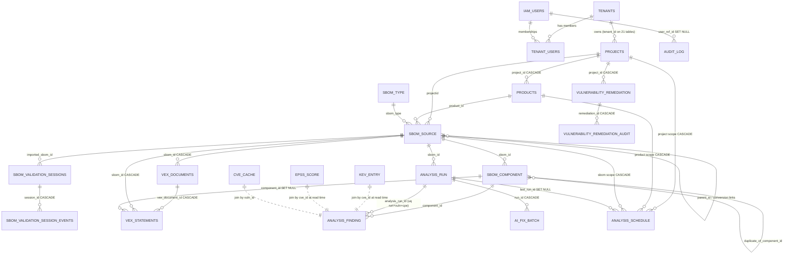

# 12. Interoperability Features

- **SBOM formats (verified in code):** CycloneDX **1.4 / 1.5 / 1.6** (JSON and XML; vendored schemas/XSDs; Protobuf deferred) and SPDX **2.2 / 2.3** (JSON and Tag-Value; SPDX-Lite `elements[]` handled on extraction). SPDX 3.0 JSON-LD, RDF/XML and YAML are **rejected** with `E013`/HTTP 415 ("deferred in v1"). Format detection is content-based and never guesses (ambiguous → 415 `E011`). SPDX→CycloneDX conversion is built in (`POST /api/sboms/{id}/convert/cyclonedx`).
- **Identifier schemes:** PURL (ECMA-427; packageurl-python with vendored fallback), CPE 2.2/2.3 normalization, distro PURL→CPE translation for deb/rpm/apk/conan with a curated ~60-entry soname table (flag `DISTRO_CPE_ENABLED`, default off; documented limitation: not backport-aware).
- **Runtime:** Python ≥3.11 on Linux containers (dev also Windows via bootstrap.ps1); Node (unpinned; bootstrap installs Node 20) for the frontend.
- **Databases supported:** PostgreSQL 16 (production/normal dev), SQLite (dev/test only, `ALLOW_SQLITE=true`); others refused at startup.
- **Export formats:** FDA 510(k) five-tab Excel workbook (Instructions · SBOM Metadata · SBOM Components · Vulnerabilities & VEX · Lifecycle & Support Plan — sheet contract enforced at export), vulnerability XLSX (18 Snyk-style columns), CSV, SARIF, PDF (reportlab), JSON (runs export, VEX report), compare markdown/csv/json, SBOM document exports (native/JSON/XML/CycloneDX/SPDX × original/converted/enriched/normalized), lifecycle CSV/ZIP report pack.
- **Interchange consumed:** NVD CVE API 2.0 JSON, OSV schema JSON, GHSA GraphQL, VulnDB API v3, CISA KEV JSON, FIRST EPSS API, endoflife.date API v1, deps.dev v3, package-registry metadata (npm/PyPI/NuGet/Maven/RubyGems), CSAF/CycloneDX-VEX/OpenVEX documents.

# 13. Maintenance Features

1. **Diagnostic support (Current Implementation):** unauthenticated `GET /health` (DB availability/dialect + NVD-mirror freshness — deliberately never fails the probe on mirror staleness); `GET /` service banner; `GET /api/analysis/config` (effective analysis configuration + configured-flags, secret names only); match-strategy telemetry (per-finding strategy/reason/confidence columns; NVD rejection counters and `provider_status` in the run's raw report; `nvd.findings_rejected_total` log metrics); structured JSON logs with correlation ids; request duration logging; DB pool diagnostics script (`scripts/db_pool_diagnostics.py`); lifecycle provider health surface (`provider_status_summary`, health badges in admin UI). **Known Limitation:** `/health` includes raw exception text for mirror errors (minor information leak).
2. **Serviceability:** cache invalidation is systematic — TanStack invalidation helper layer on the frontend (17 helpers, architectural test); TTL-driven caches server-side with beat sweeps (`cve-cache-purge`, `source-cache-sweep`, KEV refresh) and per-run `force_refresh`; re-enrichment jobs on demand (SBOM/component lifecycle refresh endpoints, `POST /api/sboms/{id}/revalidate`, NVD mirror manual sync + watermark reset). **Zombie-run detection/cleanup: Not Implemented for analysis runs** (AI-fix batches have startup reconciliation; see §5.6 — Recommended Improvement). Maintenance scripts: `reconcile_analysis_run_finding_counts.py`, `backfill_products_for_existing_sboms.py`, `check_sbom_upload_integrity.py`, `check_unsupported_sboms.py`, `migrate_sqlite_to_postgres.py`, `migrate_env_to_db.py`.
3. **Maintenance-related design:** migration runbook = manual `alembic upgrade head` with pre-migration backup (033's downgrade instructs "restore from a pre-migration backup"); the startup schema gate makes a missed migration a hard, immediate failure rather than silent drift. Feature-flag rollback = flip env + restart affected processes (worker restart mandatory; §5.9). Staged rollout gates are documented per feature in `docs/rollout-*.md` / `docs/runbook-*.md` (AI fixes, SBOM validation, compare, CVE modal). **Known Limitation:** no backup/restore runbook exists (only incidental "take a DB backup first" advice) — OQ-017.

---

# 14. Security Features

(Refer to the Security Risk Management Plan for full detail — **TBD, document not in repository**, §9/OQ-014. Everything below is confirmed implementation.)

1. **Access control levels — roles.** Five roles (`app/core/permissions.py`): `PLATFORM_ADMIN` and `TENANT_ADMIN` (all 41 permissions), `SECURITY_ANALYST`, `DEVELOPER` (read-mostly + `remediation:write`), `VIEWER`. Enforcement is per-request permission mapping (`enforce_request_access` on every router except health) plus route-level `require_permission` on tenant/lifecycle-admin/repair routes. **Known Limitations:** the analyst/manager/admin triad from planning material maps onto these five roles rather than existing literally; NVD-mirror admin routes are mounted at `/admin/nvd-mirror` while the permission map keys on `/api/nvd-mirror` — they therefore fall through to generic read/write permissions instead of `platform:admin` (**Design Risk — authorization-mapping defect, OQ-018**); an admin-role split for mirror routes is an acknowledged TODO in code.
2. **Encryption / secrets handling.** AI provider keys: AES-256-GCM envelope encryption at rest (`app/security/secrets.py`, master key `AI_CONFIG_ENCRYPTION_KEY`, keygen script provided), preview-only read API (first 6 + last 4). NVD mirror API key: Fernet (`NVD_MIRROR_FERNET_KEY`), fail-closed stub when absent. Lifecycle provider secrets: encrypted + masked, cipher key from `APP_SECRET_KEY`/`SETTINGS_SECRET_KEY`/`AI_CONFIG_ENCRYPTION_KEY`/`JWT_SECRET_KEY` candidates. Source API credentials (`NVD_API_KEY`, `GITHUB_TOKEN`, `VULNDB_API_KEY`, `LIFECYCLE_XEOL_API_KEY`) are plain environment variables (12-factor). `.env` is gitignored and dockerignored; no secrets are committed.
3. **Secure communication.** Outbound HTTPS with certifi roots everywhere; JWKS URL must be HTTPS; inbound TLS is delegated to the operator's proxy (none ships). SSE rides the same HTTP channel; **client-side SSE authentication is the open P0 gap** (§8.1) — the channel is only as authenticated as its transport today.
4. **Data at rest and in transit.** At rest: PostgreSQL (encryption at rest is a hosting concern; not configured in-repo); application-level encryption for the three secret stores above; uploaded SBOM text lives in `sbom_source.sbom_data` and (large files) under `data/sbom-workspaces/`. In transit: HTTPS outbound; HTTP behind operator TLS inbound; Redis plaintext/unauthenticated by default (**Design Risk** — enable Redis AUTH/TLS in production).
5. **Audit log / activity log.** §10.1.1 — middleware auto-audit (mutations, logins, tenant switches, export downloads) + domain writers + credential/remediation/session-event audit tables, capturing user, tenant, IP, user-agent, old/new values, timestamp.
6. **Authentication / Authorization.** OIDC/JWKS validation (RS256 only, HS rejected; `exp`/`nbf`/`iss`/`aud`/`sub` verified), context cache ≤120 s capped at token `exp`; token issuance/refresh entirely at HCL IAM (frontend PKCE; proactive refresh; sessionStorage). Legacy `API_AUTH_MODE` (none/bearer/HS256-jwt, per-request env read) survives only on `/api/analysis/config` and `/api/types`, plus a header-trusted `X-SBOM-Roles` bridge intended for trusted-gateway deployments (**deployment guidance needed — OQ-019**). **Token on SSE: not sent by any client surface (P0, §8.1).** Rate limiting: slowapi 300/min global, 15/min analyze, keyed by first XFF hop + token hash. Account lockout/password policy: Not Applicable (no local passwords — identity is external). Additional hardening present: 50 MB body cap middleware, capped JSON decoder, defusedxml/lxml hardened XML path, GZip, CORS `allow_credentials=false`. **Missing (confirmed):** security headers/CSP (nowhere), Dependabot/pip-audit-style supply-chain automation, CI-enforced gates.

# 15. Product Support

1. **Technical documentation (in-repo, verified):** README (setup, DB rules, run commands), `docs/` — ~50 documents including runbooks (`runbook-ai-fixes`, `runbook-ai-credentials`, `runbook-compare`, `runbook-cve-detail-modal`, `runbook-metric-debugging`, `runbook-sbom-validation`), rollout plans, feature/design specs, `metric-conventions.md`, `validation-error-codes.md` (generated), NVD-mirror discovery/design/operations, quickstart, ADRs 0001/0007/0008/0009, `Testing.md`, bootstrap scripts with `BOOTSTRAP.md`. API reference: FastAPI `/docs` (OpenAPI) + the API Inventory companion. **Gap:** no consolidated admin guide or backup runbook (OQ-017).
2. **COTS/third-party support:** VulnDB subscription — required only if the fourth source is activated (key currently absent); NVD API key — free registration, recommended for rate limits; GitHub token for GHSA; optional Xeol API key; optional LLM provider accounts for AI fixes (credentials managed in-app, encrypted). Dependency upgrade policy: pinned freeze + `*.before-upgrade.*` snapshots record each upgrade wave; no automated CVE monitoring of the platform's own dependencies (Recommended Improvement).
3. **Software upgrade:** release procedure = deploy new image → run `alembic upgrade head` (backup first; forward-only from 033) → start api/worker/beat (API hard-fails on stale schema, making a missed migration immediately visible) → rebuild frontend when `NEXT_PUBLIC_*` change. Flag-gated features roll out per-feature with kill switches (`AI_FIXES_KILL_SWITCH`, `CVE_MODAL_ENABLED`, `COMPARE_V1_FALLBACK`) and documented rollback steps; canary cohorts exist for AI fixes (`AI_CANARY_PERCENTAGE`).

# 16. Standards

## 16.1 Standards Reference

Verified against official publishers on 2026-07-07 (Evidence: standards register). Compliance stance: R = required (regulatory driver), T = targeted (product capability), P = partial, I = informational.

| S.No. | Standards Name | Version | Year of Publication | Stance |
|---|---|---|---|---|
| 1 | FDA — Cybersecurity in Medical Devices: Quality Management System Considerations and Content of Premarket Submissions (Final) | February 2026 (supersedes June 27, 2025 final) | 2026 | R |
| 2 | FD&C Act Section 524B — Ensuring Cybersecurity of Devices (21 U.S.C. § 360n-2) | Pub. L. 117-328, Div. FF §3305(a) | Enacted 2022; effective 2023-03-29 | R |
| 3 | NTIA — The Minimum Elements For a Software Bill of Materials (SBOM) | EO 14028 §4(e) report | July 12, 2021 | R (validated by NTIA stage) |
| 4 | CycloneDX Bill of Materials Specification (ECMA-424) | Product supports 1.4/1.5/1.6; current spec 1.7 (ECMA-424 2nd ed.) | 2025 (1.7: 2025-10-21; ECMA 2nd ed.: Dec 2025) | T (1.4–1.6 implemented; 1.7 not yet — Planned) |
| 5 | SPDX — ISO/IEC 5962:2021 (SPDX 2.2.1); SPDX 2.3; SPDX 3.0.1 | Product supports 2.2/2.3; 3.0 rejected | 2021 (ISO); 2.3: 2022 `TBD – requires regulatory confirmation`; 3.0.1: 2024 | T (2.2/2.3 implemented; 3.x Planned) |
| 6 | CVSS v3.1 / CVSS v4.0 (FIRST) | v3.1; v4.0 | June 2019; November 1, 2023 | T (v3.x fully consumed; v4.0 partially — see 16.2) |
| 7 | EPSS (FIRST) | Model v4 (v2025.03.14) | Scores since 2025-03-17 | T (implemented) |
| 8 | CISA KEV Catalog / BOD 22-01 | Live catalog | Nov 3, 2021 `TBD – requires regulatory confirmation` (cisa.gov unverifiable this session) | T (implemented) |
| 9 | Package URL (PURL) — ECMA-427 | 1st edition | December 2025 | T (implemented) |
| 10 | CPE — NISTIR 7695 Common Platform Enumeration: Naming Specification v2.3 | 2.3 | August 2011 | T (implemented) |
| 11 | OSV Schema (OpenSSF) | 1.7.5 | January 21, 2026 | T (implemented consumer) |
| 12 | OWASP Top 10 | 2025 edition (A03: Software Supply Chain Failures) | 2025 (`TBD` exact day) | I |
| 13 | OWASP ASVS | 5.0.0 | May 30, 2025 | I (security baseline for the platform itself) |
| 14 | IEC 62304 — Medical device software — Software life cycle processes | Ed. 1.1 (2006 + A1:2015 consolidated) | 2015-06-26 (Ed.2 status `TBD`) | I — applicability to this program `TBD – requires regulatory confirmation` (OQ-020) |
| 15 | ISO 14971:2019 — Application of risk management to medical devices | 3rd edition | 2019 | I (risk-framework interface) |
| 16 | ECMA-428 — Common Lifecycle Enumeration (CLE) | 1st edition | December 2025 | I (future lifecycle feed candidate) |
| 17 | OASIS OpenEoX | TC formed Dec 14, 2023 — **no published specification yet** | n/a | I (provider stub implemented, disabled) |

## 16.2 Specifications Supported — SBOM & Scoring

**SBOM specifications**

| SBOM Specification | Link | Supported / Implemented |
|---|---|---|
| CycloneDX 1.4 / 1.5 / 1.6 — JSON | cyclonedx.org/specification/overview/ | **Implemented** (vendored JSON schemas; validated then parsed) |
| CycloneDX 1.4 / 1.5 / 1.6 — XML | ecma-international.org (ECMA-424) | **Implemented** (namespace-detected; XSD-validated, XXE-hardened) |
| CycloneDX 1.7 / ECMA-424 2nd ed. | cyclonedx.org | **Not Implemented** — E013 unsupported-version rejection (Planned) |
| CycloneDX Protobuf | cyclonedx.org | **Not Implemented** (deferred; E024/E010) |
| SPDX 2.2 / 2.3 — JSON | spdx.github.io/spdx-spec/v2.3/ | **Implemented** (vendored schemas) |
| SPDX 2.2 / 2.3 — Tag-Value | spdx.dev | **Implemented** (via spdx-tools parse + re-validation) |
| SPDX 3.0 / 3.0.1 (JSON-LD), RDF/XML, YAML | spdx.github.io/spdx-spec/v3.0.1/ | **Not Implemented** — explicit E013 rejection ("deferred in v1") |
| CycloneDX VEX / CSAF / OpenVEX (VEX ingestion) | oasis-open.org, cyclonedx.org | **Implemented** (upload + discovery + embedded VEX processing) |

**Scoring / identifier specifications**

| Scoring/Identifier Specification | Link | Supported |
|---|---|---|
| CVSS v3.1 | first.org/cvss/v3.1/specification-document | **Implemented** (primary severity input; thresholds CRIT≥9.0/HIGH≥7.0/MED≥4.0) |
| CVSS v4.0 | first.org/cvss/v4.0/specification-document | **Partially Implemented** — v4 vectors/scores parsed from VulnDB (`cvss4` blocks) and stored by the NVD mirror (`score_v40`); `cvss_version` persisted and displayed; the live-NVD extraction path prefers v3.x (`Unable to confirm` full v4 coverage — OQ-022) |
| EPSS | api.first.org/epss | **Implemented** (24 h cached scores + percentiles; risk amplifier) |
| PURL (ECMA-427) | github.com/package-url/purl-spec | **Implemented** (packageurl-python + fallback parser; normalization; qualifiers incl. `distro=`) |
| CPE 2.3 (NISTIR 7695) | csrc.nist.gov/pubs/ir/7695/final | **Implemented** (2.2→2.3 normalization; trusted-source gating for NVD queries; PURL→CPE generation) |
| OSV schema 1.x | ossf.github.io/osv-schema/ | **Implemented** (querybatch/vulns consumers; alias handling) |
| SARIF 2.1.0 | docs.oasis-open.org | **Implemented** (run export) |

---

# 17. Appendix

## 17.1 Data Model Reference

Core entities referenced by the §10 Input/Return tables (full field-level dictionary for all 42 tables, including nullability, defaults, keys, indexes and relationships: companion *SBOM_Analyzer_Data_Dictionary*). Naming note: **there is no separate `Match` or `Advisory` table** — match attributes live on `analysis_finding` (`match_strategy`, `match_reason`, `matched_range`, `match_confidence`), rejected candidates exist only as counters in the run's `raw_report.provider_status`, and advisory payloads are cached in `source_response_cache`/`nvd_lookup_cache`/`cve_cache`.

**`sbom_source` (SBOM)** — key fields: `id` PK; `sbom_name` (unique with `tenant_id`+`sbom_version`); `sbom_data` Text (full document); `sbom_type` FK; `projectid` FK, `product_id` FK, denormalized `product_name`; version lineage `parent_id` (self-FK), `sbom_version`, `productver`; validation columns `status` (default `validated`), `failed_stage`, `validation_errors` JSON, `error_count`/`warning_count`, `validated_at`; conversion columns (`original_format`, `current_format`, `converted_from_format`, `source_sbom_id`/`converted_sbom_id`, `conversion_*`); `enrichment_status`, `component_extraction_status`; `completeness_score`/`completeness_report`; `dedupe_report_json`; soft-delete + tenant mixins.

**`sbom_component` (Component)** — `id` PK; `sbom_id` FK; raw identity (`bom_ref`, `name`, `version`, `purl`, `cpe`, `cpe_source`, `supplier`, `scope`, `license`, `hashes`, `component_type`/`group`); ~25 normalization fields (`normalized_name/version/purl/ecosystem`, parsed PURL parts + qualifiers JSON, `normalized_cpes`/`primary_cpe`/`cpe_evidence_json`, `normalized_package_key`, `normalized_component_key`, `dedupe_canonical_id`, `canonical_identity_confidence`); dedup flags (`is_duplicate`, `duplicate_of_component_id` self-FK, `dedupe_group_id/reason/confidence/evidence_json`); lifecycle columns (`lifecycle_status`, `eos_date`/`eol_date`/`eof_date`, `deprecated`/`unsupported`/`is_deprecated`, `maintenance_status`, `latest_version`/`latest_supported_version`/`recommended_version`, `lifecycle_recommendation/source/source_url/confidence/checked_at/evidence_json/is_stale/manual_override`). Unique: `(tenant_id, sbom_id, bom_ref, name, version, cpe)`.

**`analysis_run` (Analysis Run)** — `id` PK; `sbom_id` FK (+`project_id`, `product_id`); `run_status` String (canonical vocabulary, no CHECK); `trigger_source` (`api`/`manual`/`schedule`/`unknown`); `source` label; `started_on`/`completed_on` (ISO strings), `duration_ms`; counters `total_components`, `components_with_cpe`, `total_findings`, `critical_count`, `high_count`, `medium_count`, `low_count`, `unknown_count`, `query_error_count`; `raw_report` Text (full run JSON incl. `provider_status`, `raw_observation_count`, rejection summaries).

**`analysis_finding` (Finding / accepted Match)** — `id` PK; `analysis_run_id` FK; `component_id` FK; `vuln_id` (canonical id, `UNKNOWN-CVE` fallback); `source` (comma-joined list); `title`, `description`; `severity` (uppercase, `UNKNOWN` fallback), `score` Float, `vector`, `cvss_version`, `attack_vector`; `published_on`, `reference_url`, `cwe` (JSON list or legacy scalar), `cpe`, `component_name`/`component_version`, `fixed_versions` (JSON array text), `aliases` (JSON array text); match telemetry `match_reason`, `matched_range`, `match_confidence` Float [0,1], `match_strategy`. **Dedup guarantee: UNIQUE(`analysis_run_id`, `vuln_id`, `cpe`)**; re-analysis deletes and rewrites the run's rows. EPSS/KEV/lifecycle are *not* columns — joined at read time.

**`cve_cache` (CveCache)** — `cve_id` PK; `payload` JSON (merged `CveDetail` for the modal); `sources_used`; `fetched_at`/`expires_at` (TTL-bucketed: KEV 6 h / recent 24 h / stable 7 d / error 15 min); `fetch_error` (non-null = negative cache); `schema_version`.

Supporting entities (summarized; full detail in the Data Dictionary): `projects`, `products`, `sbom_type`, `sbom_validation_sessions` (+`_events`), `sbom_analysis_report` (legacy), `analysis_schedule`, `run_cache`, `compare_cache`, `vex_documents`/`vex_statements` (+ override audits), `component_lifecycle_cache`, `lifecycle_provider_configs`/`_secrets`/`lifecycle_vendor_records`, `kev_entry`, `epss_score`, `nvd_lookup_cache`, `source_response_cache`, AI tables (`ai_usage_log`, `ai_provider_config`, `ai_fix_cache`, `ai_fix_batch`, `ai_provider_credential`, `ai_settings`, `ai_credential_audit_log`), identity (`tenants`, `iam_users`, `tenant_users`), `audit_log`, `vulnerability_remediation` (+audit), NVD mirror (`nvd_settings`, `cves`, `nvd_sync_runs`).

## 17.2 Analysis Run States

Canonical vocabulary (ADR-0001; `app/services/analysis_service.py:114-121`): `PENDING`, `RUNNING`, `OK`, `FINDINGS`, `PARTIAL`, `ERROR`, `NO_DATA`. Legacy inbound aliases `PASS`→`OK`, `FAIL`→`FINDINGS` (display forbidden; migration 005 renamed stored rows; FE `canonicalRunStatus()`). Legacy DB rows may still carry `QUEUED`/`ANALYSING`/`ANALYZING` — accepted as *active* for the concurrency guard but **no current code writes them**. `CANCELLED` is reserved for the planned cancellation feature (a FE label exists; **no writer** — Not Implemented).

| State | Meaning | Written by (owner) | Trigger | Timestamps persisted |
|---|---|---|---|---|
| PENDING | Row created, fan-out not started | API (stream + legacy endpoints only) | Run-row creation | `started_on` set at creation |
| RUNNING | Source fan-out in progress | API (stream + legacy endpoints) | Just before fan-out | — |
| OK | Completed; 0 findings, 0 provider errors | `persist_analysis_run` (API process; worker process for scheduled runs) via `compute_report_status` | Completion | `completed_on`, `duration_ms` |
| FINDINGS | Completed; ≥1 finding (**even if some providers errored** — label gains " (partial)" suffix) | same | Completion | same |
| PARTIAL | Completed; **0 findings AND ≥1 provider error** (narrower than ADR-0001's prose — recorded as OQ-023) | same | Completion | same |
| ERROR | Unhandled failure | stream `mark_failed`; legacy except-block; `persist_analysis_run` fallback | Exception | `completed_on` where reachable |
| NO_DATA | Legacy/empty-SBOM backfill | Startup backfill only (`backfill_analytics_tables`) | Boot-time migration of legacy report rows | — |
| CANCELLED | Reserved | **No writer — Not Implemented** | — | — |

**Transition table** (no state machine is enforced in code — `run_status` is a plain string; "illegal" means no code path produces it):

| From → To | Legal? | Owner / trigger |
|---|---|---|
| (none) → PENDING | Yes (stream/legacy paths) | API at row creation |
| (none) → OK / FINDINGS / PARTIAL / ERROR / NO_DATA | Yes (production + scheduled paths create the row directly in a terminal state) | `persist_analysis_run` / backfill |
| PENDING → RUNNING | Yes | API before fan-out |
| RUNNING → OK / FINDINGS / PARTIAL | Yes | `persist_analysis_run` |
| PENDING/RUNNING → ERROR | Yes | exception handlers |
| Terminal → any | Illegal (no writer; nothing prevents manual SQL) | — |
| RUNNING → RUNNING (forever) | **Zombie condition** — API death or SSE client disconnect mid-run; no age cutoff in `get_active_analysis_run`, no reaper → all later analyses of that SBOM return `already_running`; recovery is manual SQL (Known Limitation §5.6) | — |

**Figure 14 — Analysis-Run State Diagram**

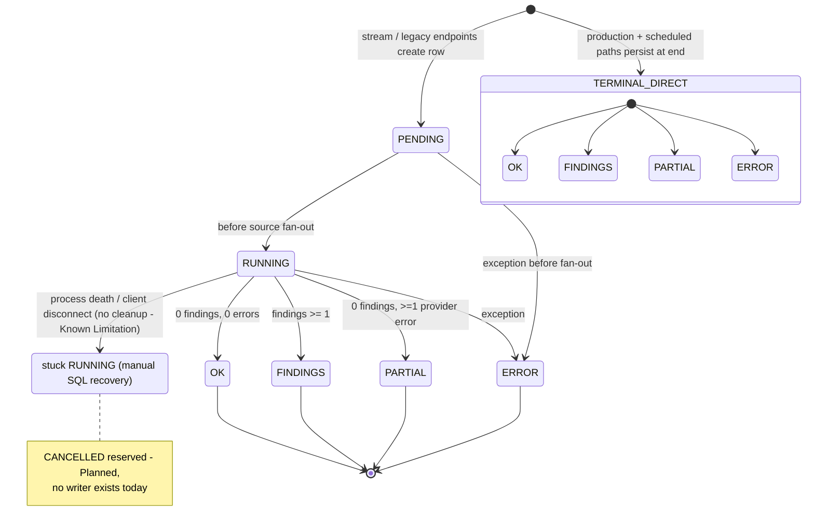

## 17.3 Severity Bands

CVSS score → severity mapping (env-tunable thresholds; `app/sources/severity.py`, `CVSS_*_THRESHOLD`):

| Band | Rule | Notes |
|---|---|---|
| CRITICAL | score ≥ 9.0 | |
| HIGH | 7.0 ≤ score < 9.0 | |
| MEDIUM | 4.0 ≤ score < 7.0 | |
| LOW | 0 < score < 4.0 | |
| UNKNOWN | No usable score/severity from any source | Stored explicitly; severity column defaults to `UNKNOWN`, dashboards report it as its own bucket (ADR-0001) and the severity-sum invariant `total == crit+high+med+low+unknown` is test-locked |

Source-provided severities (e.g. GHSA severity, VulnDB `risk.name`) are uppercased and reconciled during merge by worst-severity / max-score rules (17.5). Read-time risk score = `cvss × (1 + amplifier × epss) × kev_multiplier` (not a severity band; displayed separately).

## 17.4 Match Strategies

Persisted per finding in `match_strategy`; confidence = `0.5×name + 0.3×version + 0.2×vendor` token-overlap (version credit: 1.0 exact / 0.5 major.minor), clamped [0,1], then lifted to a per-strategy floor. Confidence is a triage signal only — **no acceptance threshold rejects candidates by confidence**.

| Strategy | Source | Mechanics | Confidence floor |
|---|---|---|---|
| `cpe_name` | NVD (trusted-CPE lookup; mirror hits too) | Exact CPE 2.3 query + `configurations.cpeMatch` applicability walk | 0.5 |
| `cve_ids` | NVD (batch backfill of CVEs found by other sources) | `cveIds=` batch enrichment | — (absent from the strategy Literal and floors; NVD production findings carry NULL confidence — Known Limitation OQ-024) |
| `purl_direct` | OSV | Version-qualified `querybatch`/`query` by PURL (or name+ecosystem) | 0.6 |
| `ghsa_alias` | GitHub | GraphQL per (ecosystem, package); local range check | 0.6 |
| `virtual_match_string` | NVD (spec'd, **dormant** — helpers exist, zero call sites) | Wildcard CPE match string | 0.5 |
| `keyword_search` | NVD (spec'd, **dormant** in production path) | Keyword query fallback | 0.0 |
| (untagged) | VulnDB | CPE or free-text search; no version matching | — |

`match_reason` records the version-range verdict (e.g. `version_in_range`, `ecosystem_unsupported` conservative-keep, `osv_version_qualified_query`), `matched_range` the interval. Comparator dispatch by ecosystem: npm/go/generic semver-ish; PyPI PEP 440; Maven ordering; deb/rpm/apk/conan conservative-keep unless `DISTRO_CPE_ENABLED`.

## 17.5 Source Precedence & Canonical CVE Aliasing

Deduplication/merging runs in three passes with a DB backstop UNIQUE(`analysis_run_id`,`vuln_id`,`cpe`). Full field-precedence matrix:

| Field | Rule (final winner) |
|---|---|
| Canonical `vuln_id` | First CVE regex match among vuln_id+aliases → else first GHSA → else first `OSV-` → else first value (uppercased). `DEBIAN-CVE-*` wins only when no CVE/GHSA/OSV alias exists. Original ids folded into `aliases`. |
| `sources` | Case-insensitive sorted union, comma-joined into `analysis_finding.source` |
| `aliases`, `references`, `fixed_versions`, `cwe` | Set unions (case-normalized, sorted) |
| `severity` | Worst (rank LOW<MEDIUM<HIGH<CRITICAL) |
| `score` (CVSS) | Pass 1: replaced only together with a higher severity; Pass 2/3: **max**, with pass 3 carrying the max-score record's `vector`+`cvss_version` |
| `description`, `title`, `url`/`reference_url` | First record to arrive (fast sources arrive before NVD; NVD text fills only when it is first for that CVE — e.g. the Debian gap path where no fast source had text) |
| `purl`, `ecosystem`, `normalized_name`, `bom_ref`, `package_type`, `attack_vector`, `applicability_status`, `match_reason`, `matched_range`, `match_strategy`, `match_confidence`, `vector`, `cvss_version` (pass 2) | First non-empty |
| `cpe` | First record's value (part of the uniqueness key) |
| CVSS authority (CVE modal only) | NVD authoritative for CVSS; summary precedence GHSA→OSV→NVD (aggregator — different subsystem from run persistence) |

**Figure 15 — Finding Deduplication and Merge Flow**

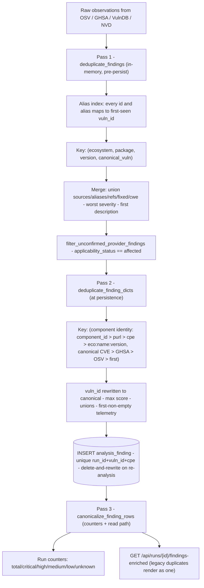

**Worked example (fictional component data).** Component `pkg:pypi/requests@2.19.1` receives the same vulnerability from three sources:

1. **OSV** emits `{vuln_id:"GHSA-x84v-xcm2-53pg", aliases:["CVE-2018-18074"], sources:["OSV"], severity: HIGH (from OSV CVSS), fixed_versions:["2.20.0"], match_strategy:"purl_direct", match_confidence:0.6+, applicability_status:"affected"}`.
2. **GHSA** emits `{vuln_id:"GHSA-x84v-xcm2-53pg", aliases:["GHSA-x84v-xcm2-53pg","CVE-2018-18074"], sources:["GITHUB"], score/vector from advisory.cvss, matched_range from vulnerableVersionRange, match_strategy:"ghsa_alias"}`.
3. **NVD** (running last, having collected `CVE-2018-18074` from the others' aliases) emits `{vuln_id:"CVE-2018-18074", sources:["NVD"], score:9.8 → CRITICAL, description: NVD English text, cwe from NVD, match_strategy:"cve_ids", match_confidence:null}`.

Pass 1: the alias index co-resolves all three to canonical `CVE-2018-18074`; key `("pypi","requests","2.19.1","CVE-2018-18074")` collapses them into one dict — first-arrived record's `vuln_id`/description/title (OSV or GHSA), `sources={OSV,GITHUB,NVD}`, alias/reference/fixed-version unions, severity upgraded to CRITICAL with 9.8 (worst-severity rule). Pass 2: key = (`purl:pkg:pypi/requests@2.19.1`, `CVE-2018-18074`); `vuln_id` **rewritten** to `CVE-2018-18074` (GHSA id retained in aliases); sources sorted `"GITHUB,NVD,OSV"`; score = max. Persisted row: `analysis_finding(vuln_id="CVE-2018-18074", source="GITHUB,NVD,OSV", severity="CRITICAL", score=9.8, aliases=["CVE-2018-18074","GHSA-x84v-xcm2-53pg"], fixed_versions=["2.20.0"], match_strategy="purl_direct", match_confidence≈0.6, cpe=NULL)`; the unique constraint guarantees no second row. Counters: `total_findings=1`, `critical_count=1`; `raw_report.metrics.raw_observation_count=3`, `unique_vulnerabilities=1`. Rejected candidates (e.g. GHSA range says not-affected) are dropped pre-emit and appear only in rejection counters/logs — never as rows.

## 17.6 Feature Flag Reference

All flags are environment variables read into the cached Settings singleton unless noted; **set them in every consuming process (API and worker) and restart after changes**. (The "six flags" in the original outline grew; this is the verified full set.)

| Flag | Default | Read by | Restart |
|---|---|---|---|
| `NVD_ENABLED` / `NVD_BACKGROUND_ENRICHMENT` | true / true | API+Worker / Worker | restart |
| `NVD_VERSION_RANGE_FILTER_ENABLED` (roadmap #1) | **false** | API+Worker | restart |
| `SOURCE_CACHE_ENABLED` (roadmap #2) | **false** | API+Worker | restart |
| `DISTRO_CPE_ENABLED` (roadmap #5; gates distro PURL→CPE routing and distro version-range handling together) | **false** | API+Worker | restart |
| `NVD_KEYWORD_FALLBACK_ENABLED` | true | API+Worker | restart |
| `NVD_REJECTION_DETAIL_LOGGING` | false | API+Worker | per-call (no restart) |
| `CVE_MODAL_ENABLED` | true | API (echoed to FE) | restart |
| `COMPARE_V1_FALLBACK` | false | **Backend: defined but read nowhere (dead — OQ-025)**; FE twin `NEXT_PUBLIC_COMPARE_V1_FALLBACK` | FE rebuild |
| `COMPARE_LICENSE_HASH_ENABLED` | false | API | restart |
| `AI_FIXES_ENABLED` / `AI_FIXES_KILL_SWITCH` / `AI_FIXES_UI_CONFIG_ENABLED` / `AI_CANARY_PERCENTAGE` | false / false / false / 100 | API+Worker | restart |
| `AUTH_ENABLED` / `DEV_DEFAULT_TENANT` | false / true | API | restart |
| `LIFECYCLE_XEOL_ENABLED` / `XEOL_ENABLED` / `OPENEOX_ENABLED` | false ×3 | API+Worker | restart |
| `NVD_MIRROR_ENABLED` / `NVD_MIRROR_DOWNLOAD_FEEDS_ENABLED` | false / false | Worker/Beat (DB-backed after first seed) | next task run (no restart) |
| `API_RATE_LIMIT_ENABLED` / `API_IDEMPOTENCY_ENABLED` | true / true | API | restart |
| `API_AUTH_MODE` (legacy) | none | API | **per-request (no restart)** |
| `SBOM_SIGNATURE_VERIFICATION` | **False — hard-coded constant, not env-configurable** | API | code change |

## 17.7 PURL→CPE Mapping Rules

Bespoke implementation (`app/sources/cpe.py`; no purl2cpe library):

1. **Trusted allowlist** `trusted_cpe23_from_purl()` — reviewed mappings producing `cpe_source="trusted_mapping"`; currently a single entry: `("pypi","pillow") → cpe:2.3:a:python:pillow:...`. Only *trusted* CPEs (`sbom_provided`, `official_nvd_cpe`, `manual_verified`, `trusted_mapping`) are ever sent to NVD.
2. **Heuristic generator** `cpe23_from_purl()` → `cpe_source="generated_fallback"` (never queried against NVD; kept for display/telemetry): PyPI `name=vendor=product`; npm scope→vendor; Maven `org.apache.*`→vendor `apache`, `log4j-*`→`log4j`; Go last-namespace-segment vendor; composer vendor/package; generic slugify fallback; version sanitized; emits `cpe:2.3:a:<vendor>:<product>:<version>:*:*:*:*:*:*:*`.
3. **Distro resolver** (`app/sources/distro_cpe.py`, flag `DISTRO_CPE_ENABLED` default off): deb/rpm/apk/conan PURLs → upstream `(vendor, product)` via a curated ~60-entry table including soname aliases (`libssl1.1`→`openssl:openssl`, `libc6`→`gnu:glibc`, `xz-utils`→`tukaani:xz`, …); strips `epoch:` prefixes and `-revision` suffixes from versions. **Documented limitation: not backport-aware** — a patched distro build can still match the upstream vulnerable range (over-reporting risk).
4. **CPE normalization** (`cpe_normalizer.py`): CPE 2.2 (`cpe:/`) and 2.3 forms normalized; `primary_cpe` = first normalized; provenance retained in `cpe_evidence_json`.

## 17.8 Error Code Catalogue

Validation error codes — single source of truth `_CODE_TABLE` (`app/validation/errors.py`); full generated reference `docs/validation-error-codes.md` (via `scripts/gen_error_code_reference.py`) and in-app at `/docs/sbom-validation-errors`. Status precedence when multiple errors: 413 > 415 > 422 > 400; report caps at 100 entries (`truncated=true`).

| Code range | Stage | HTTP | Representative codes |
|---|---|---|---|
| E001–E003 | 1 ingress (size) | 413 | E001 size exceeded (50 MB); E002 decompressed cap (200 MB); E003 ratio cap (100:1) |
| E004–E006 | 1 ingress (encoding) | 400 / 415 | E004 invalid UTF-8; E005 empty body; E006 unsupported content-encoding (only gzip/deflate) |
| E010–E013 | 2 detect | 415 | E010 format indeterminate; E011 ambiguous (never guesses); E013 spec version unsupported (CDX ≠1.4/1.5/1.6, SPDX ≠2.2/2.3, SPDX 3.0, RDF) |
| E014–E015 | 2 detect | 422 | E014 missing specVersion/spdxVersion |
| E020–E029 | 3 schema | 400 / 422 | E022 YAML unsupported; E023 tag-value parse; E024 protobuf deferred; E025 schema violation (also the synthetic internal-validator-error code); E026 required; E027 type; E028 enum; E029 format |
| E040–E047 | 4 semantic (SPDX) | 422 | E040 SPDXID; E041 namespace; E042 dataLicense CC0-1.0; E043 license expression; E044 checksum length; E045 created timestamp; E046 DESCRIBES relationship |
| E050–E057 | 4 semantic (CycloneDX) | 422 | E050 serialNumber urn:uuid; E051 duplicate bom-ref; E052 PURL parse; E053 CPE 2.3 syntax; E054 hash length; E055 BOM version int; E056 timestamp; E057 component type enum |
| E070–E073 | 5 integrity | 422 | E070/E072 dangling dependency refs (CDX/SPDX); E071 self-edge |
| E080–E089 | 6 security | 400 / 413 | E080 depth >64; E081 array >1e6; E082 string >64 KB; E083 DTD forbidden; E084 entity declaration; E085 external entity; E087 prototype-pollution keys; E088 embedded blob >1 MB |
| E110–E112 | 8 signature | 422 | E110 "verifier is not yet implemented" (stage is a stub behind a hard-off constant) |
| W074, I075 | 5 integrity | non-blocking | dependency cycle warning; orphan info |
| W100–W106 | 7 NTIA | 200 (warnings) / 422 under `strict_ntia` | supplier, name, version, unique id, dependency relationship, author, timestamp |
| W113 | 8 signature | non-blocking | signature absent |
| W120–W121 | 9 normalization | 422-class warnings | duplicate-identity groups; normalization warnings |

HTTP-level envelopes (non-validation): `payload_too_large` 413; `internal_error` 500 (+`correlation_id`); `DATABASE_BUSY` 503; 429 rate limit; `duplicate_name` 409; `sbom_validation_failed` (repair envelope); `workspace_blocked` 422; `unsupported_form_fields` 422; `broker_unavailable` 502 (schedule run-now); `fda_510k_report_incomplete_analysis` 409. **Known Limitation:** duplicate name+version on the multipart upload path surfaces as 500 `internal_error` instead of 409 (missing preflight — OQ-026).

---
